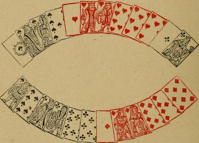
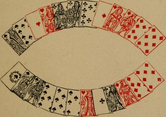

# The laws of piquet : adopted by the Portland and Turf clubs with a treatise on the game

Cavendish, 1831-1899

## LAWS OF PIQUET.

### SHUFFLING

1. Each player has a right to shuffle both his own and his adversary's pack. The dealer has the right of shuffling last.

2. The pack must not be shuffled below the table, nor in such manner as to expose the faces of any of the cards.

### CUTTING

3. A cut must consist of at least two cards, and at least two must be left in the lower packet,

4. In cutting, the ace is highest. The player who cuts the higher card has the choice of deal, and the dealer has the choice of cards at the commencement of each partie.

5. If, in cutting for deal, a player expose more than one card, he must cut again.

6. The cut for the deal holds good, even if the pack be incorrect.

7. If, in cutting to the dealer, or in reuniting the separated packets, a card be exposed, or if there be any confusion of the cards, there must be a fresh cut.

8. When a player in cutting has once separated the pack, he must abide by the cut.

### DEALING

9. The dealer must deal the cards by two at a time or by three at a time, giving the top cards to his adversary, the next to himself, and so on, until each player has twelve cards. The dealer having selected the mode in which he will distribute the cards, must not change it during the partie. The eight undealt cards (called the stock) are to be placed face downward, in one packet, on the table between the players.

10. If the dealer deal the cards wrongly, he may, with the permission of his adversary, rectify the error prior to either player having taken up his hand.

11. If the elder hand find that he has a card too many or a card too few, he has the option of a fresh deal after looking at his hand, but before taking up a card of the stock. If the elder hand, having twelve cards dealt him,' find,in drawing the stock toward him after discarding,that it contains but seven cards, he has the option of a fresh deal, or of altering his discard.

12. If more than one card be dealt wrongly, or if there be nine cards in the stock, there must be a fresh deal (except as provided in Law 10).

13. If the dealer expose a card belonging to his adversary, or to the stock, the elder hand has the option of a fresh deal. If the dealer expose any of his own cards, the deal stands good.

14. If a faced card be found in the pack when dealing, or in the stock when taking in, there must be a fresh deal.

15. If the dealer deal with the wrong pack, and the error be discovered before either player has taken up any of his cards, there must be a fresh deal with the right pack. If the error be not discovered before either player has taken up any of his cards, the deal holds good, and the packs remain changed.

16. The players deal alternately. If a player deal out of his turn, and either player discover the error before taking up any of his cards, the deal in error is void, and the right dealer deals.But if the error be discovered too late to correct it, the elder hand in that deal must deal twice running with the same pack (except as provided in Law 76), unless that or the next deal be the last of the partie.

17. The non dealer must collect the cards for the ensuing deal, and must place them, properly collected, face downward on the table.

### CARTE BLANCHE

18. _Carte blanche_ (a hand dealt, consisting of at least twelve cards, without king, queen, or knave) scores first, and consequently saves a _pique_ or a _repique_. It also counts toward a _pique_ or a _repique_.

19. _Carte blanche_ must be shown by counting the cards, one by one, face upward on the table.

20. As soon as a player is aware that he has a carte blanche, he is bound to inform his adversary, but he need not show the _carte blanche_ until his adversary has discarded.

### DISCARDING AND TAKING IN

21. The elder hand is entitled to discard five cards and to take in five. He is obliged to discard one card (except as provided in Law 42).

22. The younger hand is entitled to discard three cards, and to take in three (except as provided in Laws 41 and 43). He is obliged to discard one card (except as provided in Law 40).

23. In taking in, the cards must be taken in order from the top of the stock.

24. After a player has taken up a card of the stock he cannot alter his discard.

25. If a player, after having taken up a card of the stock, take back into his hand any of his discard, he must play with more than twelve cards, and can reckon nothing that deal.

26. If a player, after having taken up a card of the stock, mix any of his hand, or any card he is entitled to take in, with his discard, he must leave it with his discard. He must play with less than twelve cards, and his adversary counts as tricks all cards that cannot be played to.

27. If the elder hand, when taking in, or when looking at cards he has left, expose or take up any of the bottom three cards of the stock (except as provided in Laws 41 and 43), he can reckon nothing that deal. And similarly, if the younger hand, when taking in, expose or take up any of the top five cards of the stock (not being cards declared to be left by the elder hand), he can reckon nothing that deal.

28. If the elder hand mix with his hand any of the bottom three cards of the stock (exceptas provided in Laws 41 and 43), or if, having left any cards, he mix with his hand any of the cards he ought to have left, he can reckon nothing that deal; or, the younger hand, after looking a this cards, may elect to have a fresh deal. If he elect to stand the deal, he can only take as many of his cards as have not been mixed.

29. If the younger hand mix with his hand any of the top five cards of the stock (not being cards declared to be left by the elder hand), he can reckon nothing that deal; or, the elder hand, after looking at his cards, may elect to have afresh deal. If he elect to stand the deal, he can only take as many of his cards as have not been mixed. If, however, the elder hand have taken in some of his cards, the others remaining on the stock, and the younger hand take up any of them,he incurs no penalty, unless he mix any of the cards taken up with his hand, when he can reckon nothing that deal.

30. If a player, having twelve cards dealt him, discard more cards than he takes in, he must play with less than twelve cards, and his adversary counts as tricks all cards that cannot be played to.

31. If a player, having twelve cards dealt him,take in more cards than he discards, but do not take from the stock one of his adversary's cards,he must play with more than twelve cards, and can reckon nothing that deal.

32. If the elder hand do not take all his cards,he must declare the number he takes or leaves before taking up a card of the stock. If he fail to do so, and the younger hand, on touching the stock (but before taking up a card of it),find that it contains more than three cards, he is entitled to alter his discard, and to take in the card or cards left.

33. If the elder hand leave any cards, he is entitled to look at them; but if he take them up, together with the cards he is about to take in, he can reckon nothing that deal.

34. The younger hand is entitled to take in all the cards that are left in the stock.

35. If the younger hand leave any cards, and take up, together with the cards he is about to take in, more cards than he has discarded, he can reckon nothing that deal.

36. If the younger hand leave any cards he is entitled to see them; but he must declare whether he will look at them or not, after the elder hand has named the suit he will first lead, or has led a card, and before laying a card himself. If the younger hand elect to look at them, the elder hand is also entitled to see them, after he has named the suit he will first lead, or has led a card. If the younger hand elect not to look at them, neither player has a right to see them.

37. If the younger hand leave any cards, and mix them with his discard without showing them to the elder hand, the elder hand, after leading a card, is entitled to see his adversary's discard,and the cards mixed with it.

38. If a player announce that he has eleven or thirteen cards dealt him, the stock may be counted to ascertain how many cards it contains.

39. If the elder hand, having eleven or thirteen cards dealt him, take up a card of the stock without announcing the error, he loses his option of a fresh deal. He cannot alter his discard,and he must leave at least three cards for the younger hand. But, if the stock contain seven cards, and the elder hand have eleven, there must be a fresh deal.

40. If the elder hand elect to stand the deal when he has thirteen cards, and there are eight in the stock, he must discard one card more than he takes in, and he must discard at least two cards. The younger hand must discard one less than he takes in; but, if he only take one card, he need not discard any.

41. If the elder hand elect to stand the deal when he has thirteen cards, and there are seven in the stock, he must discard one more card than he takes in. He must discard at least two cards;and, if he take all his cards, he discards six, and the younger hand can only take two cards.

42. If the elder hand elect to stand the deal when he has eleven cards, and there are eight in the stock, he must discard one less than he takes in; but, if he only take one card, he need not discard any. The younger hand must discard one more than he takes in, and he must discard at least two cards.

43. If the elder hand elect to stand the deal when he has twelve cards, and there are seven in the stock, he must discard the same number of cards as he takes in; and, if he take all his cards, the younger hand can only take two cards.The younger hand must discard one more than he takes in, and he must discard at least two cards.

44. When a player subjects himself to the penalty of reckoning nothing that deal, the adversary has the option of not enforcing the penalty.

45. A player may examine his own discard at any time.

### CALLING AND SHOWING

46. The elder hand must call his point first, or he loses the right to call it. It is sufficient to call the number of cards of the point. The younger hand is not entitled to reply by inquiring what the elder hand's point makes, unless he hold at least an equal number of cards; and the inquiry bars him from counting a superior number of cards for point.

47. It is not compulsory on the younger hand to call his point first; nor is it compulsory on either player to call sequence next after point.

48. It is sufficient to call the number of cards of a sequence if the call be good against the cards. If not good against the cards, the elder hand is bound to state to what card his sequence is. And similarly, in calling a quatorze or trio,the elder hand is bound to state the value of the cards of which it consists, unless the call is good against the cards.

49. If the elder hand first call a sequence which is good against the cards, he can reckon any sequences he holds, whether of superior counting value to the one called or not. And similarly, if the elder hand first call a _trio_ or a _quatorze_ which is good against the cards, he can reckon any _quatorzes_ or _trios_ that he holds.

50. If the elder hand call a smaller point,sequence, quatorze, or trio than he holds, he may correct his miscall before it has been replied to by the younger hand.

51. If the younger hand allow a correct call to be good or equal, when he holds better in his hand, he may correct his reply before the elder hand has made another call; or, in case there is no further call, before the elder hand has led a card.

52. If either player call a larger point, sequence,quatorze, or trio than he holds, and it is allowed to be good, he may correct his miscall before the younger hand has played to the first trick.In case of a correction of such miscall by the younger hand, after the elder hand has led, the elder hand is at liberty to retake the card he led, and to play differently.

53. There is no penalty for a misnomer. It is a misnomer, if a player call a point or sequence, when he holds one of that counting value, but names the suit wrongly; or a sequence, when he holds one of that counting value, but names its rank wrongly ; or a trio or quatorze, when he holds one, but hames its rank wrongly ; provided, however, that he could not possibly have held what he claims, in his hand and discard taken together.

54. If a player who calls a point, sequence,quatorze, or trio that he does not hold, and such call is allowed to be good, do not correct his miscall before the younger hand has played to the first trick, he can reckon nothing that deal, except in the case of a misnomer, or of his having called anything which he could not possibly have held in his hand and discard taken together, when he is liable to no penalty. On discovery of the error, the adversary may reckon anything he has good, which is not barred by a correct call of the player in error, made in addition to his miscall.

55. A player who calls anything which is allowed to be good or equal, must show the cards called at any time they are asked for, orin the case of the younger hand, at any time after the elder hand has led a card. If a player,before he plays a card, voluntarily show anything which he claims to be good or equal, he is liable to no penalty for miscalling what he has shown.

56. When the younger hand has played to the first trick, neither player can reckon anything omitted (except as provided in Law 54).

### PLAYING

57. If a player play with less than twelve cards in hand, he is liable to no penalty. His adversary counts as tricks all cards that cannot be played to.

58. If a player play with more than twelve cards in hand, he can reckon nothing that deal;but his cards, though not good to score, are good to bar his adversary.

59. A card once led or played cannot betaken up, except as provided in Law 52, and as follows:

 - I. If a player accidentally drop a card or cards, he may retake them.
 - II. If the leader lead two or more cards consecutively without waiting for his adversary to play, and the adversary plays too many cards, he may, on discovery of the error, retake the extra card or cards. All cards subsequently played in error must be taken up and played over again.
 - III. If a player lead out of turn, the card led may be taken up, unless the adversary have played to the trick, when the error cannot be rectified. 
 - IV. If a player do not follow suit when able,he must; when the error is detected,retake any cards played in error, and substitute the suit led. The players also retake all cards played after the mistake,and the play of the remainder of the cards then proceeds as though no error had been committed.
 - V. If a player, when asked what cards he has in hand which have been allowed to be good or equal, misinform his adversary, the adversary may retake all cards played subsequently to the misinformation, and play differently.

60. A player is entitled to examine both hi sown and his adversary's tricks at any time.

### SCORING

61. Carte blanche scores ten.

62. The largest point is good. The point, when good, scores one for each card.

63. The longest sequence is good; as between sequences of equal length the highest is good. Sequences, when good, score as follows : a huitième scores eighteen; a septième, seventeen; a sixième, sixteen; a quint, fifteen; a quart, four; a tierce, three.

64. The highest _quatorze_ is good. Any _quatorze_ is good against a _trio_. As between _trios_, the highest _trio_ is good. A _quatorze_, when good, scores fourteen. A _trio_, when good, scores three.

65. In playing the cards, each player scores one for every card he leads, or with which he wins a trick. The winner of the last trick scores two instead of one.

66. A player who wins more than six tricks scores ten for the cards. If each player win six tricks the cards are divided, and there is no score for them. A player who wins twelve tricks wins a _capot_, and scores forty for the cards instead of ten.

67. The scores, whether obtained by the elder or younger hand, reckon in the following order :

 - I. Carte blanche.
 - II. Point.
 - III. Sequences.
 - IV. Quatorzes and trios.
 - V. Points made in play.
 - VI. The cards.

68. A _repique_ is obtained on the score of thirty being made by a player, in his hand alone, by scores that reckon in order before anything that his adversary can count. A player obtaining a _repique_ adds sixty to his score.

69. A _pique_ is obtained on the score of thirty being made by the elder hand, in hand and play, before his adversary has reckoned anything that deal. A player obtaining a _pique_ adds thirty to his score. A _capot_ reckons after points made in play; and, therefore, does not count toward a _pique_.

70. Errors in counting the hand, if proved, maybe rectified at any time before the player in error has seen his next hand.

71. A partie consists of six deals. The partie is won by the player who makes the higher score in six deals. If both players score the same number in six deals, each deals once more, when the partie is concluded, even if there should be a second tie.

*Note* By agreement, a partie may consist of four deals, the score in the first and last deals counting double. In case of a tie, each deals once more, the scores in the extra deals counting single.

72. The winner of the partie deducts the score of the loser from his own; and the difference, with a hundred added, is the number of points won.

73. If the loser fail to score a hundred, the winner, whether his score reach a hundred or not, adds the score of the loser to his own; and the sum, with a hundred added, is the number of points won.

74. In case of a difference in the written scores, a player's score of his own hand shall be taken as correct.

### INCORRECT PACKS

75. If a pack be discovered to be incorrect, redundant, or imperfect, the deal in which the discovery is made is void. All preceding deals stand good.

### CHANGING CARDS

76. Before the pack is cut to the dealer a player may call for fresh cards at his own expense. He must call for two new packs, of which the dealer has the choice.

77. Torn or marked cards must be replaced, or new packs called for at the expense of the two players.

### BYSTANDERS

78. If a bystander call attention to any error or oversight, and thereby affect the score, he maybe called on to pay all stakes and bets of the player whose interest he has prejudicially affected.

## LAWS OF PIQUET AU CENT

The Laws of Piquet au cent, differ from those of Piquet in the following particulars: The player who cuts the lower card has to deal. If he exposes more than one card in cutting, his adversary may treat the lowest of the exposed cards as the one cut.

The deal is by two cards at a time.

If the elder hand find that he has a card too many or too few, he has the option of a fresh deal before touching the stock.

If the dealer deal with the wrong pack, and the error be discovered before the deal is completed, there must be a fresh deal with the right pack. If not discovered before the deal is completed, the deal holds good.

If a player deal out of his turn, and discover his error before taking up his hand, the deal in error is void, and the right dealer deals. If not discovered before taking up the hand, there is no remedy.

If the younger hand have a carte blanche, he need not declare it until his adversary has discarded and touched the stock.

The younger hand is not obliged to discard any card.

After a player has touched the stock he cannot alter his discard (except as provided in Laws of Piquet 11, 32, and 38).

If the elder hand mix with his hand one of the three bottom cards of the stock, he loses the game ; and, similarly, if the elder hand, having left a card or cards, mix with his hand any of the cards he ought to have left, he loses the game.

If the younger hand take up any of the top five cards of the stock (not being cards declared to be left by the elder hand), he loses the game.

If the elder hand do not take all his cards,he must declare the number he takes or leaves before touching the stock.

If the younger hand leave any cards and elect not to look at them, and either player should then look at them, they must be exposed, and a suit may be called from the offender when next he has to lead.

If the elder hand elect to stand the deal when he has thirteen cards, he must discard one more card than he takes in, but he is not obliged to take in any. He must leave at least three cards for the younger hand.

If the elder hand elect to stand the deal when he has eleven cards and there are eight in the stock, he must discard one less than he takes in, and he must discard one card. The younger hand must discard one more than he takes in, but he is not obliged to take in any. If the elder hand elect to stand the deal when he has twelve cards and there are seven in the stock, he must leave at least three cards for the younger hand. The younger hand must discard one more than he takes in, but he is not obliged to take in any.

The elder hand must call the number his point makes. It is not sufficient to call the number of cards of the point.

It is not sufficient to call the number of cards of a sequence. The elder hand must state to what card his sequence is. And, similarly, if he calls a _quatorze_ or _trio_, he is bound to state the value of the cards of which it consists.

If the elder hand call a smaller point, sequence, quatorze or trio than he holds, or a trio when he holds a quatorze, he must abide by his call, and he cannot reckon anything superior, even though his call is good against the cards. He may,however, correct a misnomer of sequence, trio,or quatorze, before he leads a card, and may reckon anything of equal or inferior counting value, provided his call in error was good against the cards.

The elder hand having called anything which is good or equal must show the cards called,except in the case of quatorzes and trios. If he lead a card without showing his call, he cannot reckon it, and the adversary may show and reckon his point or sequence, even though it be equal or inferior to the one called.

If the elder hand show a sequence and call an inferior one, he cannot reckon the superior one; but the show bars the younger hand from reckoning his sequences, if only equal or inferior to the one shown.

The younger hand having allowed a correct call to be good or equal, must abide by his answer.

If the younger hand disallow a call, and it be discovered that the call of the elder hand is good or equal, the elder hand can show and reckon his superiority, or show his equality, notwithstanding that he has led a card.

If the younger hand say equal or not good to a call, and play to the first trick without showing his superiority or equality, the elder may show and reckon what he has called, notwithstanding that he has led a card.

If a player call a quatorze or trio which he does not hold, and it is allowed to be good,and he play a card without correcting the miscall, he can reckon nothing that deal.

When the elder hand has led a card, or the younger hand played to a trick, they cannot reckon anything omitted.

By agreement, points ending in four count one less than the number of cards.

By agreement, in playing the cards, nines,eights, and sevens are not counting cards.

Errors in adding up, or in marking the score,if proved, may be rectified at any time during the game.

A game is one hundred up. A player scoring a hundred before his adversary has scored fifty wins a double game.

A partie is won by a player who wins three games out of five, a double counting as two games.

A player has no choice of cards on commencing a fresh partie.

## CASES AND DECISIONS.

### Case I.

 - A calls four cards for point.
 - B replies, " Equal."
 - A says, " Forty-one."
 - B then finds he cannot have a point of forty-one, but that he has a point of five cards.
 - A claims to score the point.

**Decision** 

A cannot score the point. He has not made another call or a further call (Law 51); he has only completed an imperfect call.

B's reply bars him from counting a superior number of cards for point (Law 46). His point, though not good to score, is good to save a _pique_ or a _repique_.

### Case II 

A calls three kings, which B allows to be good. It is presently discovered that A has not three kings. B then claims to reckon four tens. Is he entitled to do so ?

**Decision**

B's admission of three kings being good is subject to A's holding them. B, it is true, might at once have disallowed the call; but, when he supposes A to have three kings, he may desire to sink his tens, and this he may no longer wish to do if he knows A to have a king out.

### Case III

A proposes a fresh deal.

B makes no reply until after A has discarded, when he says he will give a fresh deal.

A, judging from B's hesitation that there is not a powerful hand against him, states that he does not now wish for a fresh deal. B insists that as he has never refused the offer, it is still open,

**Decision** : 

The law does not contemplate the offer of a fresh deal. A fresh deal is a matter of agreement between the players. In this case, though B has not, in words, refused a fresh deal, he has allowed A to carry the game a step further by discarding. This is tantamount to a refusal.

### Case IV

A calls a point headed by ace, and two tierce majors in other suits, and leads a card, but says nothing about aces. Can B reckon three knaves ?

**Decision**

B cannot reckon three knaves. A has declared three aces by implication, and can reckon anything he has omitted before B plays to the first trick (Law 56). B's course is to play a card, saying nothing about knaves, when A loses the score for the aces.

If, however, A is under a rubicon, and B calls knaves, if A objects he must reckon his aces.

### Case V

Elder hand directs the younger to discard for _carte blanche_. The younger having discarded three cards, the elder then shows his hand, and says, "I leave a card." Can the younger hand alter his discard after having seen his adversary's cards ?

**Decision** : Yes. The elder hand should state that he leaves a card before showing his _carte blanche_.

### Case VI

Elder hand discards, and takes up a card of the stock (Law 24).

Younger hand then finds he has a carte blanche, and proposes to show it (Law 19).

Can the elder hand alter his discard, as he has not been informed of the carte blanche? (Law 20.)

If not, can the younger hand reckon the _carte blanche_, as he has not informed the elder hand intime for him to discard for a carte blanche ?

**Decision** : The elder hand cannot alter his discard. The younger hand can reckon the _carte blanche_.

Note : This is a matter of etiquette rather than of law. The younger hand is bound to inform the elder as soon as he is aware he has a carte blanche (Law 20). If he is not aware that he has a _carte blanche_ before the elder has taken up a card of the stock, there is no help for it.

The younger hand cannot be required to do an impossibility. Of course, bona fides is assumed on the part of the younger hand, i.e. that he has not unnecessarily delayed his declaration.

The old law was that the younger hand need not inform the elder of a carte blanche. The distinction between the duties of the elder and younger hands in this respect, was no doubt drawn in order to preclude the occurrence of such a case as the present.

### Case VII

A calls three queens. B says. "Which queendo you not reckon ?" A replies, " Queen ofdiamonds," and then reckons queens. B says,"Three queens are not good; I have three kings."Is B entitled to score his kings?

Decision.-&mdash;No. Asking which queen is out isequivalent to admitting three queens to be good.B, by ascertaining which queen is out, obtainsinformation to which he is only entitled in thecase of A's scoring the queens.

Case VIIL

A calls three kings. B says, "Good. Whichking do you not reckon?" A replies, "King ofdiamonds." On playing the cards it is discoveredthat A has the king of diamonds in hand, andthat he has put out the king of hearts.

PIQUET. 25

B claims that A can score nothing that hand.A contends that it is only a misnomer, for whichhe cannot be punished.

Decision.&mdash;B's claim is correct. It is true thatA actually held three kings; but, as the replyof the elder hand is only a substitute for showingthe kings, he has defined his claim to be forthree kings, including one which he has not got.He is therefore liable to the penalty for scoringwhat he does not hold.

Case IX.

A calls four knaves (holding only three). Breplies, "Good." A then says, "I beg yourpardon, I have only three knaves." B reiDlies,"Not good." B might have held four aces, but,having discarded an ace, has only three.

A thus discovers before he leads a card thatB has an ace out, and so obtains information towhich he is not entitled. Has B any remedy?

Decision.&mdash;B has no remedy. It is one of thoseaccidents that will occasionally happen which cardlaws cannot reach.

Case X.

A (elder hand) has a quint major, and suchother cards that he will probably put B to a card.A places the quint major on the table and says," Play five cards."

2 6 PIQUET.

B accidentally plays six cards.

At the end of the hand, when A plays hislast card, it is found that B has no card to playto it.

B claims to play the hand over again (Law 59,par. II.)

A urges that B was distinctly informed how manycards he had to play; that he cannot benefit byhis own mistake; and that, now he has seen all thecards, he knows which card to keep in order tosave the capot.

Decision.&mdash;The hand must be played over again,B retaking one of the cards he played to the quintmajor.

A might have protected himself by counting thecards originally played by B. If he is too carelessto do so, he must take the consequences.

Case XI.

A (elder hand), having a quint major in clubsand the seven, places the quint major on thetable together with the seven of spades, and says,"Play six cards."

B plays five cards, and then takes the seven ofspades with the eight. A then says, " I made amistake; I intended to have played the seven ofclubs." Can A rectify his error?

Decision.&mdash;A is too late after B has played hissixth card. But prior to that A can rectify his

PIQUET. 2 7

Case XIL

A (elder hand), has a tierce to a knave in clubs,good against the cards. He might also have hada tierce to a queen in hearts, but he has discardedfrom that suit. He calls a point in diamonds, anda tierce, but does not declare in what suit it is,nor to what card it is (Law 48). B (younger hand),plays on the supposition that the tierce is in hearts,and in consequence loses the cards. B then claimsto play the cards again, on the ground that he hasbeen misinformed (Law 59, par. V.), or, at least,that he has not been sufficiently informed.

Decision.&mdash;B has not been misinformed, and hasno right" to have the cards played again. Hemight have protected himself by asking A to showthe tierce (Law 55), or, what amounts to the samething, by asking to what card the tierce is.

Note.&mdash;As a matter of etiquette, it is usualamong piquet players to volunteer information whenthere may be a doubt as to the nature of the claim.Thus the younger hand might have the point, goodor equal, in more than one suit. After the elderhand has led a card, it would be in accordancewith custom for him to say "In hearts," or what-ever the suit may be; or, if he has a high cardof his point out that might influence the play (hispoint nevertheless being good or equal), to showthe cards.

In case no mention is made of the suit, theclaim is generally understood, among players, to

28 PIQUET.

refer to the highest or best combination that canbe held, in the case of the tierces, first given,to the tierce to a queen. If A and B are inthe habit of playing on that tacit understanding,B has just cause of complaint, and A shouldendeavour to repair the injury inflicted on B, thesimplest course probably being not to demur toB's request to play the cards again.

Similar observations apply to quatorzes andtrios. Thus the elder hand has point and quart,both good, and might also have three kings andthree tens, both good against the cards, but hasput out a king. He should not call his handthus :&mdash;" Five a^d four are nine, and three aretwelve." He should say, "and three tens aretwelve."

Case XIII.

B (younger hand) accidentally takes up a cardless than he discards. The mistake is discoveredwhen the hand has been partly played out. Bclaims to take in the card he left on the table,the card in question not having been mixed withhis discard.

Decision.&mdash;B can take up the card he left onthe table, unless he has announced that he willleave a card, when he must play with eleven cards.If B has not renounced in the suit to which thecard belongs, the hand proceeds in the usual way.If he has renounced, Law 59, par. IV., comesinto operation.

PIQUET. 29

Case XIV.

The younger hand (B) discards and takes upthe bottom three cards of the stock before theelder hand (A) has taken in. A then says, " Ileave a card." What is the consequence?

Decision.&mdash;B having taken up a card of thestock cannot alter his discard; and, as in takingin he is obliged to take the cards in order fromthe top of the stock, including cards left by theelder hand, he must take the card left by A,must play with thirteen cards, and can reckonnothing that deal.

Case XV.

The elder hand holds king, knave, ten, nine,eight, seven of diamonds. He calls six cardswhich are not good, and a quint minor whichis good.

During the play of the cards, the elder throwsten, nine, eight, seven of diamonds. The youngerhand then says, " How many diamonds ?" Theelder replies, " Two." The younger, supposingthat the reply is only as regards the quint, playsaccordingly and loses the cards thereby. He thenclaims to play the end of the hand again underLaw 59, par. V.

Decision.&mdash;The question can only be asked withregard to cards reckoned for or called as equal.The reply; therefore, can only be with regard

30 PIQUET.

to those cards. The younger hand has beenmisinformed, and can claim to play the end ofthe hand again.

Note.&mdash;This decision has been much disputed.Compare Case XVI.

Case XVI.

In the contrary case, of a player's replying" One" (or whatever the number may be), whenhe has more which he has not declared, theadversary must take the reply to be in respectof cards reckoned as good or declared as equal.

For example:&mdash;B (younger hand), who has dis-carded at least one spade, remains with threecards in hand, viz., ace, queen of hearts, andking of spades. He has not declared any point,aces, or queens, but has reckoned a quart minorin hearts. A (elder hand) has ace, queen ofspades, and king of hearts. Before leading, hesays, "How many hearts?" B replies, "None."No one disputes that B is justified in this, andthat his reply is understood, by all piquet players,to mean, "None that I have declared."

Note.&mdash;In both this and the previous case thequestion put is irregular. It should strictly takethis form, "Hov/ many of your quint?" or, "Howmany of your quart?" as the case may be. Or,the request may be, "Show me anything youhave declared" (Law 55). But as the irregularityis permitted by custom, it is assumed that the

PIQUET. 31

player who has to answer will frame his replywith reference only to cards called as good ordeclared as equal. This consideration guides thedecision in Case XV.

Case XVIL

A has thirteen cards in his hand. He does notnotice it, but discards five cards and takes in five.After he has taken in it is discovered that he hasin his discard a card belonging to the undealtpack. A claims a fresh deal under Law 75.

Decision.&mdash;There is no proof that when the packwas dealt it was redundant. The surplus card mayhave got into A's hand or discard after the dealwas completed. A is liable to the penalty for play-ing with thirteen cards, and can reckon nothingthat deal.

Case XVIII.

The facts are as in the previous case; but Akeeps in his hand the card belonging to the urj-dealt pack instead of discarding it.

Decision.&mdash;In this case, if A has not played t'tiesurplus card he may return it to the undealt pack,and there is no penalty, unless A has used thiscard in scoring anything that is allowed Xo begood, or in showing anything that is allowf-d tobe equal, and has afterwards led a card. He isthen liable to the penalty for an unfounded claim.

32 PIQUET.

and can reckon nothing that deal) subject how-ever to the possibiUty of his having held what heclaims, in his hand and discard taken together, asprovided in Law 54).

If the surplus card has been played prior to thediscovery of the error, the hands must be takenup and played over again, the surplus card beingfirst removed.

Case XIX.

A plays with thirteen cards; B with twelve.

B wins the twelfth trick, and scores two for it.

A objects that the twelfth trick is not the lasttrick (Law 65), and that his thirteenth card,though not good to score, is good to bar theadversary (Law 58).

Decision.&mdash;The word "last," in Law 65, pre-supposes that each player has twelve cards. Bis entitled to score two for the twelfth trick.

Case XX.

\A says, "Discard for carte blanche." While Bis ,3onsidering what he will put out, A places hisdis,tard face downwards on the table, and takes upsomP cards of the stock. Can A then show hiscart^. blanche?

jy^cisiojt.&mdash;Yes, provided he has not mixed anyof th^ stock with his hand. He must show hishand ^^id his discard separately, as, having taken

PIQUET. 33

up a card of the stock, he must not retake anycard of his discard.

Case XXI.

In continuation of the former case, B, on seeingA take up a card of the stock, says, "You havenot shown your carte blanche." A repUes, "Nomore I have," rehnquishes the stock, mixes hisdiscard vi^ith his hand, and is about to show thecarte blanche, when B objects, that A havingtaken up a card of the stock, and then retakenhis discard, must play with seventeen cards, andcan reckon nothing that deal.

Decision.&mdash;B's contention is so far correct thatA can reckon nothing after the carte blanche,which (so long as he has not mixed any of thestock with his hand) he is still at liberty to showand reckon. This score accrues before the playof the hand commences, and before any cardsare taken in. Consequently, the law which bars /a player from reckoning anything if he plays with /too many cards does not apply to a carte blanche,

Case XXII.

It is the last hand of a partie. A (elder hand)is sixty-two. B (younger hand) is ninety-two.

A holds ace, king, queen, knave, nine of spades;king, knave of hearts; knave of clubs; and ace,queen, knave, ten of diamonds. ;

D /

34 PIQUET.

He has discarded eight, seven of hearts; eight,seven of clubs; and seven of diamonds.

B holds ten of spades; ace, queen, ten, nineof hearts; ace, king, queen, ten, nine of clubs;and king, nine, eight of diamonds (thirteencards).

By mistake, he has only discarded two cards,viz., eight, seven of spades; and he has taken uptogether the three cards left in the stock. As hecannot alter his discard (Law 24), he is obliged toplay with thirteen cards, and can reckon nothingthat deal (Law 35).

The elder hand calls five cards, making fifty.The point is equal. The elder then calls a quartmajor, a tierce to a queen, and four knaves, goodfor twenty-one, and leads five spades. To thesethe younger hand plays ten of spades ] nine, ten,queen of hearts, and eight of diamonds.

It matters not now what the elder hand leads.As the cards happen to lie, he scores most byleading king of hearts. B wins with the ace, and' plays five clubs and divides the cards.

The scores are, A, 91; B (who reckons nothing),6)2. B wins a rubicon (Law 73) of 283 points.

' Now if B had played with twelve cards, hew^uld have lost a rubicon. This is easily provedby\ taking from B's hand the card of least import-ance to him, say the eight of diamonds. A leadsfive \ spades, as before. It is immaterial what Bplays\. A must win at least the last two tricks,and tihe cards, and scores forty.

PIQUET. 35

The scores are, A, 102 ; B, 98 (at most); but asprobably B has seen he cannot save the rubicon,it may be taken that he has let A count thirteen inplay, when the score will be, A, 106 ; B, 92. Awins a rubicon of 298 points.

Hence B profits, by his own blunder, to theamount of 581 points. The example is takenfrom actual play.

Similar examples could be furnished as to thecall of a player, with thirteen cards, barring apique or a repique, and as to the extra cardsaving a capot.

The penalty of scoring nothing that hand, whena player has too many cards, may not only be nopenalty at all, but may give the player in fault anoverwhelming advantage. That this should bepossible is a serious blemish in the game; and itis suggested that it should be provided againstby future legislators.

It is the fashion to say that, in the long' run,the habitually careless player will lose more thanhe will gain, by playing with the wrong numberof cards. This appears to the Author to amountmerely to a lame excuse for an inadequate law.

## TREATISE ON PIQUET

### PREFACE TO THE EIEST EDITION.

Since Hoyle's Treatise on Piquet was publishedin 1744, no original work on Piquet has appearedin the English language (so far as the author hasbeen able to discover), though Hoyle has severaltimes been edited with more or less success.

The issue of an authorized code of Laws*affords a good occasion for the publication of afresh treatise on the game. Although the planof it is original, the author has made free use ofthe examples contained in Hoyle's valuable work.The author has also (through the great kindnessof Mr. Clay,) been able to avail himself of thataccomplished player's judgment and experience.For the assistance rendered to him by Mr. Clay,the author takes this opportunity of expressinghis warmest thanks.

Portland Club,

May, 1873.

"■"• Of Piquet ate cent, by the Portland Club, in 1873(and, see p. 81).

### HISTORICAL.

Numerous theories have been broached respecting the origin and etymology of Piquet; but nopositive conclusions have been arrived at.

First as to the origin of the game. By somewriters, of indifferent weight, it is referred to theperiod of the reign of Charles VI. (1380-1422).

Haydn ("Dictionary of Dates"), giving Mezerayas his authority, states that Piquet was the firstknown game on the cards and that it was inventedby Joquemin for the amusement of Charles VI, ofFrance. There is no such name as Joqueminto be found in any of the biographies. The personreferred to is no doubt Jacquemin Gringonneur,to whom is erroneously ascribed the inventionof playing cards in the reign of Charles VI.Some authorities are of opinion that Jacqueminwas the name of a cardmaker, or gringonneur ofthat period, griiigonneiir signifying a maker ofgrangons {certus tesseraru7n Indus. Du Cange,

Glossary, Supplement, Vol. ii., col. 651). Persius{^^Rouge et Noir. The Academicians of 1823."London. 1823.), says, "Of all the games at cardsPiquet is the most ancient. ^ * * Its originis somewhat singular; a great Ballet executed atthe Court of Charles VI. suggested the idea of it."

He then describes the ballet. His descriptionis identical with that of the interlude in Le Triomphedes DameSj printed in the Theatre Francois, anddanced some three hundred years later. He pro-bably confuses one with the other.

It is now well ascertained that Piquet is by nomeans the most ancient of card games. PaulBoiteau d'Ambly (^^Les Cartes a jouer et la Carto-viancieJ'' Paris. 1854.), rebuts the idea that Piquetcould have been played in the time of Charles VI.He writes, " C'est an. jeu de tarots que jouaitClia?ies VI. &gt;i&lt; =)^ * JVi le piquet 7ii, a plusforte raison le wliist ii^existaieut. ^ ^ ^ IIny a de con7iu que le tarot.'''

The latest authorities are of opinion that tarotcards {Le., emblematic cards combined with nume-rals), were first used in Italy towards the end of thefourteenth century, and that soon afterwards thetarot game was subjected to the elimination of theemblematic series, leaving the numeral series towork by itself It is, therefore, most unlikely thatcards, with which Piquet could be played, wereknown in France as early as the time of Charles VI.

It is next attempted to fix the invention of Piqueton the period of Charles VII. (1422-1461); and as this date is commonly upheld, especially byFrench writers, it is advisable to give a detailedaccount of their views.

In the " Memoire siir V Origine du Jeu de Piquettrouve dans misioire de France^ sous le Regne deCharles VII'\ by Le Pere Daniel {Journal deTrevoux. May, 1720.), Piquet is credited withbeing a symbolic, allegorical, military, political, andhistorical game. From the names of the personageson the court cards of early French packs, and fromthe marks of the suits, the Pere believed he hadmade out the origin of Piquet, which he supposedto have been devised about 1430.

Chatto, a careful and sound critic ("Facts andSpeculations on the Origin and History of Play-ing Cards." London. 1848.), speaks of Daniel'stheories as "mere gratuitous conceits," and asthe seethings of the father's imagination.

Saint-Foix {^^ JSssais Historiques sur ParishMaestricht. 1778.), patronises the ballet theory.Referring to the interlude in Le Trioinphe des Dames,he adds, "y^ crois que cet Iniermede n^etoit pas7wuveau, &lt;S^ qii'il n^etoii que Vesquisse dhm gra7idBallet execute a la Cour de Charles VII, &amp;= surlequel oil eut idee die jeic du Piqicet, qui certainementnefut imagine que vers la fin du regne de ce Prince.''

Singer (" Researches into the History of PlayingCards." London. 1816.), follows Saint-Foix, butwith great caution. He observes, " The game ofPiquet appears to have been invented in the reignof Charles VIL It has been said that its invention took rise from a Ballet danced at the court of thatMonarch; but it seems quite as probable, that thisgame furnished the device for the Ballet, as it hasdone at a later period."

Leber (" Etudes historiqiies sur les Cartes a jouer."Paris. 1842.), agrees with Daniel in assigning aFrench origin to Piquet, in the time of Charles VII.

In Boiteau's ^'■Cartes a jouer'^ there is a gooddeal of speculation as to the origin of Piquet." Rien de certain ne pent etre avance au sujet de cescommencements des cartes aux couleurs franfaises etdu jeu de piquet qui semble etre ne en mhne tempsqu^elles. Le nom meme du jeu ne s'explique pasJacilement. Quoi quHl en soit, les cartes aux couleurscoeur, carreau, pique et trefle existent sous Charles VIIet neparaissent pas avoir eie connues sous Charles VI.De plus, la creation du jeu de piquet semble se rat-tacher par plus dhm lien au regne de Charles VII.Maintenant, Est-il possible d^admettre que tout acoup aient inventes ce jeu et ces cartes ?&gt;;&lt;**Dans les cettt annees qui vont de 1350 a 14^0 il adu s'introduire ate milieu des cartes antiques plusdhme 7?iodijication qui 7ious echappe. * * *Cest Vopinion de quelques personnes, qu'il a existeun jeu intermediaire entre le iarot meridional ouallemand et le piquet francais. De ce jeu interme-diaire il ny a pas de traces, comme il ny en a pas dutravail qui a fait naitre le piquet. II ne fautpas.done dire, co7nme M. Paul lacroix, que le jeu depiquet est dii a la Hire [the famous Stephen deVignoles, a devoted adherent of Charles VII.] ou d'un semant d'armes de ce capitaine. ^ -^ ^ IIne faut pas non plus accepter les pretendues expli-cations des erudits du siecle dernier, qui 7ie sont,en general, que d^assez niauvaises conjectures. Cesera dans les files de Chinon, la ou Charles VIIperdait si gaiement son royaume, ce sera encore aParis, apres la victoire [1436] et da?is la joie du.triomphe, que la coitr galante et militaire du roimuve par Jeanne d'Arc aura imagine et opere lareforme des cartes. &gt;i&lt; * * La France con-naisait le tarot dans la seconde moitie du XIV^ siecle.* * * La connaissa?ice du jeu s^etant repandue,elle s'appliqua a approprier les cartes a son genie.La combinaison dite du jeu de piquet est nee alors.C^est une simplijication des elemens anciens. Lescouleurs et le nombre des cartes, aussi bien que Idcreation des regies fondajnentales du jeu de piquet,datent de Charles VII et probablement du milieu deson regne, qui est aussi le milieu du XV^ siecle.Jusqu^a ce moment, jusqi^au milieu du XV^ siecle,rhistoire des cartes est enveloppee d'obscurites. Lacreation du jeu francais est la chose importante danscette histoire."

Boiteau admits that nothing certain can be ad-vanced on the subject of the origin of Piquet, andthat just at the period of which he treats, thehistory of cards is wrapped in obscurity. Afterthese admissions one may safely consign his theoryto the region of guesses.

Dr. Willshire ("A descriptive Catalogue ofPlaying and other Cards in the British Museum."

48 PIQUET.

London. 1876.), the most recent, and probablythe best, authority, remarks that, "There is notsatisfactory evidence * to show the date atwhich piquet was first played. * * * En-deavours have been made to associate the origin ofthis game with the epoch of Charles VII, but adecisive solution of the question cannot be ob-tained."

The supposition of Grosley {^^ Mhnoi7-es histo-riques et critiques pour FHistoire de Troyes.''^ i774-))that Piquet was invented by a mathematician ofTroyes, named Picquet, who lived in the reign ofLouis XIII. (1610-1643), ^^d the statement ofStrutt ("Sports and Pastimes." London. 1801.),that Piquet was introduced into France in themiddle of the seventeenth century, may be met byreciting the fact that, about a century earlier,Rabelais (1535) includes Piquet in the list ofgames played by Gargantua. Boiteau believesthat the Piquet mentioned by Rabelais was adifferent game; but this original notion requiresconfirmation.

Complex card games, like Piquet, are not in-vented by, nor for, individuals. They grow out ofearlier and simpler games, until at last, throughthe survival of the fittest modifications, a highlydeveloped game is evolved. As Boiteau wellobserves, " // est impossible de dire, prenant un jeuquelconque, quHl a ete ifive^ite en telle a7inee par tintel. Cest tantot Pun et tantot Vautre qui s^avise

PIQUET. 49

d'ajouter quelques regies ^ un vieux Jeu, d^en changerle nom; des amis adoptenf; quelques societes a lasuite, et voila une invention.'''' It is therefore to theolder card games that one should look for theorigin of Piquet. The opinion of the latest writerson the history of playing cards is that Francereceived her cards, and the games played withthem, from Spain and Germany, and that thesecountries obtained them from Italy. If so, anexamination of the early games and cards of Italy,Spain and Germany may throw some light on thequestion.

The ancient name of the point at Piquet wasronfle, and la Ronfie is one of the Gargantuangames mentioned by Rabelais (1535). There wasalso an Italian game called Ro7ifa, but it is notknown how it was played Ronfa, by some, issaid to mean "ruff"; very likely this may be so,and the word ruffing may also mean discarding andtaking in, as it did at the game of Ruff andHonours, an ancestor of whist. Berni (" Capitolodel Gioco delta Primiera col Commento di MesserPietropaulo da San Chirico. Stampata i?i Romanel Anno M.D.XXVL"), includes Ron/a in a list ofeleven card games, played at that time (1526).

In one place, the facetious commentator, whostyles himself as above, thus refers to the inventionof Ron/a. (The quotation is taken from Singer'stranslation.) "'We have but little certainty whowas the inventor, or who, in the first instance de-velope.d the game, nor is that little confirmed by authority to be relied on. Some say it was Lorenzode Medici the Magnificent, and relate I know notwhat tale of an Abbot. * * * Others willhave it that Ferdinand of Naples, who so distin-guished himself, was the inventor Others Matthias,King of Hungary; many Queen Isabella; somethe Grand Seneschal. * * * We shall leavethe research to those who are desirous of knowinghow many barrels of wine Acestes gave to ^neas;or what was the name of Anchises' nurse; and thelike curiosities, worse than the Egg and Chicken.'"

Since ronfle was the point, and ronfa meant"ruff", and ruffing meant discarding and taking infrom a stock, it is hardly too much to assume thatRonfa was a game in which discarding, taking in,and calling a point, were prominent features.Ronfa or la Ronfle may have been a simple form ofPiquet; or, the similarity of the words ronfa^ ronfleand ruffvcidiy be mere coincidences.

When Italian cards, and the games played withthem, travelled to Spain, a game called Cientos wasplayed in that country. Singer says, "As thisgame was of Spanish original, and has some ap-pearance of having resembled Piquet :j^ * +may not the French have adopted it, with somealterations, merely changing its name ? " Boiteauconfirms the idea of the adoption thus :&mdash;" Le cent[piquet). Le piquet s'appelle encore aujourd^huile cent ou la grande brisque dans la Charenter

Singer assumes that the game originated inSpain. It is more probable that Cientos was a modified Italian game, possibly Ronfa^ with achange of name.

From Spain or France the game came to Eng-land, where it was called Cent.

There is no similar record of a game likeRonfa or Cientos having reached Germany, whenItalian cards journeyed to that part of Europe.The material leading to the supposition that sucha game was played in Germany, whence it is geo-graphically and historically probable it travelledto France, is very slender. What little there isdepends on the amount of reliance to be placedon Merlin (^^ Origine des Cartes a jouer.^^ Paris.1869.). The following quotation is taken fromWillshire :&mdash;

"'We desired,'" "writes M. Merlin," '"tobe able to point out in a satisfactory mannerwhat were the names and structure of the [early]German games, but have not met with informa-tion precise enough on the subject. We must becontented with communicating a few remarks withwhich the examination of the cards has furnishedus.

"' For figures we meet with kings, superior andinferior valets [the superior knave, obermann, isthe equivalent of the queen in French and Englishpacks]. * * *

'"The point cards are the ten, nine, eight,seven, six and two, a composition resembling ourown Piquet [packs], in which the ace has beendisplaced by the two. This structure is * * *

that of the Saxon game Schwerter Karte&mdash;cartesa Vepee.

'"What appears to confirm our conjecture asto the analogy of piquet with this jeu a Vepee^ isthe fact that in the modern cards manufacturedat Vienna for playing the German game, w= * *the six is suppressed, as it is in the French piquet[pack] since the end of the seventeenth cen-tury.'"

It seems not improbable that an Italian game,bearing a likeness to Piquet, grew into Cientos inSpain and into le Cent in France; and, that agame played with sword packs, in which thenumber and value of the cards was the same asin piquet packs, was known in Germany; and thata modification of this Sword Game (to coin aname for it), afterwards found a home in Franceunder the title of Picquet (the old spelling). Buthow, or when, the most advanced form of theolder games finally established its supremacy asPiquet, history does not relate.

Next as to the etymology of Piquet.

"The new World of Words" collected and pub-lished by E. P.[hillips]," (London. Ed. 1696.),states that Piquet is "perhaps so called as adiminutive of Pique, as it were a small Contestor Combat." The first edition is dated 1658;but Piquet does not occur in it, nor in the editionsof 1662 and 1671.

Skeat ("Etymological Dictionary." Oxford.

PIQUKT. 53

1882.), remarks on E. P.'s proposed derivation,"This is ingenious and perhaps true."

According to the Abbe Bullet (" Recherches surles Cartes a jouer:' Lyon. lyS?-)? ^^^ wordPiquet is derived from Celtic. Piquo^ he says,in Celtic signifies to choose, and pic and repic(the old spelling of pique and repique), have thesense of doubled and redoubled. The old spellingof pique was picq and of repique repicq^ but that isa trifle. The ancient name of the point, ronfle^Bullet compounds of two Celtic words&mdash;rum^ agathering together, and bell (in composition, fell)^a combat; hence rumfell^ rwnfle^ ronfie^ an assem-blage of cards of the same suit.

"Pick" probably does belong to the Celticlanguages, but there is no consequent reason forassociating it with the game of Piquet. Skeatsays of Celtic, "This is a particularly slipperysubject to deal with," and "we must take carenot to multiply the number [of borrowed Celticwords] unduly." Prior to the appearance of his"■Recherches,^'' the Abbe was engaged on a Celticdictionary, and he refers many words of doubtfuletymology to Celtic. The coincidences he pointsout are generally regarded as more curious thanvaluable.

Grosley's fable that the game was invented bya man named Picquet would hardly be worthnotice, but that it has been repeated (guardedly,it is true), by others. Persius says, " It appearsvery probable that this game bears the name of

54 PIQUET.

its inventor." And Littre has, "The game issupposed to have been named after its inventor."

It has already been pointed out that games UkePiquet are not invented by any one person.

In the absence of a better etymology, the sug-gestion that the name of the game may have beenderived from the spade suit, is submitted for con-sideration.

In the oldest known playing cards, combinedwith tarots, the suit of spades was represented bybofia fide swords, and was named spade in Italian,espadas in Spanish. The sword also obtained, asa suit mark, in cards used in Germany; but theGermans soon altered it into laub or griin^ themark being shaped like a plum-leaf

In numeral cards, unconnected with tarots, thesuit of spades was called picche in Italian, picas inSpanish, as early as the time of Charles VIL ofFrance.

The French appear to have adopted the Germansymbol, griin^ and to have called it pique, after theItalian name. Leber, in a sentence translated byChatto, says, "' In the southern parts of Europethe French Fique is La Ficca or La Spada.'"

Merlin asserts that a game was played in Ger-many with sword cards, which in their compositionresemble piquet packs; and conjectures that theFrench Piquet was analogous to this namelessgame.

The suggestion, offered with hesitation, is thatPiquet may be a developed form of the analogous

PIQUET. 55

German game, and that, being played with piquecards in France, it may there consequently haveobtained the name of Piquet.

Neither Cent nor Piquet are mentioned byShakespeare. And it is somewhat remarkablethat though Cent frequently occurs in Englishbooks of the Shakespearian period, Piquet, sofar as is known, never does. In Nares' (" Glossaryof Words in Works of English Authors of the Timeof Shakespeare "), Cent and many other games finda place, but Piquet does not appear. From this itmay be concluded that Cent was played in Eng-land until about the middle of the seventeenthcentury, when the word Cent went out of use,and was replaced by the word Piquet.

That the two games were practically identicalwill presently be made evident. The change fromCent to Piquet, in England, may therefore beregarded as one of name only, and may perhapsbe thus accounted for. From the time of themarriage of Mary with Philip of Spain (1554),the English equivalent of the Spanish name ofthe game was in vogue. In 1625, Charles I.married the daughter of Henry IV. of France.When a French Princess came on the scene theFrench name, Piquet, was contemporaneously sub-stituted for the Spanish name.

Cent was sometimes corrupted into Saunt, Saint,Cente, Sent, and Sant; and the word occasionallyhas the prefix "Mount." So far as is known, the

56 PIQUET.

meaning of this prefix has never been explained.A few quotations from authors of the period (1532to 1656), may prove of interest.

The earliest known reference to Cent is in "AManifest Detection of the most vyle and detestableUse of Diceplay, and other Practises lyke the same;A Myrour very necessary for all younge Gentilmanand others sodenly enabled by worldly Abiidance,to loke in. Newly set forth for theire Behoufe.",a very rare tract, printed in 1532, and said- to beby Gilbert Walker. The Percy Society's reprint(1850.), is quoted:&mdash;

"' After the table was removed, in came oneof the waiters with a fair silver bowl, full of diceand cards. * * * Then each man choose hisgame.'"

The writer goes on to say, " ' Because I allegedignorance [of dice] * * * we fell to Saunt,five games a crown.'" This looks as though thestake was on the old-fashioned partze, best offive games.

Another early reference is to be met with inTurberville's "Book of Faulconrie " (1575.) ^&mdash;

"At coses or at Saunt to sit,Or set their rest at prime."

In the " Book of Howshold Charges and otherPaiments laid out by the L. [ord] North and hisCommandement" (Nichol's "Progresses of QueenElizabeth"), there are several entries of losses at

PIQUET. 57

play. In the entry, 1578, May 15 to 17, thereoccurs, "Lost at Saint, xv.s."

This is interesting, as showing that at that timeCent was a fashionable game, and played at court.Lord North used frequently to play with the Queen,and there are several entries of money lost to her,but the names of the games are omitted.

Northbrooke calls the game Cente. In "ATreatise, wherein Dicing, Daucing, Vaine Plaies orEnterludes are reprooved ". (London. 1577.), theauthor thus addresses the reader :&mdash;

"What is a man now a dales if he knows notfashions ? &gt;k * * To plaie their twentie, fortie,or 100./. at Gardes, Dice, &amp;c., Post, Cente, Glekeor such other games: if he cannot thus do he iscalled a miser, a wretch, a lobbe, a cloune, and onethat knoweth no fellowship nor fashions, and lesshonestie."

The " honestie'' is not apparent in all cases. In" No-body and Some-body", an anonymous play{circa 1592.), Lord Sicophant confers with Some-body, the stage villain, as to introducing " Deceit-full Cards " at Court, the guilt to be made to restwith No-body. During the conversation, Sicophantshows cards prepared for cheating at various games,and, (/. 1533), says, "These are for saunt."

This is no mere effort of imagination on the partof the playwright. The use of " Deceitfull Cards "at Saunt, about this time, was unfortunately a fact.They are mentioned in "Dice Play"; and theaction of Baxter vers. Woodyard and others",

58 PIQUET.

brought in 1605, was for cheating at this gamewith prepared cards, as the following extract fromMoore's "Reports" (1688.) shows:&mdash;

''^ Accoji sur le case sur deceit e7iter eux practise pluy disceaver al Cards, al un ga7?ie le Mountsant,per inducer d^un Carde appel le Bumcarde per queils devise que le pP [plaintiff] 71^ ave?'oit que iielsga77ies que ils plero7it, ^^ joy7idro7it asctm foils a lourpleasure, per quel coso7iage &amp;= deceiie, colore ludendi,ils defraud le pP de 16/. les def pleade non culp',6^ le Jury eux trove culf ^^ assesse da77iages"

In Minsheu's "Pleasant and delightfull Dialogues,Spanish and English " (London. 1599.), the gameis also called Mount Sant. In the third Dialoguebetween " five gentlemen friendes," Rodricke, SirLorenzo and Mendoza converse thus:&mdash;

*'R. Here are the cards. What shall we play at?

******

L. At Mount Sant.

M. It makes my head to be in a swoune to be alwaiescountmg."

In "A Woman kilde with Kindnesse," a play,by Thomas Hey wood, acted before the year 1604,Cent is called Saint: "Husband, shall we play at

Saint?" and in Gervas Markham's "Famous

or Noble Curtezan" (1609.), Cent is called Mount-cent :&mdash;

"Were it Mount-cent, primero, or at chesse,I wan with most, and lost still with the lesse."

PIQUET. 59

Brewer (" Lingua, or the Combat of the Tongueand five Senses." 1607.), reverts to the older spell-ing Saunt. "As for Memory, he's a false heartedfellow, he always deceives them; they respect nothim, except it be to play a Game at Chests, Pri-mero, Saunt, Maw, or such like."

In "The Dumb Knight" (1608.), by LewisMachin, there is a direct statement that the nameof the game was derived from a hundred. Theplay also contains, in punning allusions to the loveaffairs of two of the characters, important materialsfor establishing the great similarity of Cent toPiquet.

" Enter aloft to cards the Queen and Phylocles.

Q. Come, my Lord, take your place, here are cards, andhere are my crowns.

P. And here are mine; at what game will your Majestyplay ?

Q. At Mount-Saint.

P. A royal game, and worthy of the nameAnd meetest even for Saints to exercise;Sure it was of a woman's first invention.

Q. It is not Saint, but Cent, taken from hundreds.

P. True, for 'mongst millions hardly is found one saint.

Q. Indeed you may allow a double game.But come, lift for the dealing: it is my chance to deal.

P. An action most, most proper to your sex.

Q. What are you, my Lord ?

P. Your Highness' servant, but misfortune's slave.Q. Your game, I mean.

P. Nothing in show, yet somewhat in account :Madam, I am blank.

6o PIQUET.

Q. You are a double game, and I am no less.There's an hundred, and all cards made but one knave.******

What's your game now ?

P. Four king's, as I imagine.

Q. Nay, I have two, yet one doth me little good.

P. Indeed, mine are two queens, and one I'll throw away.

* * * -;:- * *

P. Can you decard, madam ?Q. Hardly, but I must do hurt."

Here the mention of showing, of the blank(carte blanche), of double games (counted in theold fashioned partie), of four kings, of throwingaway, and of the decard (discard) prove conclu-sively the likeness of the two games.

In Taylor's "Motto" (1621.), Cent, under thespelling Sant, is enumerated among the games atwhich the prodigal "flings his money free withcarelessnesse":&mdash;

" Ruffe, Slam, Trump, Nody, Whisk, Hole, Sant, New Cut."

In the "Annalia Dubrensia. Upon the yerelycelebration of Mr, Robert Dover's Olimpick gamesupon Cotswold Hills" (1636.), a very rare book ofwhich a copy is preserved in the Grenville Library,contributed to by thirty-two authors of the period,including Michael Drayton, Ben Jonson, Trussell,and others of less note, the game is spelt Cent.In the eulogium on Dover by William Dennythis passage occurs :&mdash;

" Cent for those Gentry, who their states have marr'd.That Game befitts them, for they must discard.

PIQUET. 61

This again shows that discarding was part of thegame.

Sir William Davenant, Poet Laureate after BenJonson, in " The Witts, a Comedy present'd at thePrivate House in Black Fryers" (1636.), spells thegame Sent:&mdash;

"While their glad sons are left seven for their chanceAt hazard: hundred and all made at Sent."

The inference is, as before, that " Sent" was playeda hundred up.

The following quotation from "The Discoveryof a most Exquisite Jewel, found in the Kennelof Worcester Streets, the Day after the Fight"(1651.), by Sir Thomas Urquhart of Cromarty,shows that the name of the game was sometimesanglicised into Hundred: " Verily I think theymake use of Kings as we do of card Kings inplaying at the Hundred; any one whereof, if therebe appearance of a better game without him (andthat the exchange of him for another incomingcard is likely to conduce more for drawing thestake), is by good gamesters without any cere-mony discarded."

If further evidence is required that the gameof Cent was so called from its being played ahundred up, it may be obtained from a littlebook, published in 1656, entitled "The Scholer'sPracticall Cards," by F. Jackson, M.A. It ischiefly occupied with instructions how to spell.

62 PIQUET.

write, cypher, and cast accounts, by means ofcards. Several games are mentioned in it, andamong them Saunt which the author explains bycentum, a hundred.

Probably the earliest mention of Piquet, in print,is by Rabelais (1535). As already stated, he in-cludes it in the list of games played by Gargantua;and it is to be noted that le Cent and la Ronfie arealso to be found there.

It is not until after the lapse of rather morethan a hundred years that Piquet appears withany frequency in French books, or at all inEnglish books. It will be convenient first totake a few of the most interesting French refer-ences of the seventeenth century, and then toreview Piquet in England from that time to thepresent.

The earliest work on Piquet extant is, probably,"Z^ Royal lev dv Piqvet plaisant 6^ recreatif.Reueu et corrige en cette derniere Edition, pour leContentement de ceux qui font Profession d^enobserver les Regies." {Rouen. 1647.). This is theearliest edition to be met with in the BritishMuseum. The book was translated into Englishin 1651, with the following title :&mdash;" The Royall anddelightfull game of Picquet written in French andnow rendred into English out of the last Frenchedition. London. Printed for J. Martin andJ. Ridley, and are to be sold at the Castle inFleet-street nere Ram alley."

PIQUET. 63

The following is the translation of the preface:&mdash;

** There comming to my hands, not long since, a smallTreatise, concerning the game of PICQUET, and havingperused the same ; I have since thought fit to communicateit to the World ; as being a game approved of everywhere,especially among the Gentry, and persons of Honour. Itis a kind of Divertion, so sweet, and pleasing, as that itmakes the houres slide away insensibly: it easeth the Goutyperson ; cleares up the melancholicke spirit; and refresheththe pensive Lover. These considerations are of sufficientforce to put in any one a desire to the Play: But that whichshould most stir you up to the purchasing of this Booke, is,that you have here laid downe before you, an absolute, andexact account of the whole Game, and have all the dif-ficulties, that may arise therein, fully resolved. If you there-fore but observe the Rules and Maximes here delivered ; youshall avoid all the quarrells, which usually arise amongstGamesters, for want of being thoroughly informed in theGame; and shall preserve mutuall Society, which is theBond that unites all things. Be sure, therefore, that youpurchase this Booke : For in so doing, you shall not onlymuch advantage your selves, but me also."

According to this treatise the game was playedwith thirty-six cards, the sixes remaining in thepack; the set or number up was a matter ofagreement, but was usually fixed at a hundred,it being " in the choice of the Gamesters to makeit more or lesse." In cutting for deal, more thanone card must be "lifted," as the top one might beknown by the back. In this remark is seen thereason for several of the severe rules which for-merly obtained at Piquet, such, for instance, asallowing no change of discard after touching&mdash;

64 PIQUET.

not looking at, but touching&mdash;the stock. In thedays when cards were not so well manufacturedas now, it is easy to understand that a pack mightfrequently contain marked cards, and, therefore, noone was allowed even to touch the stock withoutpenalty.

In cutting for deal, "whichsoever of the twodips the least card " deals. The deal was eitherby two at a time, or by three or four at a time,to each player, at the option of the dealer; buthe was bound to continue dealing through thegame as he began, or, at least, to announce,before the cut, that he would change his method.The same object is apparent here as before, viz.,that no advantage should be taken of a markedcard. Twelve cards were given to each player,and twelve were left in the stock, of which theelder hand might take eight, the younger, four;each player being bound to discard one card.With thirty-six cards it was possible for bothplayers to hold a carte blanche, and this case isprovided for, the two annulling each other. Thepoint was called the ruffe, in the French Treatise,ronfle. The description of the way of countingthe point explains why points ending in a fourcounted one less than the number of cards. Thepoint was not formerly reckoned by cards but bytens idixaines); and " For every Ten that he canreckon, he is to set up One. As, for example,for Thirty, he is to reckon Three, for Fourty,Foure: and so upward. Where, by the way, it is

PIQUET. 65

to be noted, that you are to reckon as much forThirty five as for Forty; and as much for Fortyfive as for Fifty: and so of the rest: but for thirtysix, thirty seven, Thirty eight, or Thirty nine, youare to reckon no more than for Thirty five: inlike manner as for Thirty one. Thirty two, Thirtythree or Thirty four, you are to reckon no morethan for Thirty." When the game came to beplayed with thirty-two cards, points ending in atwo or in a three could no longer be held, butthose ending in a four could, and, the old methodof reckoning being continued, it seemed as thougha point ending in a four was an arbitrary exceptionto the rule of reckoning one for each card.

A curious expression is used in respect of thehighest sequence making good all lower ones inthe same hand, notwithstanding the adversary mayhold intermediate ones. The best sequence issaid to " drown " all the sequences held by, theopponent. Cards under a ten did not reckon inplay. It seems that in Paris it was permittedto amend incorrect calls of point or sequence,but not in Provence or Languedoc, where "theFirst word is alwaies to stand."

A few years later was published "Z&lt;2 MaisonAcade7?iique^^ (Paris. 1654.), in which appears "Z&lt;?lev dv Picqvef'' as then played. The generaldirections for play are almost identical with thosein "Z^ Royal lev dv nqvety

That Piquet was much played in France aboutthis time is made evident by the publication of

F

66 PIQUET.

these boo^s, by its repeated mention in Moliere'splays, andvby its having been chosen as the title ofthe ballet, already referred to.

^^ Les Fdcheux,^' by Moliere (1661.), contains aninteresting Piquet hand, which deserves more thana passing notice. The description, freely trans-lated, runs thus:&mdash;

"Console me, Marquis, for the extraordinary partie atPiquet I lost yesterday against St. Bouvain, a man to whomI could deal and give fifteen points. It is a maddeningcoup which crushes me, and which makes me wish allplayers at the devil;&mdash;a coup enough to make a man goand hang himself. I only wanted two points; he requireda pique. I dealt; he proposed a fresh deal. I, havingpretty good cards in all suits, refused. He takes six cards.Now observe my bad luck : I carry ace of clubs; ace, king,knave, ten, eight of hearts; and throw out (as I consideredit best to keep my point), king, queen of diamonds, andqueen, ten of spades. I took in the queen to my point,which made me a quint major. To my amazement, myadversary showed the ace and a sixieme minor in diamonds,the suit of which I had discarded king and queen. But, ashe required a pique, I was not alarmed, expecting to makeat least two points in play. In addition to his seven dia-monds he had four spades, and, playing them, he put me toa card, for I did not know which of my aces to keep. Ithought it best to throw the ace of hearts, but he had dis-carded all his four clubs, and capoted me with the six ofhearts! I was so vexed I could not say a word. Confoundit! why do I have such frightful luck?"

Supplying the unnamed cards, St. Bouvain'shand would be knave, ten, nine, eight, seven,six of diamonds; king, queen, nine, seven of

PIQUET. 67

clubs; and nine, seven of hearts. He discardsthe four clubs and the two hearts; he takes inace of diamonds; six of hearts; and ace, king,knave, eight of spades.

Alcippe (his adversary), deals himself king,queen of diamonds; queen, ten of spades; ace,king, knave, ten, eight of hearts; and ace, knave,eight of clubs. He discards the diamonds, spades,and knave, eight of clubs; he takes in nine, seven,six of spades; queen of hearts; and ten, six ofclubs.

St. Bouvain's point and sixieme are good fortwenty-three; he plays the diamonds and spades,which include six counting cards, making himtwenty-nine; and there is one card to be played.Alcippe reckons nothing, and has to play elevencards. He must keep either ace of hearts or aceof clubs. He elects to keep the club. St. Bouvainwins the last trick with the six of hearts (this is anon-counting card; "but, if it wins, it reckons onefor the last trick), and piques and capots hisopponent.

Moliere has skilfully heaped up the varioussmall worries that may annoy an irritable playerduring a hand. The score is one source of an-noyance :&mdash;St. Bouvain wants a pique, Alcippeonly wants two points, and has such cards that,though a pique is not impossible it is in thehighest degree improbable. As Fielding ("TomJones ") truly remarks, " The gamester who losesa party at Piquet by a single point, laments his

F2

68 PIQUET.

bad luck ten times as much as he who never camewithin a prospect of the game." Again, Alcippehas the chance offered him of a fresh deal, whichimplies that his adversary has very bad cards.The fresh deal is refused, and, notwithstanding,St. Bouvain wins. Then the elder hand, having aright to take eight cards, only takes six, which isa disagreeable surprise after proposing a freshdeal, as Alcippe would naturally wonder how itcould be that, notwithstanding the bad hand,St. Bouvain can afford to leave two cards; and,lastly, Alcippe is put to a card, which is by nomeans pleasant at any time, but is most unpleasantof all to a player with two aces, who only requiresone trick to win the partie, and who loses it if hekeeps the wrong one.

Alcippe, though he boasts his superior play, anddeclares that he lost by bad luck, really makes twomistakes which lose him the game. First, he doesnot discard to the score. His game, when wantingto score only two, is to protect himself from acapot by throwing out his point. If he discardsace, knave, ten, eight of hearts, and knave, eightof clubs, he is morally certain to win. Next, heplays badly in throwing the ace of hearts. It isevident that, in order to save the game, St. Bou-vain's last card must be a non-counting card.Now, he may hold any one of three non-countinghearts, or either of two non-counting clubs. Thisbeing so, it is three to two in favour of keeping theheart.

PIQUET. 69

In 1676 was produced "Z^ Triomphe des Dames,^''with the ballet interlude, about which so much hasbeen written by Piquet historians. As it has oftenbeen stated that this play was never printed, it maybe as well to give the title and publisher's name infull:&mdash;

"Z^ Triomphe des Dairies. Comedie mcsUe d^ Ornmnentsaziec Explication ou Combat a la Barriere et de toutes lesDevises, par 77^.[omas] Comeille, representSepar la Trouppedu Roy. Etallie au Fourbotirg S. Germain. Paris. JeanRibon. 1676."

The '"''Theatre Francois'''' describes the balletthus:&mdash;

^''En 1676, on represent a stir le Thedtre deV HotelGuenegaud tine Co7nedie de Thomas Corneille, en cinqactes, intittilee le Triomphe des Dames, qui n'a point iteimprimee, 6^ dont le Ballet du Jeu de Piquet etoit tut desIntermedes. * * * Les Rois, les Dames ^ les Valets^apres avoir forme, par letirs danses, des tierces et des qua-torzes; apres s''etre ranges, tous les noirs d^un cdte, ^ lesrouges de Vautre, finirent par tin contre-danse, ou toutes lescoukurs ctoient melees confusement, et sans stiite."

'''■La Maison Academiquej'^ after several editions,gave place to the more comprehensive ^^AcademieUniverselle des Jeux.'''' This work, variously editedand augmented, was the French authority on gamesfor about a century and a half The later editionsare mainly reprints of the previous ones ; and,probably owing to the book's not keeping pacewith the times, it gradually lost its prestige.Modern '■''Academies''^ there are still; but they

70 PIQUET.

are no more like the older ones than modern"Hoyles" are like the "Short Treatises" ofHoyle.

The Academies^ properly so called, nearly allagree on two points. They give Piquet the firstor second place among card games; and theyderive a good deal of their Piquet inspirationfrom "Z(? Royal lev dv Piqvet.''''

The French Academic was translated into Eng-lish about 1768. The title of the book is :&mdash;" TheAcademy of Play; Containing a full Descriptionof; and the Laws of Play, Now observed in theseveral Academies of Paris, Relative to The fol-lowing Games, viz. [Here follow the names ofthirty-three card games.] From the French of theAbbe Bellecour. London: Printed for F. Newbery,the Corner of St. PauVs Church-Yard^ Ludgate-Streetr

The preface says, "The Game of Piqiiet is* * * here treated in a manner more clear,and more conformable to the present Practice, asin all the Rules here given, we have followed theDeterminations of the most able Players."

The " Determinations of the most able Players "enable the reader to trace the origin of the proverbthat " Piquet is not a game of surprise," a sayingnot always true of the game. It refers to changingthe suit when playing the cards :&mdash;

*' You have to observe that as there is no advantage to betaken by surprize, at the Game of Piquet he that inplaying, changes his Suit, is to name the Suit in which he

PIQUET. 71

then leads; in default of which, the other Party, supposingthat he still continues to lead in the former Suit, has a rightto take up the Card that he has played, even tho' it shouldbe in the Suit in which he then leads."

And this is the penalty, when " surprises " of amore serious nature are detected :&mdash;

'' Qui reprend des cartes dans son ecart, est stu'pris a enchanger, on fait cTatitres tours de fripon, pe7-d la partie, etdoit etre chasse co77ime ti-n coquiit avec qtti on ne doit plusjotter. La peine de cet article ne saurait et7-e assez forte,pidsque dest pourptinir un fripon avere."

This is quaintly translated as follows :&mdash;

" He who takes in any part of his Discard, or is detectedin changing his Cards, or in any other kind of fraud ; losesthe party, and ought to be drove out as a cheat; with whomno one ought to play.

The punishment here cannot be sufficiently sevej'e, as it isintended to chastise a 77ia7iifest scoti7id7'el."

The only points of importance in which theAbbe's " Academy " differs from " The Royall anddelightfull game of Picquet", (the same alterationsbeing present in the corresponding French editions),are that thirty-two cards are substituted for thirty-six, and consequently that the number taken afterdiscarding is five instead of eight elder hand, andthree instead of four younger hand: that dealing byfour cards at a time is no longer permitted; thatthe ro?ifie or ruffe is called the point; that some-times every card of the point is allowed to reckon;

72 PIQUET.

and that the counting in play of cards below a tenis optional.

The above changes in the mode of play wereintroduced about the end of the seventeenthcentury.

Piquet, according to popular belief, was importedinto England from France.

"Vat have you oi grand plaisir in dis towne,Vidout it come from France, dat vill go down ?Picquet, basset; your vin, your dress, your dance ;'Tis all you see, totit a la mode de France.''''

&mdash;Farquhar.Epilogue to " Sir Harry Wildair" (1701).-

But, as has been seen, the game first came tothis country as Cent; and there is nothing to showwhether it was of French or of Spanish importation.

Be this as it may, Cent was deposed in England,in favour of Piquet, about the middle of the seven-teenth century. One of the earliest writers to referto Piquet under its new name is John Hall, in his" Horae Vacivse" (1646). He says:&mdash;"For Cardes,the Philologil of them is not for an essay; a man'sfancy would be sum'd up at Cribbidge; Gleeke re-quires a vigilant memory: Maw, a pregnant agility;Picket a various invention; Primero, a dexterouskinde of rashness."

In 1659, a curious pamphlet (now rare) waspubhshed, entitled,&mdash;" Shufling, Cutting, and Deal-ings in A Game at Pickquet: being Acted from the

PIQUET. 73

Year, 1653. to 1658. By O. P. [Oliver Protector]And others; With great Applause.'' It representsCromwell, after the Long Parliament, playing cardswith some old officers, friends, and opponents, theplayers expressing their political sentiments throughallusions to the game of Piquet:&mdash;

"Oliver P. I am like to have a good beginning on't:I have thrown out all my best Cards, and got none buta Company of Wretched ones; so I may very vi^ell becapetted [capoted]."

One of the characters says, " I am nothing buta Ruff" {7'onfle or point). Another, "I got morethe last Game when I plaid Cent: for I had ahundred, and all made."

A similar squib was published in '•''MelangesHistoriques de Bois Jourdain ", some half centurylater. It alludes to the state of France on theaccession of Louis XV. The following is a speci-men :&mdash;

"Le Jeu de Piquet, 1716. Les Exili^s&mdash;Un qtcatorzede rot [Louis XIV.] avait gate notre jeu; une quinte de roi[Louis XV.] le rend phis beau.^''

In "The Wild Gallant" (1662.), Dryden's firstacted play, there is drawn the singular picture of aman playing Piquet against an imaginary adversary^who however arrives in time to pick up the stakes :&mdash;

"A Table set with Cards upon-it.

Trice. * * * Ay, it shall be he : Jack Loveby, whatthink'st thou of a game at Piquet, we two hand to fist? You

74 PIQUET.

and I will play one single game for ten pieces : 'Tis deepstake, Jack, but 'tis all one between us two : You shall deal.Jack :&mdash;Who I, Mr. Justice? That's a good one ; you mustgive me use for your hand then; that's six i' the hundred.[The advantage of the deal was formerly estimated at aboutseven points in a hundred..]&mdash;Come, lift, lift;&mdash;mine's a ten;Mr. Justice :&mdash;Mine's a king ; oh, ho, Jack, you deal. Ihave the advantage of this, i' faith, if I can keep it. {Hedeals tzvelve apiece, two by two, and looks on his ozvn cards. ^I take seven, and look on this&mdash;Now for you, Jack Loveby.

Enter Loveby, behind.

Lov. How's this ? Am I the man he fights with ?

Trice. I'll do you right, Jack ; As I am an honest man,you must discard this; There's no other way : If you weremy own brother, I could do no better for you.&mdash;Zounds, therogue has a quint-major, and three aces younger hand.&mdash;{Looks on the other cards.) Stay ; What am I for the point?But bare forty, and he fifty-one : fifteen, and five for thepoint, twenty, and three by aces, twenty-three; Well, I amto play first: one, twenty-three; two, twenty-three ; three,twenty-three ; four, twenty-three; now I must play into hishand : five : now you take it. Jack;&mdash;five, twenty-four,twenty-five, twenty-six, twenty-seven, twenty-eight, twenty-nine, thirty and the cards forty.

Lov. [aside'] Hitherto it goes well on my side.

Trice. Now I deal: How many do you take, Jack ? All.Then I am gone : what a rise is here ? Fourteen by aces,and a sixieme-major; I am gone, without looking into mycards.&mdash;[Takes up an ace and bites it.) Ay^ I thought so:If ever man play'd with such cursed fortune, I'll be hanged,and all for want of this damned ace.&mdash;There's your ten pieces,you rooking, beggarly rascal as you are.

Loveby enters.

Lov. What occasion have I given you for these words,Sir? Rook and Rascal! I am no more rascal than your-self. Sir !

Trice. How's this? How's this?

PIQUET. 75

Lov. And though for this time I put it up because I am awinner&mdash;{Snatches the gold.)

Trice. What a devil dost thou put up ? Not my gold, Ihope, Jack ?

Lov. By your favour, but I do ; and 'twas won fairly : asixieme, and fourteen aces, by your own confession."

In " Flora's Vagaries," a comedy printed in 1670,Piquet is again introduced :&mdash;

" Grimani, Well, lay by your work, w'e will have a gameat cards. Giacomo, go fetch some cards and counters,picket you play well at.

Otrante [his daughter]. I am no Gamester, but if youplease to play&mdash;

Gri. Sit down, come, lift, I deal. How many take you in?Otr. I take seven. Sir.

Gri. Take them and I will have all the rest. So now,what say you to the point ?

Otr. a little game, some three-and-fifty.Gri. 'Tis good, hunch out.Otr. Quart major.Gri. And that too.

Otr. Three kings.

Gri. No, that's not good.

Otr. Nine, and there's ten, eleven, twelve, thirteen.

Gri. I had forgot my aces.

Otr. You have lost you aces, fourteen."

The action of the play then causes the gameto stop.

It is interesting to observe that the score wasmarked with counters, and that the mode of playwas as now, except that the pack was composed

76 PIQUET.

of thirty-six cards, otherwise Otrante could nottake seven cards, and could not have a point offifty-three, as with a thirty-two card pack this pointcannot be made. (See pp. 63-65, for an accountof the old mode of playing.)

The occurrence of Piquet in dramatic and otherwritings of this period is very common.

About this time appeared, "Wit's Interpreter: theEnglish Parnassus." The third edition, with manyadditions, by "J. C", is dated 1671. One part con-taining " Games and Sports now us'd at this dayamong the Gentry of England, (Sec", has instruc-tions for playing "The Ingenious Game calledPicket." Picket is also included among the cardgames in Cotton's "Compleat Gamester" (1674).In both cases "The Royall and delightfull game ofPicquet" has been plagiarised. In the edition of"The Compleat Gamester" of 1709 a note is added,that "These were the Rules of the Game whenit was play'd with the sixes, but however the Ruleshold for the Game as it is play'd at present withoutthe Sixes, only when it is play'd without the Sixesthe Elder Hand is to take Five of the Eight Cardsin the Stock." This fixes the time when the altera-tion of the pack became generally recognised inEngland.

At the beginning of the eighteenth century,card-playing was the rage in all parts of Europe.The games most in favour, with people of fashionin England, were Ombre, Piquet and Basset(now called Faro). In "The Confederacy" by

PIQUET. 77

Vanbrugh (1705), Clarissa exclaims, "We'll playat Ombre, Piquet, Basset, and so forth, and closethe evening with a handsome supper and ball."Other games are referred to, but not so frequently.In "Sir Harry Wildair," (1701), for example, thefollowing conversation occurs :&mdash;

"Sir Harry. The capot at Piquet, the paroli at Basset,and then Ombre ! Who can resist the charms of Matadores ?

Lady Lurewell. Ay, Sir Harry ; and then the sept leva ! Quinze le vci! Trente le va I [Basset].

Sir H. Right, right, Madam !

Lady'Lure. Then the nine of diamonds at Comet [PopeJoan], three fives at Cribbage, and Pam [Knave of Chibs] inLanterloo [Loo], Sir Harry !

Sir H. Ay, Madam, these are charms indeed. Then thepleasure of picking your husband's pocket over night to playat Basset next day."

About this date Piquet is sometimes speltPiquette, as though the idea had gained groundthat the word is a diminutive oi pique {see p. 52).The first volume of Thomas D'Urfey's celebratedpoems, " Wit and Mirth: or Pills to purge Melan-choly," (1719.), contains "A Poole at Piquette, TheWords made and set to a Tune, by Mr. D'Urfey,made at Ramsbury Mannor."

"Within an Arbour of delight,

As sweet as Bowers ElisianWhere famous Sidney us'd to write

I lately had a Vision :Methought beneath a Golden State,

The Turns of Chance obeying,Six of the World's most noted great.

At Piquette were a playing.

7 8 PIQUET.

'' The first two were the brave Eugene

With Vcndosme Battle waging ;The next a Nymph who to be Queen,

Her MoiLusieur was Engaging ;The Fleur de Lis Old Maintcnon

With sanctified Carero ;And next above the scarlet Don,

Queen Anne, and Gallick Nero."The Game between the Martial braves,

Was held in diff'rent Cases ;The French man got Quatorze of Knaves,

But Prince Etigcm four Aces :And tho' the 'tothers eldest Hand

Gave Hopes to make a Jest on't,Yet now the Point who soonest gain'd

Could only get the best on't.*' From them I turned mine Eyes to see

The Church man and the Lady,And found her pleas'd to high degree

Her Fortune had been steady,The Saints that cram'd the Spanish Purse

She hop'd would all oblige her,For he had but a little Terse

When she produc'd Quint-Major."And now betwixt the King and Queen

An Empire was depending ;Within whose mighty Game was seen

The Art of State-contending :The Mounsieur had three Kings to win't

And was o'er Europe roaming,But her full Point Quatorze and Quint

Won all and left him foaming."

Again, in Pope's " Moral Essays in four Epistles,"(1733.), in the first of which the character of LordGodolphin is sketched, it is stated that

" His pride is in Piquette,Newmarket fame, and judgment in a bet."

PIQUET. 79

In 1719 Richard Seymour published "TheCourt Gamester: or full and easy Instructionsfor * * * Ombre, Picquet, and the Royal Gameof Chess." Much of the Piquet is derived fromthe original source; but there are considerableadditions, and quaint remarks peculiar to thistreatise which deserve quotation. Speaking oftierces and other sequences, Seymour observes,''These Terms may sound a little like conjuring,to Persons that don't understand them; but theyare only the French Terms that we make use of,because we have not English whereby to expressthe same thing in one Word." Further on, afterexplaining the annulling of minor sequences bymajor ones, he adds, "Thus, among Cards aswell as Men, the Great still overcome the Small."

The directions are repeated in seven editionsup to 1750; in the fifth edition it is stated that"Piquet is now become so common that eventhe meanest people have become instructed, andlet into all the Tricks and Secrets of it." This,however, is doubtful, for though Piquet was muchplayed in the clubs, and in fashionable society,in the middle of the eighteenth century, it neverappears, in this country, to have been the gameof the masses, as it is in France.

Apropos of club play, about this time, a storyis told in Walpole's " Letters " of Selwyn's walkinginto White's, in November, 1752, where he foundJames Jeffries playing Piquet with Sir EdwardFalkener, who was at that time Joint Postmaster-

So PIQUET.

General. "Oh," quoth Selwyn, "he is nowrobbing the mail!"

The " Court Gamester" was eventually amal-gamated with the "Compleat Gamester"; and,in the eighth edition (1754) a number of Hoyle'srules and cases are plagiarised.

Bath was the head quarters of fashionable card-,playing about the middle of the eighteenth cen-tury. It is related of a notorious gambler, namedLookup, that he won large sums of money of LordChesterfield, chiefly at Piquet, and that, with hiswinnings, he built some houses at Bath, which hejocularly called " Chesterfield Row." Lookup diedin 17705 with cards in his hand, while playing thegame of humbug, or two-handed whist. Foote,on hearing this, said, " Lookup is humbugged outof the world at last."

The Bath play continued until about the year1840, a coterie of distinguished Piquet playersconstantly meeting there during the early part ofthe present century; and the club play continuedat White's and Graham's. When the Bath playdeclined, and Graham's club was broken up, Piquetpretty well died out in England, almost the onlyplace where it was regularly played being the Port-land Club. Recently Piquet has revived; and itis now (1890) so much played in England, that itmay be called a popular game.

The last work on the game which calls for noticehere is Hoyle's " Short Treatise on the Game ofPiquet." (1-744.), This is original, and not, like

PIQUET. 81

the others, taken from the older books. Thoughsomewhat obscure in style, it contains much valu-able instruction, and also the laws of the game,which were the only authority in this country untilthe code of the Portland Club was published in1873. Hoyle^s laws were twenty-six in number,and were all observed by strict players. Editorsof Hoyle, however, subsequent to 1800, took theliberty of adding nine other laws on their ownaccount. These added laws had no weight, and,in several instances, the practice of club playerswas opposed to them.

Hoyle does not fix the number the game isto be played up, probably because it was still amatter of agreement in his day. His editors,however, in coj^ies published after Hoyle's death,say the game is a hundred-and-one up. Piquetau cent is played a hundred-and-one up in someparts of France at the present day (1873); butthe practice in this country, and in Paris whenPiquet au cent is played, is to make the game ahundred up. Piquet au ce?it is now (1885), how-ever, almost entirely superseded by the RubiconGame. The introduction of this form of Piquetnecessitated the redrawing of the Portland code.In this task the Turf Club assisted; and, since1882, the joint code of these two clubs has ruledthe game among English players.

It is somewhat remarkable that so fine a gameas Piquet should have been almost entirely neg-lected by writers on games from 1744 to 1873G

82 PIQUET.

(nearly a hundred-and-thirty years), except byeditors of Hoyle. This is the more singular, asit is generally admitted that Hoyle's laws anddirections for play, though excellent as far asthey go, are by no means complete. In thefollowing pages an attempt has been made tosupplement Hoyle's work, by giving a full de-scription of the modern game (Piquet au centbeing now seldom played), and by enlargingmore thoroughly on the various points of play.

^M^

DESCKIPTION OF THE GAME,

INTRODUCTORY.

The Game of Piquet is played by two persons,with a pack of thirty-two cards&mdash;the sixes, fives,fours, threes, and twos, being thrown out from acomplete pack. It is convenient to have twopacks, each being used alternately.

DEALING.

The players cut for deal. The highest haschoice. The order of the cards, both in cutting,and in calling and playing, is ace (highest), king,queen, knave, ten, nine, eight, seven (lowest).

The pack is then cut by the non-dealer, orelder hand, to the dealer, or younger hand, whore-unites the packets and gives the top two cardsto his adversary, the next two to himself, and soon, dealing two cards at a time to each player,until they have twelve cards a-piece. Or, the dealmay be by three at a time. The dealer placesthe undealt cards (called the stock), eight innumber, face downwards on the table between theplayers. {See also Laws 1-17, pp. 1-3.)

DISCARDING.

The players then look at their hands and pro-ceed to discard, i.e., to put out such cards as

G2

84 PIQUET.

they deem advisable (but see carte blanche, p. 95).They then take in an equivalent number of cardsfrom the stock. The elder hand has the privilegeof thus exchanging five of his cards. He maytake any less • number, but he must exchange one.He separates his discard from his hand, places itaside, face downwards on the table, and takesfrom the top of the stock the number of cardsdiscarded.

If the elder hand takes all his five cards heleaves three for the younger hand. If he discardsless than five cards (leaving more than three inthe stock) he announces the fact by saying, "Ionly take four,"&mdash;or three, or less, as the casemay be; or, "I leave a card,"&mdash;or two, or morecards, as the case may be.

When the elder hand discards less than fivecards he is entitled to look at the cards heleaves. For example: If he discards four cards,he takes the top four cards of the stock, andlooks at the fifth, the one left on the top of thestock after he has taken his four. If he discardsbut three cards, he may similarly look at the twocards left, and so on. He returns the cards thuslooked at to the top of the stock without showingthem to his adversary.

The younger hand has the privilege of discard-ing three cards. He is obliged to discard one.

If the elder hand has left any of his cards,the younger hand may take all that remain inthe stock, discarding an equal number. Thus,

PIQUET. 85

if the elder hand has left one card, the youngermay take four, viz., the one left and his ownthree. He separates his discard from his hand,and lays it aside as explained in respect of theelder hand; and, in a similar way, takes his cardsfrom the stock after the elder hand has taken in.

Whether the elder hand takes all his cards ornot, the younger hand must take his cards fromthe top of the stock, including any card or cardsthat may have been left by the elder hand. Forinstance, the elder hand takes four cards; theyounger hand only takes two, and leaves twocards. He must take the card left by the elderhand and the top card of the other three, andmust leave the bottom two.

If the younger hand leaves any cards, heannounces the number left. He has a right tolook at cards he leaves, at any time before heplays to the first trick, but not afterwards. Hemust declare whether he will look at them or notas soon as the elder hand has named the suit hewill first lead (which he generally does by leadinga card). If the younger hand looks at them, orat any of them, he must also show all that are leftto the elder hand, the elder hand first naming thesuit he will lead. If the younger hand elects notto look at the cards left, the elder cannot see them.

Cards left untaken, and not looked at, mustbe kept separate from the hands and discards.

Each player may look at his own discard atany time during the play of the hand; but he

S6 PIQUET.

must keep his discard separate from his othercards. {See also Laws 21-45, PP- 4""^-)

CALLrNG AND SHOWING.

The discarding and taking in being over, theplayers next announce or m/l certain combina-tions of the cards in hand, and, if good, score forthem. These combinations are point, sequences,and quatorzes and trios.

The point must be announced first (Law 46).It is scored by the player who calls the suit ofgreatest number. If each player's best suit con-tains an equal number of cards, the point is thenscored by the one who calls the suit of greateststrength, according to the following way of valuingit:&mdash;The ace is valued at eleven, each of the courtcards at ten a-piece, and the other cards at thenumber of pips on each.

The elder hand calls his point, thus:&mdash;Supposehis best suit to consist of five cards. He wouldcall, "Five cards." If the younger hand has nosuit of equal or greater number, he replies, "Good."The elder hand then names the suit, saying, " Inspades," or as the case may be, and counts onefor each card, saying, " Five."

If the point called by the elder hand happensto be equal in number to the best suit of hisadversary, the younger hand says, "Equal," Theelder then announces the value of his cards.Thus:&mdash;The elder's point is ace, king, knave,nine, eight; he would say, "Forty-eight," or,

" Making eight." If the younger hand's five cardsmake less than forty-eight, he replies, " Good," andthe elder then names the suit. If the youngerhand's point makes exactly forty-eight, he says,"Equal." The elder hand then names the suitin which his equality is, but does not count any-thing for it.

If the younger hand's five cards make morethan forty-eight, he says, " Not good," and theelder hand does not name the suit he called.

If the younger hand has a point consisting of agreater number of cards than the one called byhis adversary, he says, " Not good," and the elderdoes not name the suit he called.

When the younger hand's point is equal, henames the suit after the elder has finished callinghis hand and has led a card, but he does notcount anything for point. If the younger hand'spoint is good, he names the suit and reckonsone for each card of the point as soon as theelder has led a card.

A player calling a point which is smaller thanhis best suit, can correct his miscall before theyounger hand has answered, "Not good," or,"Equal."

It is usual, but not compulsory, to call se-quences next after point; quatorze or trio maybe called before sequence, without prejudiceto a subsequent call of sequence.

The elder hand should first call his best sequence.Any three or more cards of the same suit held in

hand in the order given at p. 83 constitute a se-quence. Sequences, and the amounts reckonedfor them when good, are as under:&mdash;
<table class="calibre8"><tr class="calibre9"><td class="calibre10">
aence of eight cards (named
</td><td class="calibre10">
a huitieme) scores eighteen.
</td></tr><tr class="calibre9"><td class="calibre10">
,, seven ,
</td><td class="calibre10">

</td><td class="calibre10">
septieme)
</td><td class="calibre10">
, seventeen
</td></tr><tr class="calibre9"><td class="calibre10">
,, six ,
</td><td class="calibre10">

</td><td class="calibre10">
sixieme )
</td><td class="calibre10">
, sixteen.
</td></tr><tr class="calibre9"><td class="calibre10">
,, five ,
</td><td class="calibre10">

</td><td class="calibre10">
quint )
</td><td class="calibre10">
, fifteen.
</td></tr><tr class="calibre9"><td class="calibre10">
,, four ,
</td><td class="calibre10">

</td><td class="calibre10">
quart )
</td><td class="calibre10">
, four.
</td></tr><tr class="calibre9"><td class="calibre10">
three ,
</td><td class="calibre10">

</td><td class="calibre10">
tierce )
</td><td class="calibre10">
, three.
</td></tr></table>
It will be observed that tierces and quarts reckonone for each card; and that higher sequencesreckon one for each card, with ten added.

Sequences are further defined by name accord-ing to the card which heads them. Thus, asequence of king, queen, knave, is named a tierceto a king; ace, king, queen, is called a tiercemajor; and so on for other sequences headedby an ace. A sequence of nine, eight, seven,is called a tierce minor; and so on for othersequences of the lowest cards.

Whether or not a sequence is good is deter-mined by {a) the number of cards it contains,and by {b) the highness of the cards. A highersequence is superior to or good against a lowerone containing the same number of cards; buta sequence containing a greater number of cards,even though low ones, is good against a highersequence containing fewer cards. For example :&mdash;A tierce major is good against any other tierce;a quart minor is good against a tierce major.

The elder hand, when calling his sequence,names it thus :&mdash;"A quint minor," "A quart toa queen," or whatever it may be. The youngerhand says, "Good," "Equal," or "Not good,"as in the case of the point. If good or equal,the elder hand then names the suit in whichhis sequence is. If not good, the younger callshis sequence, and names the suit in which it is,after the elder has finished calling and has leda card.

When a player has a sequence that is good, hereckons one for each card of it, and an additionalten if it is a sequence of five or more cards {seep. Z^). The player whose sequence' is allowed tobe good, is also entitled to reckon all smallersequences in his hand, notwithstanding that hisadversary holds a sequence of intermediate value.For example:&mdash;A has a quart to a queen (queen,knave, ten, nine) in one suit and a tierce minor(nine, eight, seven) in another suit; B has a quartto a knave (knave, ten, nine, eight) in a thirdsuit. A calls a quart to a queen, which is good.He scores four for it, and then calls the tierceminor, and scores three for that. B's quart toa ten counts nothing, and does not prevent Afrom reckoning the tierce minor.

If the two players' sequences are equal, theequality is called by both, and neither scoresanything for sequence, even though one playermay hold a second sequence of equal value, orkn inferior sequence. The equality of the superior

90 PIQUET.

sequence nullifies the whole. Thus : &mdash; A callsa tierce major; B says, "Equal." A and B areprecluded from scoring a second tierce major orany smaller sequence.

If the elder hand inadvertently calls a low se-quence, holding a higher one, he may correcthis miscall before it has been replied to bythe younger hand. After the younger hand hasreplied, "Good," or "Equal," the elder mustabide by his call, and can only reckon sequencesequal to, or lower than, the one he called. Thus :&mdash;A has a quart minor and a tierce minor. If hefirst calls a tierce minor, and it is admitted to begood, he can reckon two tierce minors, but hecannot reckon the quart.

There is one exception to this. If the elderhand calls a sequence that is good against thecards {i.e., better than any sequence the youngerhand could possibly have in hand and discardtaken together), he can reckon any sequence heholds, even though it is better than the one firstcalled. For example:&mdash;A has a quart to a king,and a tierce to a queen, good against the cards.If he first calls a tierce to a queen, he may after-wards reckon his quart.

Some players show all that they claim as goodor equal; this, however, is not compulsory, unlessthe cards are asked for.

As the law now stands, calling is equivalent toshowing. Hence, if A calls, say, " Forty-eight indiamonds," the only diamonds he can hold being

PIQUET. 91

ace, knave, ten, nine, eight, B is deemed to knowthat A holds a quart. A forgets to reckon hisquart, and leads a card. B cannot reckon anyequal or inferior sequence. If A remembers hehas not reckoned the quart, he can rectify theomission before B has played to the first trick.(See Law 56, p. 11, and Case IV., p. 22.)

The younger hand is not bound to.call his bestsequence first. Thus, if the elder has called atierce major, and the younger has replied, " Notgood," the younger is at liberty to show and counta tierce minor first, and then a quart or larger se-quence. The reason for the difference betweenthe elder and younger hands in this respect isthat the younger is only reckoning (adding uphis score); but the elder is ascertaining whetherwhat he calls is good, and, by calling a lowersequence before a higher, he might gain infor-mation as to the contents of his opponent's handto which he is not entitled. The elder hand,however, having called a sequence which is good,may reckon lower sequences in any order for thesame reason, viz., that he is then only adding uphis score.

After sequence (but see p. 87), quatorzes {i.e.,four aces, kings, queens, knaves, or tens), or trios(three of any of these), are called and reckonedas before, except that in this combination therecan be no equality. Quatorzes or trios of cardssmaller than tens are of no value. A quatorzeif good reckons fourteen (one for each card with

92 PIQUET.

ten added); a trio if good counts three. Anyquatorze is good against a trio; thus, four tensare good against three aces. If each player hasa quatorze the highest is good; the same if eachhas a trio; and, as in the case of sequences, any-thing that is good enables the player to count allsmaller combinations of four or three in his hand,and nullifies any that the adversary may hold ofintermediate value. For example:&mdash;A has fourtens and three knaves; B, three aces. A. scoresfourteen for tens, and three for knaves; and Bdoes not count his aces.

A quatorze or trio is called thus:&mdash;"Four aces,""Three queens," or as the case may be. Theyounger hand then says, "Good," or " Not good,"as before. The cards of a quatorze or trio arenever shown on the table. The adversary, how-ever, has a right to demand their production ifhe thinks fit.

The reason that quatorzes are not shown isthat when aces, kings, queens, knaves, or tensare called, the adversary knows what the cardsare. When a player might hold a quatorze, butonly calls three of that rank (as, e.g.^ A calls threekings, when he might have held four), the adver-sary is entitled to know which card is not reckoned.In the case of the example given, B might say,"Show your kings," by which means he wouldascertain the king that is not called. But theusual course is for B to say, "Which king doyou not reckon?", and A is bound to reply.

PIQUET. 93

In calling quatorzes or trios the elder handshould call his best first, as, if he calls a lowerone, he cannot afterwards reckon a higher one,unless the lower one is good against the cards.If the one first called is good, any lower onesmay be reckoned without regard to order, as inthe case of sequences.

The younger hand may reckon his quatorzesor trios, if good, in any order. He is not obligedfirst to call his best, and he may rectify a miscallof any kind until he has played to the first trick,for the reason already given {see p. 91).

After the elder hand has finished calling, andhas reckoned all that he has good, he leads acard. Before playing to this card, the youngerhand reckons all that he has good, or calls allthat he has equal.

A player is not bound to call anything unlesshe pleases \ and he may always call less than heholds, if he does not desire to expose his hand.{See also Laws 46-56, pp. 8-11,)

PLAYING.

The players having called what they have goodor equal, and reckoned what they have good,next proceed to play the hands. The elder handleads any card he pleases, and his opponent playsto it. The younger hand must follow suit ifable, but otherwise he may play any card hethinks fit.

94 PIQUET.

Two cards, one played by each player, consti-tute a trick. The trick is won by the playerwho plays to it the higher card of the suit led.A player is not obliged to win the card led unlesshe chooses, if he can follow suit without. Thewinner of the trick leads to the next, and soon, until all the twelve cards in each hand areplayed out.

During the play the leader counts one for eachcard led. He counts one whether he wins thetrick or not. If the leader wins the trick, hisadversary counts nothing in play; but if thesecond player wins the trick, he also counts one.The winner of the trick again counts one for thecard he next leads, and so on.

The winner of the last trick counts two insteadof one.

The tricks are left face upwards on the tablein front of the player who wins them. Theymay be examined by either player at any time.

If each player wins six tricks, the cards aredivided., and there is no further score. If oneplayer wins more than six tricks (called winningthe cards)., he adds ten to his score, beyond whathe has counted in hand and play. If one playerwins every trick (called winning a capot)., he addsforty to his score instead of ten, ten for the cards,and thirty for the capot.

All cards scored for as good, or called as equal,must be exhibited to the adversary if demandedduring the play of the hand. This, however, does

PIQUET. 95

not apply to a call of an equal fiumber of cardsfor point by the younger hand, when the strengthof his point is inferior to that of the elder's.Among players, the cards are not as a rule ex-hibited; but all necessary questions with regardto them are replied to. Thus, A scores a pointof five cards, and plays three of them. Presently,B wants to refresh his memory, so he says, " Howmany of your point have you?", or "How manyspades?", or as the case may be; and A is boundto reply, "Two." Similarly, if A had scored threekings, B is entitled to a reply to the question,"What kings have you in hand?", or B mightask, " Have you anything in hand that you havecalled?", when A must tell him. (^See alsoLaws 57-60, pp. II, 12.)

CARTE BLANCHE, PIQUE AND REPIQUE.

In the foregoing pages carte blanche, pique andrepique have been omitted in order to simplify thedescription of the game.

If either player has dealt to him a hand whichcontains neither king, queen, nor knave, he holdscarte blanche. This entitles him to score ten. Be-fore he takes in he must show the carte blancheby dealing his cards quickly one on top of theother, face upwards on the table, after which heretakes them into his hand. If either player hascarte blanche, he must inform his adversary atonce, by saying, "I have a carte blanche," or

96 PIQUET.

"Discard for carte blanche." As ^soon as theadversary has discarded, the carte blanche isshown him. (See also Laws 18-20, pp. 3, 4.)

If the elder hand scores, z'n hand and play ^ thirtyor more before his adversary counts anything thathand, he wins a pique. A pique entitles the playerto add thirty to his score; but in all other respectsthe hand is played as already explained. For ex-ample :&mdash;A has a quint major, which is good for pointand sequence, and three aces, which are also good.He counts twenty for the point and quint, and threefor the aces, and then leads the quint major and thetwo aces, or one of the aces and some other card.This makes him thirty; and, as his adversary has notscored anything, it is a pique. A, when he leadsthe card which makes him thirty, instead of counting"Thirty," counts "Sixty." It is not necessary thatthe card led which makes thirty should win the trick.The elder hand, having reckoned twenty-nine whenhis adversary has reckoned nothing, and having thelead, wins a pique even if he leads a losing card.

If a player scores, in hand alone., thirty points ormore by scores that reckon in order before anythingthat his adversary can count, he wins a repique. Arepique entitles the player to add sixty to his score.Thus:&mdash;If a player has point, quint, and quatorze (allgood), he repiques his adversary. He counts fivefor point, fifteen for sequence, making twent}'-, andfourteen for quatorze, making thirty-four. Instead

of counting "Thirty-four," he counts "Ninety-four."In all other ways, the hand is played as alreadyexplained.

Equalities do not save a pique or a repique.In the case of an equality, the game proceeds asthough no such mode of scoring existed. Thus:&mdash;A has point equal, quint and quatorze, both good,and leads a card. He wins a pique.

SCORING.

During the progress of the hand, each playercontinues to repeat aloud the amount of hisscore that hand for the time being {see Example,pp. 103-5). ^t th^ ^^d of ^^^ hand, the numberscored is written on a scoring card, each playerrecording both his own and his opponent's score,in separate columns.

Although the scores are, for the sake of con-venience, recorded only at the end of the hand,they are recordable when they accrue, whethermade by the elder or younger hand, in the ordergiven in the following table of precedence:&mdash;

1. Carte blanche.

2. Point.

3. Sequences.

4. Quatorzes and trios.

5. Points made in play.

6. The cards.

H

It is important to bear in mind this order ofaccretion in the case of piques or repiques.Thus, a pique can only be won by the elderhand, as the card he leads counts one in playbefore the younger hand plays; hence it stops apique. But the one reckoned by the elder hand,when he leads his first card, does not preventhis being repiqued if he has nothing good, andthe younger hand can score thirty or morein hand, because scores in hand reckon beforepoints made in play. So, also, if the elderhand scores thirty or more in hand, he doesnot necessarily gain a repique. Thus he mayhave a quint (good), a tierce, and a quatorze(good). But if his point is not good, he doesnot gain a repique, although he scores thirty-twoin hand alone; because the younger hand's pointis recordable in order before the sequences andquatorze.

To take another example; A (elder hand) hasa huitieme (good for twenty-six) and a tierce(good for three more). He then leads a card,and thus reaches thirty. B (younger hand) hasthree tens which are good. The three tenssave a pique, as they reckon in order before thepoint made in play by A.

Carte blanche, taking precedence of all otherscores, saves piques and repiques. Carte blanchecounts towards piques and repiques just the sameas other scores. Thus: &mdash; A player showing acarte blanche, and, after discarding, having point

PIQUET. 99

and quint (both good), would repique his ad-versary.

A capot does not count towards a pique, as theforty for the capot is added after the play of thehand is over. For instance:&mdash;A (elder hand) hasace, king, queen, knave, eight of spades; ace,king, knave, ten, eight, seven of hearts; and aceof diamonds. His point and quart are good.These, with three aces, reckon thirteen. Hewins every trick, and his total score is twenty-six.He adds forty for the capot, making him sixty-six.He does not gain a pique, as he only madetwenty-six in hand and play.

A player who reckons nothing that deal as apenalty {see Laws 25, 27, 28, 29, 31, 33, 35, 54,and 58) is not piqued or repiqued if he holds anycards which, but for the penalty, would havescored before his adversary reached thirty. Hiscards though not good to score, are good to bar hisadversary.

A partie consists of six deals, each playerdealing three times. The partie is won by theplayer who makes the higher score in six deals.If both players score the same number, eachdeals once more. If there is a second tie, thepartie is drawn.

By agreement the partie may consist of onlyfour deals, the scores in the first and last dealscounting double. In case of a tie, each dealsonce more, the scores in the extra deals countingsingle.

H 2

lOO PIQUET.

The winner of a partie deducts the points scoredby his opponent from his own, and adds a hundredto the difference. Thus :&mdash;A scores in the six deals131; B scores 113. A wins 131 - 13 = 118 points.Should the loser score less than a hundred in thesix deals, the winner (whether he has made ahundred or not), adds the points scored by hisadversary to his own, instead of deducting them,and also adds a hundred to his score. Thus:&mdash;A scores 125; B scores 81. A wins 125 + 181= 306. This is called winning a rubicon. (Seealso Laws 61-74, pp. 12-14.)

When, during the last hand of a partie, a playerfinds (before the play of the hand begins) that hecannot save his rubicon, he is not required tocount any points in play. He throws down hishand, and tells his adversary to count every trick(thirteen), and the cards (ten). He may, if hepleases, play to divide the cards; but in that case,he has to add to his score the points he makes inplay. Or, his adversary may play for a capot; butthat does not affect the case, as, if capoted, theloser has no points in play to score.

Scoring cards and pencils are required. Thediagram (p. loi) shows a card ruled for six parties,or for five parties if the totals are recorded on thesame card.

The game is played for so much a point, or for somuch a hundred, odd money not being reckonedin the final total. Thus :&mdash;A and B play fiveparties, at ten shillings a hundred (about equal to

PIQUET.

lOI

half-crown points at whist). A wins 75 points, asshown by the card. Fractions of fifty points arenot reckoned ; A wins five shillings. Some playersonly neglect fractions of twenty-five points; thisshould be agreed beforehand. Twopenny pointsare reckoned at a pound a hundred, fractions of
<table class="calibre8"><tr class="calibre9"><td class="calibre10">
A
</td><td class="calibre10">
B
</td><td class="calibre10">
A
</td><td class="calibre10">
J3
</td><td class="calibre10">
A
</td><td class="calibre10">
J3
</td><td class="calibre10">
A
</td><td class="calibre10">
B
</td><td class="calibre10">
A
</td><td class="calibre10">
B
</td><td class="calibre10">
A
</td><td class="calibre10">
B
</td></tr><tr class="calibre9"><td class="calibre10">
27
</td><td class="calibre10">
13
</td><td class="calibre10">
15
</td><td class="calibre10">
30
</td><td class="calibre10">
20
</td><td class="calibre10">
IS
</td><td class="calibre10">
2S
</td><td class="calibre10">
14
</td><td class="calibre10">
23
</td><td class="calibre10">
12
</td><td class="calibre10">
Tot
</td><td class="calibre10">
als.
</td></tr><tr class="calibre9"><td class="calibre10">
15
</td><td class="calibre10">
31
</td><td class="calibre10">
75
</td><td class="calibre10">
A
</td><td class="calibre10">
4
</td><td class="calibre10">
115
</td><td class="calibre10">
11
</td><td class="calibre10">
36
</td><td class="calibre10">
9
</td><td class="calibre10">
25
</td><td class="calibre10">
150
</td><td class="calibre10">
476
</td></tr><tr class="calibre9"><td class="calibre10">
44
</td><td class="calibre10">
G
</td><td class="calibre10">
45
</td><td class="calibre10">
G
</td><td class="calibre10">
10
</td><td class="calibre10">
42
</td><td class="calibre10">
00
</td><td class="calibre10">
12
</td><td class="calibre10">
40
</td><td class="calibre10">
S
</td><td class="calibre10">
416
</td><td class="calibre10">
141
</td></tr><tr class="calibre9"><td class="calibre10">
IS
</td><td class="calibre10">
20
</td><td class="calibre10">
32
</td><td class="calibre10">
12
</td><td class="calibre10">
33
</td><td class="calibre10">
11
</td><td class="calibre10">
S
</td><td class="calibre10">
41
</td><td class="calibre10">
15
</td><td class="calibre10">
■ 26
</td><td class="calibre10">
126
</td><td class="calibre10">

</td></tr><tr class="calibre9"><td class="calibre10">
35
</td><td class="calibre10">
12
</td><td class="calibre10">
G
</td><td class="calibre10">
38
</td><td class="calibre10">
3
</td><td class="calibre10">
74
</td><td class="calibre10">
10
</td><td class="calibre10">
17
</td><td class="calibre10">
27
</td><td class="calibre10">
13
</td><td class="calibre10">
692
</td><td class="calibre10">
617
</td></tr><tr class="calibre9"><td class="calibre10">
25
</td><td class="calibre10">
23
</td><td class="calibre10">
51
</td><td class="calibre10">
2
</td><td class="calibre10">
5
</td><td class="calibre10">
41
</td><td class="calibre10">
15
</td><td class="calibre10">
24
</td><td class="calibre10">
16
</td><td class="calibre10">
20
</td><td class="calibre10">
617
</td><td class="calibre10">

</td></tr><tr class="calibre9"><td class="calibre10">
1G4
</td><td class="calibre10">
lU
</td><td class="calibre10">
224
</td><td class="calibre10">
02
</td><td class="calibre10">
75
</td><td class="calibre10">
301
</td><td class="calibre10">
103
</td><td class="calibre10">
144
</td><td class="calibre10">
130
</td><td class="calibre10">
104
</td><td class="calibre10">
75
</td><td class="calibre10">

</td></tr><tr class="calibre9"><td class="calibre10">
14
</td><td class="calibre10">

</td><td class="calibre10">
192
</td><td class="calibre10">

</td><td class="calibre10">

</td><td class="calibre10">
175
</td><td class="calibre10">

</td><td class="calibre10">
3
</td><td class="calibre10">
4
</td><td class="calibre10">

</td><td class="calibre10">

</td><td class="calibre10">

</td></tr><tr class="calibre9"><td class="calibre10">
150
</td><td class="calibre10">

</td><td class="calibre10">
41G
</td><td class="calibre10">

</td><td class="calibre10">

</td><td class="calibre10">
47G
</td><td class="calibre10">

</td><td class="calibre10">
141
</td><td class="calibre10">
126
</td><td class="calibre10">

</td><td class="calibre10">

</td><td class="calibre10">

</td></tr></table>
fifty points not counting in the final total. Three-penny points are not reckoned by the hundred,but by multiples of forty, fractions of forty pointsnot counting; hence 75 points only score as 40.At sixpenny or shilling points, fractions of a poundare excluded in reckoning the finals; 75 points,therefore, only score as 60.

I02

PIQUET.

At chouette piquet {see p. io6), the points of eachpartie are reckoned as multiples of ten, adding oneto the tens for units above five, and neglectingunits from one to five. Thus, 416 counts 420;141 counts 140. As the score must always end ina naught, the naughts are omitted when enteringthe figures. Taking, as an example, the parties onthe scoring card, p. loi, the totals might be enteredas under:&mdash;
<table class="calibre8"><tr class="calibre9"><td class="calibre10">
First Partie.
</td><td class="calibre10">
Second Partie.
</td><td class="calibre10">
Third Partie.
</td><td class="calibre10">
etc.
</td></tr><tr class="calibre9"><td class="calibre10">
A + 30B- 15C - 15
</td><td class="calibre10">
A + 84B -42C -42
</td><td class="calibre10">
A - 96B + 48

C + 48
</td></tr></table>
Instead of writing each score at length, as above,and taking out the results at the end, it is foundconvenient in practice to add and subtract thetotals after every partie, and to keep a separatescoring card for that purpose, as shown below:&mdash;
<table class="calibre8"><tr class="calibre9"><td class="calibre10">
A +
</td><td class="calibre10">
30 +
</td><td class="calibre10">
114
</td><td class="calibre10">
+
</td><td class="calibre10">
18 +
</td><td class="calibre10">
32 +
</td><td class="calibre10">
19
</td></tr><tr class="calibre9"><td class="calibre10">
B -
</td><td class="calibre10">
15 -
</td><td class="calibre10">
57
</td><td class="calibre10">
-
</td><td class="calibre10">
9 -
</td><td class="calibre10">
37 -
</td><td class="calibre10">
50
</td></tr><tr class="calibre9"><td class="calibre10">
C -
</td><td class="calibre10">
15 -
</td><td class="calibre10">
57
</td><td class="calibre10">
&mdash;
</td><td class="calibre10">
9 +
</td><td class="calibre10">
5 +
</td><td class="calibre10">
31
</td></tr></table>
A wins 190 ; C, 310 ; B loses 500. At tenshillings a hundred, when fractions of fifty pointsare not reckoned, A wins 150 (or fifteen shillings);C wins 300 (or thirty shillings). B, on the score,actually loses 500 (or fifty shillings); but in con-sequence of fractional parts of fifty points notcounting in the final total of amounts receivable,B gets off with a loss of forty-five.

PIQUET. 103

EXAMPLE.

The following Example will show more dis-tinctly than mere description the mode of playingthe game. The reader, if previously unacquaintedwith Piquet, is advised, after reading the Descrip-tion of the Game (pp. 83-101), to play over theExample, and then to re-peruse the description.When playing the Example, it is advisable, inthe case of learners, to place the cards faceupwards on the table.

A and B are the players.

A (elder hand) has dealt him ace, king, knaveof spades; ace, queen, knave, eight of hearts;knave, eight, seven of clubs; and nine, eight ofdiamonds.

He discards king of spades; eight, seven ofclubs; and nine, eight of diamonds.

He takes in nine, eight of spades; king ofhearts; nine of clubs; and king of diamonds.

B (younger hand) has ten, seven of spades;ten, nine, seven of hearts; king, queen, ten ofclubs; and ace, queen, knave, ten of diamonds.

He discards seven of spades; and nine, sevenof hearts.

He takes in queen of spades; ace of clubs;and seven of diamonds.

I04 PIQUET.

The game then proceeds thus:&mdash;

A (calls his point), "Five cards."

B (says), "What do they make?"

A (replies), "Forty-nine," or "Making nine."

B (replies), "Good."

A (says), " In hearts; and quart major."

B, "Good."

A (counting his point and sequence), " Five andfour are nine." " Three knaves ? "

B, "Not good."

A (leads ace of hearts, and says), "Ten."

B (says), " Four tens fourteen, and three queensseventeen." (Plays the ten of hearts, j

A (leads all the hearts, and says), " Eleven,twelve, thirteen, fourteen."

B (plays seven, ten, knave, and queen of dia-monds, and, repeating his score, says), "Seventeen."

A now has five tricks, and, in order to win thecards, he should lead anything but a spade; for B,having called queens and tens, must have queen,ten of spades.

A (leads king of diamonds, and says), "Fifteen."

B (wins with ace of diamonds, and says)," Eighteen."

B (leads, ace, king, queen, and ten of clubs,and says), "Nineteen, twenty, twenty-one, twenty-two."

A (plays nine, knave of clubs, and eight, nine, ofspades, and, repeating his score, says), "Fifteen."

B (leads queen of spades, and says), "Twenty-three."

PIQUET. 105

A (wins with ace, and says), "Sixteen," (andthen leads knave of spades, and says), " Eighteen,"(and then adding the score for the cards, says),"Twenty-eight."

B (repeating his score, says), "Twenty-three."A then writes on his scoring card, 28, 23 ; Bwrites on his card, 23, 28; the cards are gatheredup by B, and the other pack is cut for A's deal.

Io6 PIQUET.

CHOUETTE PIQUET,

Sometimes Piquet is played by three persons.The three players (A, B, C,) cut. The one whocuts the highest card (A) has choice of deal andcards, and plays one partie, a la chouette, againstthe other two in consultation. The player whocuts the lowest card (C) sits out, and advises B.

If the single player (A) wins the partie, he con-tinues to play against the other two. C takes B'splace, and B advises C ; and so on.

As soon as A loses a partie, the player whoadvised in that partie (say C) takes A's place. Bplays against the other two, and A advises C. IfC loses, A takes C's place, and C advises A; ifC wins, A takes B's place, and B advises A; andso on.

The single player has choice of deal and cardsthroughout, and plays double stakes, as at dummy.

When a chouette is played, the totals of each■partie are recorded on a separate scoring card,as shown at p. 102.

9

PIQUET. 107

CONDUCT OF THE GAME.

SHUFFLING.

The pack should be thoroughly shuffled afterevery hand. Owing to the nature of the game,cards of the same suit are often played together.Thus :&mdash;A has a sixieme major in spades; B, asixieme minor in hearts. A puts down his sixieme,and says, "Play six cards." B has no spade, andplays his sixieme minor. A then, seeing he cannotwin another trick, lays down the remainder of hissorted hand; on these cards B places the remainderof his sorted hand. Each scores seven in play.If the cards are now taken up together and arenot well shuffled, the consequence will be that,when this pack is dealt again, the sixiemes will bepretty equally divided between the players, and thecards in the stock will run in suits; or if the packis so cut that one of the sixiemes is at or near thebottom, those cards will form the major part of thestock. Even if the cards are moderately shuffled,the cards will have a tendency to keep together insuits, as any one may convince himself by givingan ordinary shuffle to a sorted pack, and thenturning it face upwards.

Io8 PIQUET.

DEALING.

The player who cuts the higher card shouldelect to deal. There is a slight advantage inhaving the first deal. The player who deals firstis elder hand in the last deal of the partie, and istherefore the attacking hand when he has the bestopportunity of discarding, or of playing, to thescore.

MANAGEMENT OF THE STOCK.

After dealing, count the cards in the stock (andsee Laws lo, ii, 12, 39, 40, 41, 42, and 43). Placethe stock face downwards on the table, in onepacket (Law 9). Some dealers separate the stockinto packets of three and five. The elder handshould always object to this, as, if he takes up acard he is not entitled to see (which he mightreadily do if the packets happen to be separatedwrongly), he can reckon nothing that deal.

TAKING UP THE HAND.

On taking up your hand, count that it containsthe right number of cards; if not, announce thefact (and see Laws 11, 38, 39), While countingand sorting your cards, look for carte blanche.

Your next step is to decide on your discard.{See Discarding, pp. 116-151.)

TAKING IN.

Having discarded, you proceed to take in.When taking in, always count that you leave thefull number of cards for the younger hand, the

PIQUET. 109

penalty for mixing one of his cards with yourhand being that you can reckon nothing thatdeal; and this even if there is an erroneous deal,and there are not the right number of cards inthe stock. The best method is to draw the stocktowards you, at the same time spreading it slightly,when you can easily count the stock before takingup a card.

The younger hand, before taking in, should alsocount that the proper number of cards are left inthe stock; if too many are left, and the youngerhand mixes one of his opponent's cards with hishand, he can reckon nothing that deal.

CALLING AND SHOWING.

Before calling your hand, you should ascertainwhat remains good against you, or what there isequal. {See also p. 152.) If necessary, examineyour discard for this purpose.

When a point or sequence is called, which isgood or equal, it is a safe plan, especially fornovices, to show it; because a player who volun-tarily shows anything, which he claims to be goodor equal, is liable to no penalty for miscalling(Law 55).

If you are not in the habit of showing what youcall, and have put out a card of your point, whichis nevertheless allowed to be good or equal, andthe absent card may make a difference to youradversary in playing the cards, you should informhim of the value of the card you do not call. For

no PIQUET.

example:&mdash;You are younger hand, and have dis-carded the king of spades. You have taken inspades, and your point, which is good, is ace,knave, ten, eight of spades. When caUing thepoint, you should say, " Thirty-nine in spades, andI do not reckon the king." Your adversary willthen know, as he is entitled to know, and as hecould know if he asked to see your point, that heneed only keep one guard to his queen whenplaying the cards.

You would be equally entitled not to reckon theking, if you had it in hand, and wished to concealyour strength, in hopes of persuading your oppo-nent to unguard his queen when playing the cards.But as calling without showing draws special at-tention to the absence of the king, it seemspreferable always to show your point, and to saynothing about what you do not reckon. In thecase supposed, put ace, knave, ten, eight of spadeson the table, and say, "Good for four," and let youradversary think what he pleases about the king.

As a matter of etiquette, if, under such circum-stances, you do not show your point, and do notannounce that the king is out, your adversarywould have just cause of complaint at not beinginformed. If he is misled by your ignorance ofthis point of etiquette, the only reparation you canmake is to offer to play the cards again.

If you have, or might have, two points of thesame counting value, it is also your duty to de-clare which of them you claim as good or equal

PIQUET. Ill

Thus :&mdash;You have king, queen, ten, eight of onesuit, and might have ace, queen, ten, seven ofanother. If thirty-eight is good or equal, youshould say, " In spades," or " In hearts," or asthe case may be, without waiting to be askedin which suit your point is. • If younger hand,you need not announce the suit until the elderhas led a card.

Similar observations apply to sequences andtrios {see Case XIL, pp. 27, 28).

If you call a trio, allowed to be good, whenyou might hold a quatorze of the same rank, asthree kings when you might hold four, youshould state which king you do not reckon,e.g.^ "Three kings, not reckoning the king ofdiamonds." Many players omit to say whichcard of a quatorze they do not reckon, andwait to be asked. In that case, you shouldenquire which card of the quatorze your ad-versary does not reckon; but you should notput the question until he has played a card {see^also, Case IV., p. 22).

The question should be in this form, "Which

do you not reckon ? " You must not assume

that a card is out merely because it is not called;and your adversary is not bound to admit that hehas not called a card (whether by inadvertence ordesign) which he holds in his hand.

If the question is put in another form, e.g.^" Which king have you put out ?" and the ad-versary has not put out a king, but holds four,

112 PIQUET.

having called three, he is entitled to reply, " Ido not reckon the king of spades," or of thesuit in which he deems it best to conceal theking from you. Or, he may simply answer, " Kingof spades." In giving this answer, he assumes, ashe is entitled to do, that you have asked him theregular question. He leaves it doubtful whetherhe has a king out or not; and all Piquet playersunderstand his reply in that sense {st'e Case XVI.,

P- 30)-

Many players have a habit of referring to thediscard while the hand is being called. It isbetter to avoid this, as, by your consulting thediscard, a shrewd adversary may gain a clue toa card you have rejected, or may be remindedof a miscall. Thus, he calls three queens, andyou, having no queen in hand, immediately lookat your discard. If you find a queen there, youropponent will probably conclude that you werelooking for the fourth queen; if you do not finda queen there, and there has been a miscall, youradversary is reminded that he might have fourqueens, while he is in time to rectify his error.

PLAYING THE CARDS.

During the play of the cards, the opponentis entitled to be informed as to all the cardsyou have in hand, which have been reckonedas good or called as equal.

The question is usually put in this way, " Howmany of your point?" or, "How many of your

PIQUET. 113

quint?" or as the case may be. Sometimes,however, it takes this form, "How many clubs?"or as the case may be.

Suppose you hold three clubs, and have onlycalled two of them. You are entitled to reply,"Two that I have called," or, "Two of myquint," or simply, "Two." This is understoodby all Piquet players as leaving it doubtfulwhether you have a third club, and notnecessarily that you have discarded one. Theinformation should be only as to cards calledfor the purpose of scoring, or of preventingan adverse score. The enquirer is bound ineffect to say, " How many of so and so have youthat you have called?" {See Cases XV., XVL,pp. 29, 30.)

-It is disputed whether a player, who has thewrong number of cards in hand, may cover hismistake by intentionally playing too many or toofew to his adversary's lead. In strictness, thecards should be played one by one; but, forthe sake of convenience the leader frequentlyputs down a number of winning cards together.If, on doing this, he says, " Keep three (or four)cards," or as the case may be, it seems onlyreasonable that the second to play should be atliberty to do as he is bid, and to keep thenumber si^ecified. He is not bound to countthe cards led by his adversary, with whom theinitial irregularity rests. But, if the second toplay is told to play so many cards, the case isI

114 PIQUET.

different, and he ought not knowingly to play-any other number. He must then submit to theconsequences of his blunder. Some players thinkthat even in the first instance, the wrong numberof cards should not be played with intention.This is a question of ethics, which can only bedecided by the custom of the card-table. Norule has ever been laid down. It is believed,after consultation with several players of repute,that the general custom is as here stated. Theleader can always protect himself by countingthe cards played.

Another undecided point in playing the cards,which often occurs, is this:&mdash;At the end of ahand the leader says, "All the others are yours."*As a matter of fact, they are not yours, youhaving discarded a winning card. What is yourproper course?

In the opinion of players well qualified tojudgp, you should make no reply to such anobservation. If your adversary then proceeds toplay his cards, you must play to them in theusual way, and let him win such tricks as hecan. If he throws down his hand, and you havediscarded a winning card, and therefore cannotwin the remaining tricks, you should request himto play the cards one by one. Such a request is,no doubt, equivalent to informing your adversarythat you have a winning card out, and the con-sequence may be somewhat disastrous to you.This is a misfortune which cannot be helped.

PIQUET. 115

SCORING.

During the calling and the play of the hand,always keep in mind your adversary's score aswell as your own, as, even among the mosthonourable players, mistakes sometimes occur.If you observe that your adversary is reckoningtoo much, correct him at once.

After the play of the cards, call both yourown and your adversary's scores aloud as yourecord them; your adversary should do the same,or should admit your call to be correct.

At the end of the partie, similarly comparethe total before entering it on your scoring card(and see Law 74, p. 14).

12

I 16 PIQUET.

DISCAEDING.

INTRODUCTORY.

On account of the variety and complexity ofthe considerations involved in discarding atPiquet, the few general rules that can be laiddown are liable to frequent modification. Subjectto this condition, a statement follows of the moreimportant points to be borne in mind whendiscarding.

This statement is supplemented by the appli-cation of the Doctrine of Probabilities to variouscases, and by a series of illustrative Examples.

GENERAL RULES.

Before deciding on your discard, you shouldascertain whether you hold anything which isgood against the cards, or is equal, and whatthere is against you that may be reckoned asgood, or called as equal.

For example:&mdash;You take up A's hand, p. 103{q.v.). There are against you, a six-card point,a quint major, and four tens. You have nothinggood, and may be repiqued. In addition, thereare two five-card points against you, a quartminor, a tierce major, three kings and three

PIQUET. 11 7

queens. You should make yourself aware of allthis before throwing out a card; and so on forother hands. At first, this will be slow work;but, with practice, you will be able to performthe mental operation of finding what there isagainst you, with but slight effort.

When discarding, elder hand, your main object,with moderately good cards, should be to plan anattack. You should freely unguard kings andqueens, and should throw out whole suits, witha view to making a large score if you take into the suits you keep.

On the contrary, your first care, younger hand,should be to protect your weak places. Youshould keep guards to kings and queens; andyou should seldom denude yourself entirely of asuit of which you hold one or two small cardsonly, as these may guard high cards taken in.The elder hand will probably lead his best suit;and that is not unlikely to be the one in whichyou were originally weak. For instance:&mdash;Sup-pose you, being younger hand, take up the cardsalready referred to (A's hand, p. 103), includingnine, eight of diamonds. You should not partwith both the diamonds, but should discard twosmall clubs and one diamond.

Keeping the best suit for point is essential inmost cases, and especially younger hand. Thepoint is of much greater consequence than be-ginners suppose. Gaining the point makes anaverage difference of more than ten to the score,

Il8 PIQUET.

and, what is more important, it saves piques andrepiques. It is, therefore, seldom the game foreither player to discard from the suit which heselects for point.

Next in importance to the point are thecards. You should discard in such a way as togive the best chance of dividing or winning thecards Winning the cards, instead of losing them,makes a difference of about twenty-three or twenty-four points.

In consequence of the previous consideration,it not unfrequently happens, more especially elderhand, that you should not keep the longest suitfor point, when that suit is composed of low cards,and keeping them necessitates the discard of highcards from other suits.

Do not break into several suits in discardingif it can be avoided. For if cards are taken in toa broken suit, it remains ragged. When you havemade up your mind to discard from a given suit, itis often right to throw the whole of it. If any cardof that suit is kept, it would be {a) because it is awinning card ; or, {b) because it is a guarding card,more especially younger hand ; or, (r) because itmakes up a quatorze or trio.

Referring to the hand already given (A's hand,p. 103), you may discard from three suits, for tlielast of the above reasons, throwing out two smallclubs, two diamonds, and king of spades, in orderto keep the three knaves. There are four tensagainst you; and you have a poor chance of the

PIQUET. 119

point or of the cards, even if you keep the kingof spades. But suppose you had the nine ofhearts instead of the knave. You should thenthrow the clubs and diamonds, and keep twounbroken suits. Going for two suits is oftenthe resource of a player in difficulties.

It is sometimes advisable to throw a whole suit,younger hand, either because it consists of threeuseless cards, or because keeping it may injureyour hand in other respects. In the second case,the rejected suit should be one in which you arenot likely to be attacked. Thus :&mdash;If the suitdiscarded consists of king, knave, and a smallone, the elder hand will probably avoid leadingthat suit should he happen to hold ace, queenof it. King, queen, and a small card is a suitwhich may be discarded without much probabilityof being attacked in it.

It is a common error with beginners at Piquetnot to take all their cards, especially if taking thefull number involves parting with high cards. Thehands where all the cards should not be taken arefew. There is not so great an objection, however,to the younger hand's leaving a card as to theelder hand's doing so; for, in the latter case, thecard left may be taken by the adversary, but,in the former case, it is merely excluded fromthe player's hand. The principal situation forleaving a card, elder hand, is where there is achance of a great score, and no repique againstyou.

Cards in sequence, or that may form a se-quence with those taken in, should be kept inpreference to others of equal value. Thus:&mdash;If you are obliged to discard an ace or a kingfrom an ace, king suit, discard the ace, as youmay take in so as to hold a sequence to aking; if you discard the king you cannot holda major sequence in that suit. But other con-siderations may cause you to select the king.Looking again at A's hand, p. 103, it will beseen that A throws the king in preference to theace. His reason is that he has two aces andonly one king; he may take in aces to form atrio or quatorze.

Again:&mdash;Queen, knave, ten is a better suit tokeep than king, knave, ten, unless it is deemedadvisable to hold a king rather than a queen. Itis generally right to retain a virgin tierce to aqueen, especially younger hand, unless you seea chance of a great score in other suits.

Trios should be kept if they can be retainedwithout injuring the hand in other respects.Thus:&mdash;If about to discard a king or a queenof a suit, and you have two other kings, discardthe queen; but if you have two other queens,discard the king.

It is seldom advisable to put out a high cardfor the sake of keeping a low trio, especiallywhen there is a higher one or a quatorze againstyou. Many a hand is ruined by going for qua-torzes of knaves or tens.

The discard is further affected by the stateof the score, especially in the last two hands ofthe partie. If you are a good way ahead, andparticularly in the last hand but one, if you havea chance of winning a rubicon, you should makea safe discard, with the view of dividing or winningthe cards, in order to keep your adversary back.On the other hand, if the score is much againstyou, and you are under a rubicon, you are justi-fied in making a bold discard. In the last hand,the discard must frequently be regulated by thestate of the score.

CALCULATIONS.

The Piquet student should be acquainted withthe following odds.

The odds that the elder hand (if he takes allhis cards) will take in&mdash;
<table class="calibre8"><tr class="calibre9"><td class="calibre10">
One named card
</td><td class="calibre10">
are
</td><td class="calibre10">
3 to I
</td><td class="calibre10">
against him
</td></tr><tr class="calibre9"><td class="calibre10">
Two ,, cards
</td><td class="calibre10">
are .
</td><td class="calibre10">
18 to I
</td><td class="calibre10">

</td></tr><tr class="calibre9"><td class="calibre10">
Three „
</td><td class="calibre10">

</td><td class="calibre10">
113 to I
</td><td class="calibre10">

</td></tr><tr class="calibre9"><td class="calibre10">
Four ,, ,
</td><td class="calibre10">

</td><td class="calibre10">
968 to I
</td><td class="calibre10">

</td></tr><tr class="calibre9"><td class="calibre10">
Five ,, ,
</td><td class="calibre10">
.
</td><td class="calibre10">
15503 to I
</td><td class="calibre10">

</td></tr><tr class="calibre9"><td class="calibre10">
One card (at least) of two named cards
</td><td class="calibre10">
are 5 to 4
</td><td class="calibre10">

</td></tr><tr class="calibre9"><td class="calibre10">
One ,,
</td><td class="calibre10">
„ three ,,
</td><td class="calibre10">
3 to 2 on him
</td></tr><tr class="calibre9"><td class="calibre10">
Two cards ,,
</td><td class="calibre10">
,, ,, ,,
</td><td class="calibre10">
6 to I
</td><td class="calibre10">
against him
</td></tr><tr class="calibre9"><td class="calibre10">
One card ,,
</td><td class="calibre10">
,, four ,,
</td><td class="calibre10">
5 to 2
</td><td class="calibre10">
on him
</td></tr><tr class="calibre9"><td class="calibre10">
Two cards ,,
</td><td class="calibre10">
,, ,, ,,
</td><td class="calibre10">
' 3 to I
</td><td class="calibre10">
against him
</td></tr><tr class="calibre9"><td class="calibre10">
Three cards ,,
</td><td class="calibre10">
,, ,, ,,
</td><td class="calibre10">
33 to 1
</td><td class="calibre10">
,,
</td></tr></table>
PIQUET.

The odds that the younger hand (if he takes allhis cards) will take in&mdash;

One named card are . . . 17 to 3 against him

Two ,, cards are . . . 62 to I ,,

Three ,, ,, ... 1139 to i ' ,,

One card (at least) of two named cards are 5 to 2 ,,

One J, ,, ,, three ,, 3 to 2 ,,

Two cards ,, ,, ,, ,, 21 to I ,,

One card ,, ,, four ,, 29 to 28 on him

These calculations properly applied will directthe player in discarding.

Thus:&mdash;It is 3 to I that the elder hand does nottake in a named card. It is, therefore,-more advan-tageous to carry the best suit for point, and highcards for the chance of the cards, than to throwout any of these in hopes of taking in a card tocomplete a quatorze of queens, knaves, or tens{see Examples III., IV., and Y., pp. 127-130,

The odds against taking in two or more namedcards, or two of three named cards, elder hand, areso considerable, that, except in desperate cases,good cards should not be discarded on such aspeculation. But the odds are very slight againsttaking one at least of two named cards, or two atleast of four named cards ; and they are in favourof taking one at least of three or four named cards.

To apply these :&mdash;If the elder hand has a quartmajor and two other aces dealt him, the odds thathe' will take in either the ten to his quart, or theother ace, are only 5 to 4 against him.

PIQUET. 123

Again:&mdash;If the elder hand carries three aces andthree kings, the odds against his taking either theother ace or the other king are only 5 to 4 against him.

If the elder hand has a quatorze dealt him, andthere is only one superior quatorze against him, heshould, as a rule, keep the quatorze, as the oddsthat he will take in one card at least of four namedcards are 5 to 2 in his favour. But this rule mayrequire reconsideration, with a low quatorze, if, tokeep it, cards must be put out that in other waysspoil the hand, as, by compelling the player todiscard from point or sequence, or to put out highcards that risk the loss of the cards, or of a capot.

With a quart to a king and two other kings, it is3 to 2 in favour of the elder hand taking in theace or nine to the quart, or the fourth king, and,therefore, it is very advantageous to keep the quartand the three kings.

If the elder hand has a quart to a king, and aquart major dealt him, and he is considerably be-hind in the score, and he must discard from oneof the quarts, he should keep the quart to theking; for it is 3 to i against his taking in the tento the quart major, but only 5 to 4 against histaking in either the ace or nine to the quart to theking. (For a further illustration of this calculation,see Example XXV., p. 144.)

The chance of taking a certain number of cardsincluded in a larger number of named cards, mustnot be confused with the chance of taking a certainnumber of named cards. For instance, if the elder

124 PIQUET.

hand has two kings and two queens dealt him, theodds are 3 to i against his taking in two of theother kings and queens. But the odds against histaking two kings or two queens under these cir-cumstances {i.e., two named cards) are 17 to 2against him.

The odds against the younger hand's taking ineven one named card are so considerable (17 to3 against him) that he ought not to discard onsuch a chance except in desperate cases {seeExamj^le XXX., p. 149), especially if by sodoing he risks the winning or saving of thecards {see Example XIII., p. 135). The samerule applies a fortiori to more than one card.

It is only 5 to 2 against the younger hand's takingin one, at least, of two named cards. Hence, insome cases, he would discard on this chance {seeExample XVIII., p. 139; and Example XXXII.,p. 150).

Again :&mdash;It is only 3 to 2 against the youngerhand's taking in one, at least, of three namedcards. Therefore, if he must take in one of threecards to save a pique or a repique, it would beright for him to discard for this chance, even if, inorder to do so, he must put out a valuable card,as a king, or one of his point. (For a further illus-tration of this calculation, see Example XXXI.,p. 149.)

It is 29 to 28 in favour of the younger hand'staking in one of four named cards. So, having noace dealt him, he may calculate on taking in at

PIQUET.

least one; or, with two quarts (except major orminor quarts), he may expect to take a card tomake a quint; or, with a quart major against him,he may calculate on drawing, at least, one of thequart major.

If the elder hand has two quatorzes against him(say of aces and kings), it is only 33 to 31 againsthis drawing both an ace and a king {i.e.^ of drawingat least one of four aces, and at least one of fourkings). Younger hand, it is 4 to i against takingin one of each quatorze.

The younger hand has two trios, say threeknaves and three tens. Either of these, if im-proved into a quatorze, will save the rubicon.

To keep both the trios, in good pUy, he mustleave a card. Ought he to keep the two trios, andleave a card, or to take three cards and discardfrom one of the trios?

If he takes all three cards, the probability thathe draws the one card to complete the quatorze

If he only takes two cards, the probability thathe draws one at least of the two cards to com-plete a quatorze is ■^-^.

The odds are therefore 74 to 57, or about4 to 3, in favour of leaving a card.

EXAMPLES.

Owing to the impossibility of calculating allthe chances in many cases that present them-selves in actual play, differences of opinion often

PIQUET.

arise as to the proper discard. Such differencesof opinion may be expressed in respect of someof the following hands. The Author will becontent if he has succeeded in avoiding glaringerrors, and in exhibiting a series of Examplesthat serve to guide those who desire to learnthe game of Piquet.

The score is assumed to be love-all, unlessotherwise stated.

Example I.

Unguarding a kmg, elder hand, to keep the point.

Guarding kings, and protecting a weak suit,

younger hand.

With these cards the elder hand should throwout knave, eight, seven of spades, seven of hearts,and eight of diamonds, keeping the clubs for point,and the three kings. In order to keep the pointhe must unguard a king; and this, being elderhand, he does not hesitate to do.

The younger hand with these cards shouldthrow eight, seven of spades, and eight of dia-monds. He should keep both his kings guarded,

PIQUET.

T27

and should on no account part with the seven ofhearts, which would be of great service should hetake in king of hearts, or queen and another.

Example IL

Keeping the point. Unguarding suits elder liand.,and keeping guards younger hand.

The elder hand having these cards dealt him,should keep the quart to a king for point, and thefour kings, discarding queen, knave of hearts, ace,knave of clubs, and ten of diamonds.

The younger hand should also keep the pointand the four kings. In addition to this he shouldkeep all his suits guarded, and should discardknave of hearts, and ace, knave of clubs. Heshould not part with the ten of diamonds.

Example III.Discarding from low trios., to keep the poiiit.Trios of queens, knaves, or tens, may be freely

PIQUET.

discarded from, if, in order to keep them, a cardof the point has to be put out.

With these cards the elder hand should notkeep his three queens, but should throw the clubsand the diamond, and retain the other two suitsunbroken.

Example IV.

Discarding from a trio, i?i preference to tJirowi?tgfrom the point, or to leaving a card.

If the elder hand keeps his knaves he musteither throw a card from his point or leave a card.Neither course is advisable. The general rule isnot to break into the point; and it would bedangerous for the elder hand to leave a card with

PIQUET.

129

two seven-card points, a quint, three aces, threekings, and three queens against him. He mustsacrifice the knaves to keep his point, by whichmeans he will, at all events, divide the cards. Hisproper discard is the heart and the four diamonds.

Example V.

Discarding fro?n a trio^ in order to keep thepoint. Going for two stiits, with a better chance

of the cards.

The elder hand has three queens, and there isno great score against him. Notwithstanding this,he should not part with the eight of his point(diamonds) to keep the queens, but should dis-card the spades and hearts. By sacrificing thequeens he gives up a chance of fourteen; but bykeeping the eight of diamonds he increases hischance of scoring the point, and he improveshis chance of winning tricks in play.

It may be stated generally, that with ace, king,

queen, and a small card of a suit, and three

queens, or three knaves, or three tens not good

against the cards, and such other cards that the

K

I30

PIQUET.

player must either discard one of these or thesmall card of the point, the game is to keepthe point.

Example VI.

Discarding from a point which remains goodagai?ist the cards.

It is hardly necessary to state that the ob-jection to throwing a card from the point doesnot apply if, after the discard, the point stillremains good against the cards.

The discard, elder hand, is seven of spades, thetwo hearts, the club, and the diamond, for thereasons already given.

If the club or the diamond were the seven, thediscard is less easy; most players would leave acard instead of throwing one of the point.

Example VII.

Discarding frofn low trios, to divide or win the

cards. Giving up the point, younger hand, in

order to keep suits guarded.

It is seldom right to throw out an ace, or a

PIQUET.

131

king, in order to carry three queens, knaves, ortens, if by so doing the loss of the cards isrisked.

The principal exception is when one namedcard taken in gives a good chance of a piqueor a repiquej the cards ought then generally tobe risked, subject however to the state of thescore, a safe discard being preferable as a rulewhen ahead.

The elder hand should discard the clubs anddiamonds for the reasons already given.

The younger hand's discard is doubtful: on thewhole, it seems safest for him to give up the point,and to discard three spades, keeping all his suitsguarded, and going for the chance of queens andof dividing the cards.

In the above hand, substitute the ten ofspades for the seven. The elder hand shouldthen keep the spades and the queens. Theyounger hand should throw out the three clubs,unless very backward in the score,

K2

PIQUET.

Example VIII.Discarding from low quatorzes, to divide or winthe cards.If the loss of the cards is risked by keeping qua-torzes of knaves or tens, it is generally the game tosacrifice the quatorze. Younger hand, especially,should not put out a high card, to keep a low qua-torze, when there is a superior quatorze against him.

The younger hand should discard knave of hearts,and knave, nine of diamonds. He sacrifices theknaves to keep his point, and a card of entry in everysuit. By discarding thus, he must at least divide thecards; the great probability is that he will win them.

Example IX.

Discarding a quint mi7ior., elder hand, for the

chance of the cards. Keeping the quint, younger

hand, as a protection against a pique.

PIQUET. 133

With a quart major in one suit, a quint minorin another, and small cards in the third andfourth suits, it would generally be right, elderhand, to put out the quint minor in preferenceto breaking up the quart major. Keeping thequint minor will probably result in loss of thecards, £&lt;?., in a loss of over twenty points for again of fifteen.

But if one of the three outside cards is aknave, and the cards of the fourth suit are suchthat the quint minor is good against the cards, itwould, in most cases, be right to keep the quintand the knaves, as the fourth knave gives a goodchance of a repique.

The younger hand, in the case first stated,should not part with any of his quint. He hasbut little chance of saving the cards, and shouldthrow out his three ragged cards, keeping thequart and the quint in hopes of saving a piqueby his point or sequence.

Example X.A similar case {see Example IX.)

The elder hand here should throw out the five

PIQUET.

small diamonds, as, by keeping them, and throw-ing the high cards from the other suits, he wouldprobably lose the cards, and a number of pointsin play. He would also give up a chance of aquatorze of queens.

It may be objected that, by discarding in theway proposed, the elder hand runs the risk ofbeing repiqued, there being two minor quintsagainst him. It is, however, very improbablethat the younger hand can (or will), carry twominor quints.

The younger hand discard must be conceivedon different principles. He must play on thedefensive, and give up what small chance he hasof the cards in order to make sure of saving arepique. His discard will, therefore, be ace, kingof hearts, and knave of clubs.

Example XI.Discarding for the cards.

In this hand, the cards are of more importancethan the point; the elder hand discard should,therefore, be queen and four small spades, carrying

PIQUET.

135

three kings and three unbroken suits. By dis-carding thus, if he fails to take in the fourthking, he still has a good chance of winning thecards; but if he keeps the six-card suit, and failsto take in the ace of spades, he will have a verypoor chance of the cards, after having thrown outking, queen of hearts, knave of clubs, and king,nine of diamonds.

Example XII.Discarding for the cards.

This is a similar case to the last, but not sopronounced. Most players would discard nineof spades and king, nine, eight, seven of clubs.If the elder hand retains the point in clubs, andthrows out four high cards in other suits, hischance of winning the cards is diminished. Someplayers prefer to discard the hearts and diamonds.

Example XIII.

Discarding for the cards.

If the younger hand has three of each suit dealt'him, and is guarded in each suit, and can calculate

PIQUET.

on dividing the cards, he should not discard morethan one card, when, by so doing, he runs the riskof losing the cards. This rule applies especiallywhen the score renders it advisable to keep theadversary back. It does not apply to cases wherethe younger hand, being very backward in thescore, must go for a great game.

The younger hand should only take one card,discarding the seven of spades, for the reasonalready given.

Example XIV.

Discarding for a capot.

If the elder hand has such cards that he canwin eleven tricks certain, it is often right forhim to discard only one card, the losing card.Then, if he takes in to one of his guarded suits,he has a lay down capot; if not, he will verylikely put his adversary to a card. No exampleof such a combination is necessary, as, oncepointed out, the discard is obvious.

PIQUET.

137

The following case applies to the youngerhand:&mdash;

The younger hand should discard queen, ten,eight of diamonds, for the chance of a capot.He is not unlikely to succeed if he happensto strengthen the spade or heart suit when hetakes in.

Example XV.Keeping imbroken suits.

Here the elder hand should throw out the fiveclubs, and keep three unbroken suits. He has abetter chance of scoring points in play than bydiscarding from the other three suits.

13^

PIQUET.

Example XVI.Keeping unbroken suits.

The elder hand discard is tierce minor in clubs,and queen, ten of diamonds, leaving the spadesintact. It would be less advantageous to discardone diamond and one spade, as thus three suitsare broken into.

Example XVII.

Throwing a whole suit, younger hand, to keepthree unbroke?i suits.

In this case, the younger hand should throw thespades, keeping three unbroken suits, with threeaces and three queens.

PIQUET.

139

Example XVIII.

Keeping unbroken suits. Discarding on the chanceof saving a pique.

The younger hand should discard the threesmall clubs, keeping three unbroken suits. Hemight also keep three suits by discarding thehearts; but there is a pique against him, and heought not to part with the hearts, as they givehim a chance of a quart, which saves the pique.

Example XIX.Leaving a card.

Here the elder hand should keep his point andkings, and leave a card.

Similarly, with ace, king, and four small cardsof a suit, and two other kings, the game would be

I40

PIQUET.

to leave a card, if there is no repique against theelder hand.

Example XX.Leaving a card.

Here the elder hand should discard nine ofspades, nine of clubs, and king, queen of dia-monds, leaving a card. His point, sequence, andaces are good against the cards, and he has acertain pique \ but if he discards one of hishearts, he may not get the point, as there arethree six-card suits against him.

The younger hand should also leave a card,throwing the two nines, and keeping his point,three aces, and the guard in diamonds.

Example XXI.

Leaving cards., younger hand.

The main consideration for the younger hand,when in doubt as to taking all his cards, is

PIQUET.

141

whether the card or cards taken will probablybe more valuable than those thrown.

The younger hand discard is nine, eight ofspades, leaving a card. If one of the guards tohearts or diamonds is thrown, a risk is run oftaking in a less valuable card. By discarding onlytwo cards and retaining the guards, the youngerhand has a moral certainty of dividing the cards.

Example XXII.Leaving a card, younger hand.

The younger hand should throw out ten ofspades, and ten of clubs, and leave a card,keeping himself guarded everywhere, and goingfor two unbroken suits of sequence cards.

PIQUET.

Example XXIII.

Leaving a card with a repique against.

This, as a rule, can only be justified by thestate of the score.

It is the last hand of the partie. Score:A (elder hand), 68; B (younger hand), 155.

There is a repique against B.

B discards knave, eight of clubs, and isdoubtful about leaving a card. If he can makecertain of not losing the partie, he should onlydiscard two cards.

A's highest score if he carries all he possiblycan, and B takes in very badly, will be 105,viz., six diamonds (good for twenty-one), aquart in hearts, and four tens (good for four-teen), which, together with sixty for the repique,score 99. He may also make six in play.

In this case B makes nine in play, and thecards, nineteen.

The scores will therefore be. A, 173; B, 174;under the most unfavourable circumstances.

B, having a certainty in hand, should notrisk the partie.

PIQUET. 143

Example XXIV.Discarding for sequence.

With two suits of nearly equal value, the oneshould be selected for point which gives the bestchance of a sequence.

The elder hand should throw out eight ofspades, ten, nine of clubs, and knave, nine ofdiamonds, and keep thirty-nine in hearts forpoint, rather than forty in clubs. The reason is,that one card, viz., the knave of hearts, if takenin, gives a quint, whereas a quint cannot be heldin clubs without drawing two cards; also, bykeeping the hearts, there is a better chance ofwinning the cards.

Similarly, a player holding ace, queen, nine,eight, seven, in one suit, and ace, knave, nine,eight, seven, in another, should keep the latter.The chance of taking king of one or the othersuit is equal, and, consequently, the chance of thecards is equal; but in one case a ten taken ingives a quint, in the other it does not.

If the ten is substituted for the nine in bothsuits, the discard is determined on the sameprinciple.

PIQUET.

Example XXV.Discarding for seque7ice.

The elder hand should discard nine of spades,king, queen, knave of hearts, and nine of clubs.The diamonds are kept for point in preferenceto the hearts, because, in the diamond suit, oneof two named cards taken in gives a quint,whereas, in the heart suit, the quint can onlybe completed by one named card; and, which-ever suit is kept, the chance of making the cardsis not affected.

Example XXVI.Discardi?ig for sequence.

The younger hand must take in a club or aking to save a repique. He should discard queen,

PIQUET. 14.5

ten of spades, and eight of clubs, keeping twounbroken suits, both guarded, and both givinghim a chance of a good sequence if he takes ina chib. He should on no account discard a heartin order to keep his three tens.

Example XXVILDiscarding for a qiiatorze.

The proper discard, elder hand, seems to bequart minor in spades and ace of clubs, for thefollowing reasons :&mdash;It is only 5 to 4 against takingqueen or knave of spades. There are also twocombinations in diamonds (viz., ace, ten; or ten,nine), either of which gives the elder hand aquint; and, all these circumstances being con-sidered, there is a probability of a good scoreby discarding as proposed. On the other hand,if the elder hand discards the four spades only,he may leave one of the following cards : king ofclubs, ace of diamonds, or, ace, queen, or knaveof spades; and in any of these cases he would,

L

PIQUET.

probably, lose more points than by parting withthe ace of clubs.

There is another way of discarding the hand,viz., by putting out the spades and one heart. Byso doing, the elder hand runs the risk of puttingout fourteen points on a chance which is but5 to 4 against him, viz., of taking queen or knaveof spades.

Example XXVIII.

Discarding to the score.

The discard here, elder hand, depends greatlyon the state of the score.

At the commencement of a partie the discardis seven of spades, nine of hearts, and nine ofdiamonds, leaving two cards. Although the pointas dealt is good against the cards, and is notnecessarily good after the discard of the sevenof spades, it is better to throw that card thanto leave a third card, as, in order to repique theadversary, it is necessary to break up his septiemein clubs. If the elder hand succeeds in this, his

PIQUET. 147

point and sequence will be good, notwithstandingthe discard of the spade.

If, in the last hand of a partie, the elder hand isonly playing for a pique and the cards, he shoulddiscard one of his aces (not the ace of spades), inaddition to the three cards previously directed tobe thrown. He thus leaves only one card, andincreases his chance of breaking the septieme.The fourth ace is useless at this score, as theelder hand wins the partie without it, if he takesa club.

If the elder hand only wants forty-two to makesure of the partie, his discard should be the twonines, as he can then score forty-two out of hisown hand for certain. This, of course, meansthat forty-two wins the partie, notwithstanding theyounger has a septieme and makes three pointsin play.

If the elder hand's score is such that he mustwin the partie unless there is a septieme againsthim, he should keep the spade suit and throwout the other cards.

Example XXIXDiscarding; to the score.

Before discarding, especially in the fifth andsixth hands, add up the score, and ascertain howmany points each player requires.

L2

PIQUET.

The show of the elder hand is twenty-eightpoints {i.e., it is about an even chance that theelder scores twenty-eight, or more); the show ofthe younger hand is fourteen points {see p. 199).By bearing this in mind, a player can easily tellwhether he has the best of the partie or not.If he has, he should discard for a safe andmoderate game; but, if far behind, he shouldmake a bold discard for a pique or a repique,and should give up all consideration of winningthe cards.

The elder hand, at the beginning of a partie,should discard ten, nine, eight, seven of hearts,and nine of diamonds. But if it is the last handof the partie, and a tepique is necessary to win,the discard is king of spades, tierce major in clubs,and nine of diamonds, keeping the quint and thethi;ee knaves.

Similarly, if the . adversary is well ahead, in thelast hand or last hand but one, a player with aquart to a queen or knave, and three queens,knaves, or tens, should make a push for thepartie, by keeping the quart and the trio.

PIQUET.

149

Example XXX.

Discarding to the score.

The discard of the younger hand, at the com-mencement of a partie, would be the three dia-monds. But if, in the last hand, he were farbehind in the score, he should put out king ofhearts, and queen, nine of diamonds, on thechance of drawing the fourth ten, which wouldgive him a repique. Some players would go forthe repique at the beginning of a partie; but theexpediency of playing so forward a game is doubtful.

Example XXXI.

Discardiiig to the score.

At the beginning of a partie, the younger handshould discard queen, nine, eight of spades ; but

15°

PIQUET.

if, in the last hand of the partie, his score wereeighty-three, he should go for two chances of aquint to save the rubicon, and discard knave ofhearts, king of clubs, and ten of diamonds.

Example XXXII.

Discardhm; to the score.

At love-all, the younger hand would discard ace,nine, eight of clubs. In this hand it is more im-portant to keep the spades guarded and the knavesthan to preserve the four-card point in clubs.

Most i^layers would make the same discard atall scores, it being very unlikely that the elderhand can carry a pique. Some, however, in thelast hand, if only a pique against the hand canwin the partie, would discard the spades, becausethen either nine of diamonds or ten of clubs takenin saves a pique. At this score the sacrifice of theknaves is of little consequence, as they are uselessunless the younger hand pulls a king, in whichevent he is certain to win the partie.

PIQUET.

151

Example XXXIII.A doubtful discard.

This hand (elder) admits of several discards.Some players would sacrifice the knaves, andthrow knave, eight, seven of clubs, and knave,seven of diamonds. Others would throw king,ten, eight of spades, seven of clubs, and seven ofdiamonds; or, king, ten, eight of spades, ace ofhearts, and seven of diamonds; or, ace of hearts,ace, eight, seven of clubs, and seven of diamonds.

The first mode of discarding is preferred bythe Author, unless the game is desperate, whenthe last way of discarding should be resorted to.

&lt;J^^

152 PIQUET.

CALLING.

INTRODUCTORY.

Calling is not such a simple matter as at firstsight appears.

Your object is to reckon all you can (exceptas will be pointed out), and at the same timenot to expose your hand more than necessary,as by informing your adversary of the contentsof your hand, you materially assist him in play-ing the cards.

After taking in, and before calling, lookthrough your hand, and, if your memory is atfault, through your discard also, to ascertainwhat you have good, or equal, or what remainsgood against you.

CALLING THE POINT.

You should not thoughtlessly call your bestsuit for point, when you have two points. Youshould consider which of the two it is to youradvantage to declare.

For example:&mdash;You (elder hand) have king,queen, knave, eight of hearts; and ace, queen,ten, eight of clubs. You call four cards, allowedto be good. You propose to attack in hearts;you should therefore declare that suit for point.

PIQUET. 153

To carry the illustration a step further. Yourother cards are ace of spades, and three diamonds.

You have put out knave, nine, eight of spades,and two diamonds.

You know, or ought to know, that thirty-eight,in hearts, is good against the cards. You callfour cards, and are told that four cards areequal. Your point in clubs makes thirty-nine.But having ascertained that thirty-eight is good,you declare the point in hearts. Your adversarymay then suppose that you are out in clubs, andmay therefore play the cards to a disadvantage.

It may be asked, If you know your point isgood, why not declare it at once?

The answer is that, when you may hold thesame number of cards in more than one suit, itis generally advisaj^le to call the number of cardsof your point, even though good against the cards,in hopes of compelling your adversary to discoversome portion of his hand or discard by his reply.Thus:&mdash;You have forty-seven in one suit, andmight have had forty-five in another. The bestpoint the younger hand can hold is forty-six. Ifto your call of "Five cards" he repHes, "Equal,"you know five cards in his hand; if he replies,"Good," you know he has discarded from hispoint.

Again: &mdash; If any four-card point which theyounger hand can hold must be good, and youhave a point of thirty-one, you should call threecards, though holding four. You may thus induce

154 PIQUET.

the younger hand to beUeve you have three cardsin each suit, and may consequently gain severalpoints in play. (For an example of a thought-less call of four cards, see p. 175.)

REPLYING TO THE CALL OF POINT.

When you are younger hand, and the elder callsa number of cards for point, equal to yours, youshould not declare the equality if his point mustbe good.

Thus:&mdash;The elder hand calls, "Five cards." Youhave already noted that the only five-card suit hecan hold is ace, queen, knave, ten, eight of hearts,making forty-nine. Your five-card suit (ace, queen,knave, ten, seven) only makes forty-eight Youshould not reply, " Equal" to the call of five cards,but should at once allow five cards to be good.

When you reply, " Not good" to a point, youshould at the same time observe in which suitthe call is.

For example: &mdash; Elder hand calls five cards.You have already seen that the only five-cardpoint he can hold is in hearts. You, therefore,know five cards in his hand ; this knowledge maybe of great use to you in playing the cards.

Or: &mdash; Elder hand calls five cards which areequal. He may then decline to say what theymake, if he knows your five cards must be betterthan his. Nevertheless, if he can only hold onefive-card point, you know what the cards are.Or, he may declare that his cards make, say.

PIQUET.

155

forty-four. Forty-four is not good; all the same,you know that his point consists of five cards,without an ace, and ending in a tierce minor.You will thus probably be able to tell five cardsin your opponent's hand.

The following table, if learnt by heart, willfacilitate a knowledge of the cards of a pointwhich is not good :&mdash;

A point of 34 must contain35 „„ 36 „

37 ,&gt;„ 38 „

39

40

41

7, 8, 9, and a tenth card.

7, 8, and two tenth cards.

7, 8, 9, and an ace.

7, 9, and two tenth cards.

7, 8, a tenth card, and an ace.

7, and three tenth cards.

8, 9, and two tenth cards.

7, 9, a tenth card, and an ace.

8, and three tenth cards.

8, 9, a tenth card, and an ace.

7, two tenth cards, and an ace.

9, and three tenth cards.

8, two tenth cards, and an ace.four tenth cards.

9, two tenth cards, and an ace.three tenth cards and an ace.

For points from forty-four to fifty-one it is onlynecessary to add a tenth card to these. Forexample:&mdash;A point of forty-eight must containeight, and four tenth cards; eight, nine, two tenthcards, and an ace; or seven, three tenth cards,and an ace. Fifty can only be made in oneway, viz., with nine, three tenth cards, and an

156 PIQUET.

ace. Six-card points follow a similar rule; butfor large points, a simpler way of finding thecards that compose them is to see whether youhave in hand, or to remember whether you havein discard, the remaining cards of the suit.

CALLING SEQUENCES.

When, elder hand, you have called a point,which is equal, or not good, and you can con-sequently tell that your sequence in some othersuit is not good, you should not call any se-quence.

For instance:&mdash;Your point is forty-one, viz.,ace, king, queen, ten of spades. It is not good.The only better point against you is quart majorand one small diamond. Your best sequence isa quart to a queen in hearts. You should notcall the quart, as it cannot be good or equal,and by calling it you only expose your hand.By not calling it, you leave it doubtful whetheryou have put out any hearts ; and this may beof use to you in playing the cards.

SINKING.

If there is anything good against you, or equal,which is not called, you will jDrobably be, able todiscover some of the cards your adversary has putout This may subsequently assist you in playingthe cards.

But you must not conclude, as a matter ofcourse, that your adversary has discarded what

PIQUET. 157

he does not call. Owing to the advantage inplaying the cards derived from knowing the ad-verse hand, it not unfrequently happens that youradversary will conceal some of his cards, and notcall them, although they may be good. He putsup with the loss of several points in calling hishand, on the chance of afterwards dividing orwinning the cards.

You should be on your guard against thismanoeuvre (called sinking). It is especiallyresorted to when a player has a suit un-guarded, and calling all he holds would exposethe fact.

Your adversary, for instance, is a player whorarely discards from his point. He calls fivecards (good against the cards), and declares fivespades, when he might have six. You shouldimmediately suspect that he may be sinking acard of his point, and should not hesitate toattack him in another suit from which he islikely to have discarded, and in which you havea tenace. The game being for him to keep hisother suits unbroken, you will probably find himunguarded in the suit he has discarded.

Or:&mdash;Your adversary may hold a tierce in asuit other than his point. The tierce is good,or equal, and he does not call it. He mayhave put it out; or, he may be unguarded some-where, and calling the tierce would render thisevident; or, he may wish you to attack him inthe suit in which he holds the tierce, and may

PIQUET.

be trying to make you think he has put outthat suit

Again:&mdash;He may have a quart to a knave, andmay only call a tierce to a knave, which is good,or equal. Or, he may have a trio which he doesnot call; or, a quatorze, and may only call a trio.

It will be for you to judge of the probabilitiesin these and similar cases, and to act accordingly.You should especially suspect an experiencedplayer of concealing cards which, if called, wouldreveal weakness, affecting the play of the cards,in other places.

It should be added, that it is useless to practisethe stratagem of sinking cards against an indifferentplayer who does not count your hand.

EXAMPLES OF SINKING.

Example I.

The elder hand, having put out three smallhearts and two small clubs, holds the followingcards :&mdash;

His point and quart major are admitted to begood. He then proceeds to call a tierce to aking in diamonds (sinking the ten of diamonds&mdash;

PIQUET. 159

this must be done without hesitation), in orderto lead his opponent to imagine that the ten ofdiamonds has been discarded, and that the kingof hearts is guarded. He then calls three kings,which are not good. He next leads the spades,and then the king of diamonds, which the ad-versary wins, and leads clubs. To the thirdclub, the elder hand throws (without hesitation)the knave of diamonds, and to the fourth club, thequeen of diamonds. Suppose the younger handnow remains with ace, queen of hearts, and theelder with king of hearts and ten of diamonds.If the younger hand, believing the elder to havetwo hearts (as would seem to him must be thecase, if unacquainted with the ruse), leads hisqueen, in order to win the last trick, the elderhand makes both tricks and wins the cards.

The elder hand's point is equal, the youngerhaving seven hearts. The elder also has fourkings, good against the cards; but, having putout a ten, his three aces and three kings arealso good against the cards.

i6o

PIQUET.

If he calls four kings, he cannot capot hisadversary. He, therefore, calls three aces andthree kings, and declares that he does notreckon the king of hearts. He then leads hisspades, his ace, king of clubs, and ace, king ofdiamonds. His adversary will have to keep onecard, and, as he believes the king of hearts tobe out, he will probably keep either the queenof clubs or of diamonds, and throw away the aceof hearts. If he does so, he is capoted. Theelder hand gives up eleven points by sinking aking, with the moral certainty (except against avery acute or a very stupid player) of gainingthirty-two.

Example III.A (Elder Hand).

B (Younger Hand).

PIQUET. l6l

A has discarded seven of spades; nine, sevenof clubs; and knave, seven of diamonds.

A's point is not good; his tierce is equal. Adoes not call three aces; B reckons point, andthree tens.

A leads the hearts and spades, and remainswith two cards, viz., ace, queen of clubs.

B remains with king, knave of clubs, and aceof diamonds, and has yet to play one card.

If, in consequence of aces not having beencalled, B believes the ace of clubs to be out,he will play knave of clubs, when A will leadace of clubs, and B will be capoted.

A coup such as this will generally succeed inpractice; but it is difficult to see with whatcards A could have gone out to justify the dis-card of the ace of clubs.

B is in a very awkward position. Probablyhis best game is to keep the clubs, as then hesaves the capot, unless A has thrown four clubsand a spade, a most unlikely discard.

When put to a card, the general rule is to countthe cards remaining against {see pp. 170, 171).There is one other consideration, viz., what cardsthe adversary cannot in reason have discarded.Thus:&mdash;If a player might have a quart which hedoes not call, and his hand is such that it wouldhave been very bad play to discard from a quart,the presumption is he did not go out with thequart originally, and therefore that he has takenin to that suit {co?iipare Example IV., pp. 162, 163).

M

l62

PIQUET.

Example IV.A (Elder Hand).

B (Younger Hand).

B has discarded nine of clubs; and ten, nineof diamonds.

A calls a point of four cards. He is thereforeout in hearts and diamonds. He has probablygone for clubs and queens. The best four-cardpoint he can hold makes thirty-eight.

B says, " Making? " A replies, " Making eight."B says, " Not good."

The tierce major is equal. B shows ace, knave,ten, eight of spades, for point,. sinking the king,and reckons three aces.

A makes four tricks in clubs. To the fourthclub B plays eight of spades.

PIQUET.

163

A then leads king of diamonds, won by B withthe ace.

B leads tierce major in hearts. To the third heartA, believing king of spades to be out, throws sevenof spades. A wins all the remaining tricks.

A similar feature is to be noticed here as inthe previous example. It is clear that B has aclub and a diamond out. There is no conceiv-able combination of cards with which it wouldbe right for B to discard a club, a diamond, andking of spades. A should see that there is some-thing wrong; and, unless he thinks B has putout the king of spades by mistake, should keephimself doubly guarded in spades.

Example V.A (Elder Hand).

B (Younger Hand).M 2

164 PIQUET.

A has discarded nine, eight, seven of hearts ;and eight, seven of clubs.

He went out with the diamonds and threequeens, and took in king, ten of spades; ace ofhearts; and knave, ten of clubs.

B's discard was knave, ten of hearts; and nineof clubs. He kept a six - card point in spades;ace of clubs; and king, nine of diamonds. Hetook in king of hearts; king of clubs; and sevenof diamonds.

It is the last hand of the partie. A's scoreis seventy - eight; B's score is a hundred andfour.

It is obvious that B must win the partie, evenif he does not reckon his point, All A can score,under the most favourable circumstances, is thirty-three, making him in. B must make six in play;and this, with his three kings, good against thecards, will make him 113.

B should therefore sacrifice his score for point,as, if he can make it appear that he is guarded inhearts, and is therefore not attacked in that suit,he can divide the cards, when A will be rubiconed.A announces five cards. B might ask how manythey make, and score the point, sinking one spade,if A declares hearts. B will immediately be sus-pected, will be attacked in hearts, and A will savethe rubicon, with two tierces, nine in play, and thecards.

B should sink the whole of his point, and allowfive cards to be good. He may still be attacked

PIQUET. 165

in diamonds or in clubs, when he at least dividesthe cards, and A is rubiconed.

It so happens that A's point is in diamonds. Areckons five for point, and two tierces to a queen,in all eleven.

B reckons three kings.

A leads diamonds. B wins the second trickwith the king, and leads ace, queen of spades.A wins the queen, and leads the remaining dia-monds, to which B throws a diamond and twospades. A, supposing B to hold king of heartsguarded, now leads queen of clubs, and B dividesthe cards. If B had called his six-card point, Awould have led ace of hearts, instead of queenof clubs, and would have won the cards.

A scores 98, and is rubiconed.

In the worst possible case that can happen,i.e.^ if A leads ace of hearts instead of queenof clubs, notwithstanding that B is apparentlyguarded in hearts, B, as already pointed out,still wins the partie.

166 PIQUET.

PLAYING THE CARDS.

COUNTING THE HAND.

In playing the cards, you must be guided agood deal by what your adversary has called,and also, to some extent, by what he has notcalled (but see Sinking, pp. 156-165). You willgenerally know several cards in the adverse hand,or will be able to mark some that have beenput out; sometimes you will know all the cards,especially after some of the tricks have beenplayed. For instance : &mdash; If the younger handfails to follow suit to your first lead of a suitof which you could only have five cards, it isevident he has put out three of that suit. Youthen know every card in his hand, and shouldregulate your play accordingly.

In default of actual knowledge of the contentsof'your opponent's hand, you should count hiscards so far as he has called them, and shouldconsider what cards he is least likely to havediscarded. You then mentally assign to him thecards he has most probably kept, and so fill uphis number {see Examples I. and II., pp. 175-177).

PIQUET. 167

HABIT OF ADVERSARY.

You should also take into account the personalhabit of your adversary in discarding, calling, andplaying.

For instance:&mdash;Some players habitually makebold discards, and throw entire suits. Theseare often found unguarded. Others, on the con-trary, are timid discarders. These are generallyguarded, even elder hand. The timid discarderis apt to leave a card, or to put out one of hispoint, in order to keep himself guarded. In thelatter case he may, if unguarded, have sunk acard; but timid players seldom sink anything,except in very pronounced cases.

The same division of players into bold andtimid applies to their play of the cards. A timidplayer, for example, will never give away a chanceif he can make sure of dividing the cards. Againstsuch an adversary it would be useless to unguarda king in play (as in Examples III. and IV.,pp. 178-180), because, when he finds himself withfive tricks and an ace in hand, he is certain todash out the ace.

Some, again, always throw high cards whenattacked in suits in which they are guarded, inorder to induce the leader to continue the suit.Thus:&mdash;With queen, nine, eight, they will throwthe nine to the ace. If a player, who habituallydoes this, plays the eight to the ace, you mayconclude he has not got the nine, and that heis unguarded.

168 PIQUET.

Your safe rule as to playing small cards, isnot to have any rule, and to play them some-times in their natural order, and sometimes not.

PLAYING TO OBTAIN INFORMATION.

This presents itself in various forms. The fol-lowing are two common instances.

You have ace, queen, nine, eight, seven ofhearts. You decide to lead hearts, notwithstand-ing that your adversary has called kings, andmay hold king, knave, ten of hearts.

You lead ace of hearts, to which the ten falls.

You should next lead a small heart, not thequeen. You thus discover w^hether the knave ofhearts is out.

If your adversary has not called kings, and itis possible that he has discarded a king, yoursecond lead should be queen of hearts, as youmay find the knave single against you.

Again:&mdash;Several tricks have been played, andyou are in doubt what to lead. You have asuit headed by ace, king. You would generallybe right to lead the ace, in order to see onemore card before determining on your subsequenttactics. This point of play is of more importancethan at first sight appears. It will be incidentallynoticed in the Examples.

Conversely, you should play so as to avoidgiving information. Thus:-&mdash;When you have thechoice of throwing a card you have called, orone you have not, you should prefer the former.

PIQUET. 169

You have, e.g., king, queen, and a small one ofa suit, and have called kings, but not queens.Ace is led, to which you play the small one.The suit is continued; you should next play theking.

ESTABLISHING A SUIT.

Failing direct indications from the calling, yourfirst lead should be from a suit you are likelyto establish, such as king, queen, knave, and asmall card; ace, queen, knave, and a small card,and so on. It is obvious that, when you againhave the lead, you should generally pursue thesuit of which you have winning cards remaining.

With two suits of equal commanding strength,you should generally begin by leading the oneof which you hold the greater number. (For anexception to this rule, see p. 170.)

PRESERVING GUARDS AND TENACES.

When throwing to the opponent's lead, youshould, of course, keep guards to kings andqueens. Exceptional hands occur in which theseshould be unguarded, owing to the score, or toother circumstances {see Examples III. and IV.,pp. 178-180).

When towards the close of a hand you havea tenace in one suit, and winning cards with alosing card in others, you should lead the winningcards and then the losing card, to oblige youradversary to lead up to the tenace. Of course.

lyo PIQUET.

if you can count that your adversary is unguardedin the tenace suit, the above rule does not apply.

Also, when holding a tenace, it is often advis-able to keep a losing card of another suit of whichthe adversary has the best, in order to give himthe lead at a time when he must lead up to yourtenace.

When you hold two tenace suits of equal com-manding strength, and must find your adversaryunguarded in one of them in order to dividethe cards, you should generally first lead the lessnumerous suit; and, if you must play to dividethe cards (owing to the score), and your adversaryis equally likely to be unguarded in either suit,you should always attack first in the one of whichyou hold the fewer number.

The management and preservation of tenaces isa very important, and often a difficult point, inthe play of the cards. {See Examples V. to X.,pp. 181-189).

PLAYING TO SAVE A CAPOT.

When you are put to a card {i.e., when youradversary has won eleven tricks and you remainwith two cards, and are in doubt which of themto keep), you should keep the card of the suitof which the greater number is against you.

For example:&mdash;You remain with ace of spadesand ace of hearts, and have to play one of themto a club or a diamond led. By counting all thecards played, and your discard, you find that there

PIQUET, 171

are three spades wanting, and two diamonds, inrespect of which it is an even chance that anyfour may have been discarded. In that case,you should keep the ace of spades.

In making this calculation, you should includeall the absent cards of each suit, without referenceto the fact that one of them, which might havebeen reckoned in calling, has not been reckoned.For, should your adversary see he can put youto a card, he will certainly sink the combinationwhich, if reckoned, would tell you what his twelfthcard is.

An exception to this is when reckoning thescore, previously assumed to be sunk, would giveyour adversary a pique or a repique. Then itwould not be worth his while to sink a card onthe chance of a capot.

PLAYING TO THE SCORE.

If you have five, or six, tricks and a winningcard and the lead, play the winning card, unlesscertain that your opponent holds that suit, eitherfrom what he has called, or from the cards he hasalready played; for, by playing otherwise, you riskeleven points for the chance of gaining one forthe last card.

If, however, one trick does not make the dif-ference of saving, or winning, the cards, and youremain, at the end of a hand, with a winning cardand a losing card, you should generally lead thelosing card, in order to win the last trick, unless

172 PIQUET.

you can tell that the adversary has none of thesuit to which your winning card belongs. Forinstance:&mdash;You remain with ace, queen of a suit,and the lead; and there is nothing in the previouscall or play to show that your adversary does nothold the king guarded. The presumption, then,is that he has the king guarded, and you shouldlead the queen, in hopes of making the last trick.

These rules are liable to modification in conse-quence of the state of the score. For example:&mdash;Although the rule is to make sure of the cards,nevertheless, when one point saves the rubicon,or wins or saves the partie, you should risk thecards for the sake of the last trick. Again :&mdash;Ifyou are elder hand and have the best of the partie,and can ensure dividing the cards, you shouldnever risk the loss of them; but, if the youngerhand has the best of the partie, it is often to yourinterest, as elder, to risk the loss of the cards,if, by so doing, you obtain a chance of winningthem.

For an instance of playing to divide the cards,see Example XL, p. 189.

It often happens that you have the option, whenplaying the cards, of making a certain number oftricks off the reel, and of letting your opponentscore the remainder, or of changing the lead fromyour hand to his, and vice versa, one or moretimes. In either case, you win the same numberof tricks; but every time you part with the lead

PIQUET. 173

and regain it, each player scores one point in playmore than if the cards had been played withoutchanging the lead. Whether you should maketricks straight ofif, or should play in and out, de-pends on the score.

If you are less than a hundred, and are notwithin your show {see p. 199), you should playin and out. If you are within your show, andyour adversary is not, you should keep him back,by refraining from playing in and out.

If you and your adversary are both over ahundred, it is immaterial whether you play inand out or not. If you play in and out, forevery extra point you score, your adversary doesthe same; so there is then no advantage to eitherside {see Examples XII. to XVL, pp. 190-196).

When you are near a pique, reckon up allthe winning cards you have in hand, to ascertainwhether you can make thirty before you lose thelead. If you can do so, lead your winning cardsone after the other, without considering how manyof the remaining tricks you will lose.

There is one exception to this rule, owing tothe score. Suppose, in the sixth deal, the scoreis such that, if the younger hand wins the cards,he saves the rubicon. In this case, if the elderhand can win the partie without the pique, andcan divide or win the cards by not leading hiswinning cards immediately, but would lose thecards by so doing, he should forego the pique

174 PIQUET.

in order to win a rubicon (see Example XVII.,p. 197).

It may also happen, but seldom, that similartactics should be resorted to in the fifth hand,your adversary being very backward, and youvery forward, in the score.

In the last deal of a partie, if your adversaryhas scored less than a hundred, your object shouldbe to prevent his reaching a hundred, and at thesame time to make him score as many as possible,provided you can stop him short of a hundred.You should endeavour to prevent his declaringequalities; and if you cannot win the cards your-self, you should try to compel him to win them.

If, on the other hand, you see you cannot reacha hundred, your object should be to score as littleas possible, to declare equalities, and to divide thecards. If you see you cannot divide the cards, letyour adversary add thirteen (for the tricks), andten (for the cards), to his score. You thus avoidscoring by in and out play, and score nothing,it being understood that you are not piqued orcapoted in consequence {see p. 100 and Ex-ample XIX., p. 201).

EXAMPLES.

In the following Examples both hands areshown, for the sake of convenience. But onlyone hand is known, viz., the one of which the

PIQUET.

175

discard is stated. All that is known of the ad-verse hand is what is derived from calling, orfrom cards already played, as assumed, for in-stance, in Examples XII., XIII., and XIV.

The score is assumed to be love-all, unlessotherwise stated.

Example I.

Counting the hand fro in the call of point.

A (Elder Hand).

B (Younger Hand).

B has discarded seven of spades; and eight,seven of diamonds.

A calls thirty-four for point, not good. Theonly four-card point, making four, that A canhold is in clubs (^see Table, p. 155).

PIQUET.

A leads the diamonds, to which B follows suit. Athen leads ace, queen of spades; B plays ten, king.

B should now lead ace and another heart, whenhe must at least divide the cards.

If instead of leading the heart he leads the tiercemajor in clubs, he loses the cards.

If B could not count four clubs in A's hand, hewould be right to attack in the tierce major suit.For this reason, and also because if B has a four-card point it will most probably be in clubs, Ashould have called thirty-one for point. In actualpractice, however, a four-card point is frequentlycalled under similar circumstances.

Example II.

Couniing the hand, a trio not having been called.

A (Elder Hand).

B (Younger Hand).

PIQUET. 177

B has discarded eight, seven of spades; andseven of hearts.

A calls a point in hearts, a quint and threeknaves, all good. He leads ace, queen, knaveof spades.

A's score, in hand and play, is now twenty-six.He did not call three queens; and as these wouldhave given him a pique, it may be assumed he hasnot got them.

To the spades, led by A, B therefore throws tenof spades and two clubs.

A then leads a heart. B wins it, and attacksin diamonds. However A plays, B must dividethe cards.

On the other hand, if A had called three queens,B should have thrown the diamonds to the spades,and have attacked in clubs. He assigns the aceof diamonds to A as the card he is most likely tohave kept, in case he went out with, say, a quartin hearts and three knaves. Under these circum-stances it is more than probable that A has at leastone club out, when B, by attacking in clubs, will atleast divide the cards.

Experienced players may perhaps think thatExamples I. and II. are too elementary to beof much use. It is, however, by considerationssimilar to those here given, that even the bestplayers regulate their play in cases of greaterdifficulty. Beginners are recommended to ob-serve carefully the importance of counting thehands {see p. 166).

N

PIQUET,

Example III.

Unguarding a king during the play, in hopes ofdividif^g the cards.

A (Elder Hand).

B (Younger Hand),

B has discarded knave of spades; and eight,seven of hearts.

A reckons five hearts for point, and a quartmajor. He also calls three queens, which arenot good.

A leads the hearts. B plays ten of hearts, nine,eight of spades (unguarding the king), and knave,nine of clubs.

If A, now believing B to hold king, knave ofspades, leads a club or a diamond, and retains

PIQUET.

179

his tenace in spades to be led to, he only dividesthe cards.

For remarks on unguarding, see p. 180.

Example IV.Unguarding a king.

A (Elder Hand).

B (Younger Hand).

A has discarded eight, seven of spades; ten,eight of hearts; and knave of diamonds.

A calls four cards, making forty-one. B re-plies, ** Equal."

B reckons a quart major in spades, three aces,and three knaves.

N 2

l8o PIQUET.

A leads four clubs, to which B plays threeclubs and a small heart.

A then leads king of hearts, won by B withthe ace.

B leads four spades. A plays nine, ten ofspades, and, without hesitation, eight, nine ofdiamonds, unguarding the king.

B then leads a heart. A makes two tricks inhearts, and divides the cards.

If it is B's habit to dash out an ace when hehas five tricks, in order to make certain of dividingthe cards, A's play is difficult.

A has probably asked whether three kings aregood; and, if B is attentive, he will most likelycount queen of hearts, and king, knave of dia-monds in A'S hand, and will therefore lead aheart. But if B is thoughtless, and does nottake the trouble to count the hands, he maylead ace of diamonds in pursuance of his usualtactics. The worse player B is, the less likelyis A's coup to succeed, and A must regulate hisplay accordingly.

Unguarding a king (and sometimes even aqueen) during the play, if done without hesi-tation, will more frequently succeed against ahigh-class player than against an indifferent one.Of course, loss of the cards should not be riskedby unguarding, unless the score renders it im-perative to attempt to win them. Even then,if opposed to a player who keeps the score inview, the coup will hardly ever come off.

i8l

Example V.

Lead of a winning card, to preserve the tenacei?i another suit.

A (Elder Hand).

B (Younger Hand).

B has discarded ten, eight of hearts; and sevenof spades.

A declares a five-card point in spades, and fourqueens.

A leads king of spades; B wins the trick.

B leads ace, king, knave, ten of clubs; A playsseven, queen of clubs, eight of diamonds, andeight of spades.

If A plays queen of diamonds, and retains eightof spades, he is immediately attacked in diamonds,and loses the cards.

B can now read A's hand. It consists of three

PIQUET.

spades, queen and another heart, and ace, queenof diamonds. It is possible that A has put outace of diamonds to keep his four queens, andthat he has three hearts. B need not considerthis point, as then he must win the cards.

B now leads ace of hearts, that the lead maynot be put into his hand again. He next leadsknave of spades, when he must make a trick indiamonds, and win the cards.

If B does not get rid of the ace of hearts, A,after leading the spades, will give B the lead witha heart, and B only divides the cards.

Example A^I.

Leading wtfming ca?'ds, to preserve the tenace

i?i another suit.

A (Elder Hand).

B (Younger Hand).

PIQUET. 183

B has discarded nine, seven of spades; andnine of diamonds.

A calls four cards for point, not good; a quartmajor and a tierce to a knave, good; and threekings, not good .

B reckons five clubs for point; three aces, andthree queens.

A leads a quart major in spades; B plays twospades and two clubs.

A next leads knave of hearts. B wins withqueen, and leads ace, queen of clubs.

A wins the queen of clul;&gt;s, and leads ten ofhearts. B wins the heart, and, whatever he plays,must lose one trick in diamonds. Consequently,the cards are divided.

If B plays properly, he wins the cards. Afterwinning with the queen of hearts, he should leadace, king of hearts. Then, after leading ace, queenof clubs, he must be led up to in diamonds.

Of course, it is possible that A may hold a fourthheart, or a double guard to his king of clubs. Ineither of these cases, B can only divide the cards,however he plays.

The beginner at Piquet should keep theseExamples (V. and VI.) well before him. Gettingrid of winning cards in order to avoid subse-quent leads is frequently overlooked by those notthoroughly versed in the game.

There is also the complementary case of re-serving a losing card with which to place thelead, illustrated by Examples VII. and VIII. ,

PIQUET.

Example VII.

Keeping a losing card to throw the lead, in orderto preserve a tenace.

A (Elder Hand

B (Younger Hand).

A has discarded nine, eight of hearts; andknave, nine, seven of diamonds.

A leads king of spades.

B wins it, and leads the diamonds.

To these, A should throw eight of diamonds,and three small clubs. He should on no accountpart with his ten of hearts.

B now leads king of hearts. A wins it, leadsthe spades, and then the ten of hearts, to getrid of the lead, when he divides the cards.

PIQUET.

185

If A throws ten of hearts to one of the dia-monds, he will remain with three clubs, one ofwhich he must lead. He will then lose the cards.

Example VIII.

Keeping a small card to throw the lead, i7i orderto preserve a tenace.

A (Elder Hand).

B (Younger Hand).

A has discarded knave,

and eight, seven of clubs.

A leads king of hearts.

ten, eight of spades;

B wins it, and leads the clubs.

To the four clubs led by B, A should play two

i86

PIQUET.

clubs, one spade, and knave of diamonds, keep-ing one small spade with which to get rid of thelead.

B next leads king of spades. A wins it, andleads the hearts, and then nine of spades. B mustnow lead a diamond; A makes ace, queen of dia-monds, and divides the cards.

If to the fourth club, A had thrown nine otspades, he would have been obliged to continuewith a diamond, and would have lost the cards.

Example IX.Leadms: the less numerous suit.

B (Younger Hand).

PIQUET. 187

A has discarded nine, eight, seven of spades;and eight, seven of hearts.

B has called three queens.

If B has both queen of hearts and queenof clubs guarded, he must win the cards. Ashould therefore play to find in which suitB is unguarded. If he begins with theclub suit, of which he has five, and finds thequeen guarded, he cannot save the cards. Heshould therefore attack in the three-card suit ofhearts.

If the queen falls to the second trick, he leadsthe knave, and then any card except a club, anddivides the cards. If the queen of hearts doesnot fall to the second trick, he then attacks inclubs.

Similarly, A declares a six-card point, viz., ace,queen, and four small cards. B is guarded inthat suit, and holds ace, queen, ten, and two smallcards of a second suit, and ace, queen, ten onlyof a third. As soon as B obtains the lead, heshould play the ace of the suit of which he holdsonly three. If the adversary is guarded in thatsuit, he is probably unguarded in the other. Ifhe is found guarded, B then attacks in the otherin hopes of winning the cards. Should B beginwith the suit of which he holds five cards, andfind the adversary guarded, he has no chance ofthe cards, but he has a chance by playing asdirected. If A is guarded in both suits B mustlose the cards.

Example X.

Leading the less numerous suit. Playing to the score,

A (Elder Hand).

B (Younger Hand).

B has discarded seven of spades; and eight,seven of diamonds.

A calls a six-card point in clubs, a tierce majorin spades, and four kings. His hand is known,therefore, all but one card, and either the kingof hearts or of diamonds must be unguarded.

A leads tierce major in spades. B plays twospades and eight of hearts. He must not partwith his nine of clubs.

A now leads king of clubs, which B wins.

B should lead the ace of diamonds, becauseit is his less numerous suit. If the king falls,he continues the diamonds, and then leads nineof clubs, and divides the cards.

PIQUET.

189

If the king of diamonds does not fall to theace, B next leads hearts, and divides the cards.

If B leads ace of hearts, before the diamond,and finds the king guarded, he loses the cards;but if he finds the king of hearts unguarded, hewins the cards. B's play may therefore dependon the score. If winning the cards wins thepartie, or saves the rubicon, B should risk theheart; if dividing the cards wins the partie, Bshould lead the diamond. Or, if B is consider-ably behind in the score, and winning the cardsbrings him within his show, he should generallylead the heart {see Example XL).

Example XI.

Making sure of dividing the cards.

A (Elder Hand).

B (Younger Hand).

190 PIQUET.

B has discarded knave, ten of clubs-; and tenof diamonds.

A declares five diamonds, and leads the king.B wins the trick.

The probability is that A has gone for diamondsand queens. It is not at all unlikely that he hasqueen of spades or queen of hearts single.

B therefore leads ace of spades. A plays theeight. B still makes an effort to win the cards,and leads a'ce of hearts, to which A plays the seven.

B is quite in the dark as to the remainingspades and hearts in A's hand. As it happens,if B pursues the attack in hearts, he loses thecards. On the other hand, if A has guards inspades instead of in hearts, and B continues toattack in spades, he also loses the cards.

Under these circumstances, B can make certainof dividing the cards by now leading king of clubs.If the score is such that he must play to win thecards, he has no alternative but to continue hisattack at random in one or other of his ace, kingsuits.

Example XII.In and out play.

The last three cards in the leader's hand areking, queen, ten of a suit, of which he can countthe adversary with ace, knave, and a small one.

The leader makes certain of three points in playby leading the ten. If he leads king or queen,

PIQUET. 191

he only scores two, should his adversary refuseto win the card first led.

In one case, the score in play is A, two; B, three.In the other, it is A, three; B, four.

A's proper lead depends on the score {seepp. 172, 173).

Again:&mdash;A has tierce major, and two smallspades; and, king, queen of diamonds.

B has called four knaves and three aces.

A leads four of his spades. If knave of dia-monds remains in B's hand, A makes seven inplay by next leading a diamond. But, if A leadsthe fifth spade, and knave of diamonds is thrownto it, he only scores six in play.

Example XIII.In and out play.

A has, declared in his hand, ace, queen, knaveof spades; and king, ten of hearts.

B holds, ace, queen, knave of hearts; and king,ten of spades.

It is the last hand of the partie. A, who isninety-five, leads the ace of spades, which makeshis total score ninety-six. A has already won threetricks (excluding the ace of spades), and B four.

If B throws the king of spades to the ace, Acan only score to ninety-nine.

If B throws the ten to the ace, each playermakes one more point in play.

The card for B to play to the ace depends onthe score Thus:&mdash;If B requires four points to

192 PIQUET.

save the rubicon, he should play the ten tothe ace.

Example XIV.In and out play.

A has, declared in his hand, ace, queen, knaveof spades; ten of hearts; ace, nine of clubs.

B holds, king, ten of spades; knave, nine ofhearts; king, queen of clubs.

A can count B's hand, and knows him to besingly guarded in both spades and clubs.

If A leads ace, queen of spades, he will scorefive in play, and B will score four.

The result will be the same if A leads ace, nineof clubs.

If A leads ten of hearts, he scores six in play,and B five. The number of tricks won by Awill be the same in either case, viz., three.

After what has already been said, it will beclear that A's lead depends on the score.

Say it is the fifth hand of the partie, andthat A is under a rubicon. He should leadthe heart.

Or, to take an extreme case, it is the last hand,and A's score (including what he has alreadymade in the hand) is ninety-four. If he doesnot lead the heart, he is rubiconed.

On the other hand, if A is well ahead, andhis game is to keep B back, he should not leadthe heart.

PIQUET-

193

Example XV.In and out play.

A (Elder Hand).

B (Younger Hand).

B has discarded eight of spades; and eight,seven of diamonds.

A scores seventeen in hand (point in spades,tierces in spades and hearts, three queens, andthree tens).

He must win the cards, and he requires, inaddition, ten in play to get out of the rubicon.

All the cards in his hand, except two, areknown from the call. It is highly improbablethat he has put out both ace and king of dia-monds, especially as he does not reckon the tenof clubs. Therefore, it may be assumed that heo

PIQUET.

has at most two clubs. In that case, he cannotmake more than nine in play, if B plays properly.

A leads the spades. To these, B plays twospades and three diamonds. A then leads threediamonds, and any other card, and only scoresnine in play. B scores five in play.

On the other hand, if B requires six to savehis rubicon, he should keep the diamonds guarded,and should throw to the spades, two spades, aheart, and two clubs. If then he leads a diamondwhen he gets in, he scores one more in play. Ascores two more in play; but B has succeeded insaving the rubicon.

Example XVI.

In and out play.

A (Elder Hand).

B (Younger Hanc).

PIQUET. 195

A has discarded nine, eight of spades; nine,eight of clubs; and ten of diamonds.

It is the sixth hand of the partie. A has onlyfour aces good, which bring his score to seventy-seven. He wins the cards, and has to reckonthirteen in play to save the rubicon.

B's point is in hearts. A can score thirteenby in and out play, unless B has three diamonds,and attacks in that suit. Even if B has threediarnonds, it is unlikely he will lead them untilobliged, as he may find A with ace, queen, tenof the suit.

A leads seven of hearts; B plays the nine.If, instead of the seven, A leads ace, king ofhearts, as he probably would in an ordinaryhand, he cannot reckon thirteen in play.

B leads anything&mdash;say, queen of hearts. Awins with the king, and leads ace, eight of hearts.It is compulsory on A to lead eight of heartsafter the ace.

B wins the eight of hearts, and next leads aclub, which A wins.

A's best lead is now seven of spades. B winswith the ten, and continues the club. A winsit, and must return the seven of clubs.

If B now leads a spade, A wins it, returns thespade, and then leads queen of diamonds. Or,if, instead of a spade, B leads a diamond, A winsit, and leads ace, queen of spades, and makes thelast trick with a diamond.

The reason A leads seven of spades, at the

o 2

196 PIQUET.

sixth trick, instead of going on with the clubsuit, IS now apparent. Suppose all the heartsand clubs played, and that A remains with ace,queen, seven of spades, and ace, queen of dia-monds. B has king, knave, ten of spades, andking, knave of diamonds, and it is B's lead. Bleads a diamond, won by A. A leads seven ofspades, won by B, who again leads a diamond,won by A.

Now A remains with ace, queen of spades, andis in a dilemma. He cannot tell whether B hastwo spades left, or a spade and a diamond. Ifthen A leads ace of spades, on the speculationthat B has one spade and one diamond (theprobable case), he fails to score thirteen in play.By leading the seven of spades at an earlier periodof the hand, as directed, A avoids being thus putto a lead.

At some scores, A's play would be very bad.As played, A reckons thirteen and B ten. Byleading three aces and two kings, and any othercard (keeping ace, queen of diamonds), A makesthe same number of tricks, but the scores in playare. A, nine; B, six; a difference of four to eachplayer. Suppose then B were ninety-three aftercounting his hand, and A any higher score, Ashould not play in and out.

Or, suppose it is the fifth hand of the partie,and that A can reach the score of eighty-six,by playing in and out. He should play to getwithin his show {see p. 173).

PIQUET.

197

Example XVII.

Playing to the score, and foregoing a pique,

A (Elder Hand).

B (Younger Hand).

It is the last hand of the partie. A has dis-carded knave, eight, seven of clubs; and ten,eight of diamonds.

A's score is seventy; B's score is eighty-two.

A has a pique, good against the cards, if, afterreckoning his point, quint, and three aces, heleads his aces and kings, and then any othercard.

If A plays in this way, he scores sixty, andhis total score is a hundred and thirty. B scoreseight in play, and ten for the cards, and his total

198 PIQUET.

score is a hundred. B saves the rubicon, andA wins a partie of a hundred and thirty.

But, if A foregoes the pique, and leads aceand another heart, he must divide the cards, what-ever B has discarded. A then wins a rubicon.

Played in this way, with the hands given above,A scores twenty-four in hand, two in play (for ace,queen of hearts), and six for the last five tricks(in all thirty-two), and the cards are divided.

B scores seven in play (this he must reckonin order to divide the cards).

The scores will then be, A, a hundred and two;B, eighty-nine. A wins a rubicon of two hundredand ninety-one.

By foregoing the pique, A gains a hundred andsixty-one points.

In order to avoid complicating the case withother considerations, the question of A's bestplay has hitherto been neglected. It will beseen that A can still make sure of dividing thecards if he leads the ace of spades before at-tacking in hearts. And, he may find B un-guarded in spades. In that event, he wins apique and the cards. If the queen of spadesdoes not fall to the ace, A should then changeto the heart suit, leading ace and queen as aboveadvised. In other words, A should not thought-lessly throw away a chance of a pique, becausehe sees he can certainly win a rubicon by fore-going it.

PIQUET.

199

Example XVIIL

An intricate case of playing to the score (from actual

play), a7id of ivinning a capot by sinking point and

quatoi'ze.

A (Elder Hand).

B (Younger Hand).

It is the sixth hand of the partie. The scoresare, A, forty-three; B, ninety.

A has discarded eight, seven of spades; ten,seven of hearts; and nine of diamonds.

If A's point of thirty-nine in clubs is good, Bmust be out in spades, and A scores a repique.

If B is out in spades, A can equally win arepique by calling a point of thirty-eight in dia-monds. In either case B is rubiconed.

200 PIQUET.

On the other hand, if B has his quart inspades, there is no repique. A's resource, then,is a capot, and this he can win if B is unguardedin clubs.

But A may possibly capot his adversary, evenif guarded in clubs, by inducing him to believethat clubs are out, elder hand. If A calls thirty-nine for point, it is evident that the point is inclubs, and B will keep himself guarded in thatsuit. A's object, therefore, should be to concealthe fact that he holds four clubs, and A shouldcall thirty-eight in diamonds- It has already beenshown that, if B has four spades, this call can onlyinjure A to the extent of four points, a matter notworth considering as against the chance of a capot.

B replies, "Not good." He therefore has aquart in spades.

A, in pursuance of his tactics, calls four kingsand three aces (not reckoning the ace of clubs),

A leads his four diamonds. To three of thediamonds B plays nine of spades, eight of hearts,and seven of clubs. B has now to play one othercard. If he believes the ace of clubs to be out,he will naturally throw the nine of clubs. If hedoes so, he is capoted.

The scores will then be:&mdash;A, seventeen in hand,thirteen in play, and forty for the cards and capot;total, seventy. This, added to his former score offorty-three, makes him a hundred and thirteen.B scores eight, making him ninety-eight. A winsa rubicon of three hundred and eleven.

PIQUET.

20I

Example XIX.

Playing to score as lUtle as possible^ and todivide the cards.

A (Elder Hand).

B (Younger Hand).

It is the sixth hand of the partie. A has dis-carded nine, eight of hearts; and queen, nine,eight of clubs.

B's score is fifty.

A's first care should be to see whether B canpossibly make fifty, which saves the rubicon.Whatever he has discarded, he cannot score morethan forty-seven.

If A calls, '"Forty-eight" in diamonds, B willreply, "Equal," and will declare forty-eight inhearts, his object being to declare equalities. A

202 PIQUET.

should call twenty-nine for point, which compelsa score. B should allow this to be good.

A should then call a quart to a knave. Bshould say, "Not good," as, if he admits it,A also reckons a tierce in diamonds.

A then calls three tens, which B, in order toconceal his hand, allows to be good.

A leads ace of clubs, that he may not riskbeing put to a card; and, as he cannot win thecards, should try to lose them. A next leads kingof diamonds.

It is now B's turn. He has discarded sevenof spades; knave of clubs; and nine of diamonds.In order to reckon as little as possible, he onlycalls a quart in hearts.

B wins A's diamond; and, if he plays properly,can divide the cards.

B leads tierce major in spades, four tricks; ace,king of hearts, six tricks. To the hearts A playsking of clubs and ten of diamonds, endeavouringto lose the cards if B holds knave of clubs or nineof diamonds.

B now leads seven of diamonds. A wins it•with the knave; and, as he has only winningcards in his hand, the cards are divided.

If A had continued with a second club afterthe ace, B should have thrown the ten of hearts,as seven of hearts and seven of diamonds, if keptin hand, may enable B, after winning six tricks,to get rid of the lead when A remains with onlywinninLT cards.

PIQUET.

203

ODDS AT PIQUET,

THE SHOW.

The Show, elder hand (when small cards arecounted in play), is twenty-eight; younger hand isfourteen. That is, it is about an even chance theelder hand will score twenty-eight or more, andthat the younger hand will score fourteen or more.

The above results have been obtained empiri-cally thus :&mdash;

In 10,000 hands&mdash;
<table class="calibre8"><tr class="calibre9"><td class="calibre10">

</td><td class="calibre10">
The Elder Hand scored
</td></tr><tr class="calibre9"><td class="calibre10">

</td><td class="calibre10">
28 or more
</td><td class="calibre10">
27 or less
</td></tr><tr class="calibre9"><td class="calibre10">
Times
</td><td class="calibre10">
5129
</td><td class="calibre10">
4871
</td></tr></table>
It is therefore slightly in favour of a score of atleast twenty-eight, elder hand.In 10,000 hands-&mdash;■
<table class="calibre8"><tr class="calibre9"><td class="calibre10">

</td><td class="calibre10">
The Younger Hand scored
</td></tr><tr class="calibre9"><td class="calibre10">

</td><td class="calibre10">
14 or more i 13 or less

j 1
</td></tr><tr class="calibre9"><td class="calibre10">
Times
</td><td class="calibre10">
4997 5003
</td></tr></table>
PIQUET.

This gives fourteen as the show, younger hand.

The show, when small cards are not countedin play (as was formerly the case), is twenty-sevenelder hand and thirteen younger hand. It is notknown how this result was arrived at. It is be-lieved that it can only be obtained by the laboriousmethod of keeping statistics of a large number ofhands, as has now been done for the rubicongame, in which small cards are counted in play.

ODDS AT VARIOUS SCORES.

The odds at various scores may be deducedapproximately from the following tables :&mdash;

In 10,000 Hands, the Elder Hand scored

Under 10

Between 10 and 20

,, . 20 ,, 30

30 „ 40

40 ,, 50

5j 50 &gt;, 60

60 „ 70

,, 70 ,, 80

,, 80 ,, 90

,, 90 ,, 100

,, 100 ,, no

,, no ,, 120

,, 120 ,, 130

130 ,, 140

,, 140 ,, 150

150 or more

977 times

1743

2867

2105

902

76

166

664

106

20

88

210

40

2

18

16

PIQUET.

205

In 10,000 Hands, the Younger Hand scored
<table class="calibre8"><tr class="calibre9"><td class="calibre10">
Under 10 ..
</td><td class="calibre10">

</td><td class="calibre10">

</td></tr><tr class="calibre9"><td class="calibre10">
Between 10
</td><td class="calibre10">
and
</td><td class="calibre10">
20
</td></tr><tr class="calibre9"><td class="calibre10">
,, 20
</td><td class="calibre10">

</td><td class="calibre10">
30
</td></tr><tr class="calibre9"><td class="calibre10">

</td><td class="calibre10">
30
</td><td class="calibre10">

</td><td class="calibre10">
40
</td></tr><tr class="calibre9"><td class="calibre10">

</td><td class="calibre10">
40
</td><td class="calibre10">

</td><td class="calibre10">
50
</td></tr><tr class="calibre9"><td class="calibre10">

</td><td class="calibre10">
50
</td><td class="calibre10">

</td><td class="calibre10">
60
</td></tr><tr class="calibre9"><td class="calibre10">

</td><td class="calibre10">
60
</td><td class="calibre10">

</td><td class="calibre10">
70
</td></tr><tr class="calibre9"><td class="calibre10">

</td><td class="calibre10">
70
</td><td class="calibre10">

</td><td class="calibre10">
80
</td></tr><tr class="calibre9"><td class="calibre10">

</td><td class="calibre10">
80
</td><td class="calibre10">

</td><td class="calibre10">
90
</td></tr><tr class="calibre9"><td class="calibre10">

</td><td class="calibre10">
90
</td><td class="calibre10">

</td><td class="calibre10">
100
</td></tr><tr class="calibre9"><td class="calibre10">

</td><td class="calibre10">
100
</td><td class="calibre10">

</td><td class="calibre10">
no
</td></tr><tr class="calibre9"><td class="calibre10">

</td><td class="calibre10">
no
</td><td class="calibre10">

</td><td class="calibre10">
120
</td></tr><tr class="calibre9"><td class="calibre10">

</td><td class="calibre10">
120
</td><td class="calibre10">

</td><td class="calibre10">
130
</td></tr><tr class="calibre9"><td class="calibre10">

</td><td class="calibre10">
130
</td><td class="calibre10">

</td><td class="calibre10">
140
</td></tr><tr class="calibre9"><td class="calibre10">

</td><td class="calibre10">
140
</td><td class="calibre10">

</td><td class="calibre10">
150
</td></tr><tr class="calibre9"><td class="calibre10">

</td><td class="calibre10">
150
</td><td class="calibre10">
or more
</td></tr></table>
3556 times'

2560

2317

944

423

35

13

21

528

5238

7

o

o

To Work the Tables.&mdash;Add together all thehands which score less than the amount, required;and separately add together all the hands whichscore the number required or more. The sumof the one, as against that of the other, will givethe required odds approximately.

Examples.&mdash;(i). It is the last hand of a partie.The elder hand is 90. Required the odds infavour of his saving the rubicon.

The odds are 9023 to 977, or nearly 9^ to ithat he will score 10 or more.

* Of these, 102 times he scored o.

2o6 PIQUET.

(2). Required the odds that the elder hand willscore at least 20.

The odds are 7280 to 2720, or about 8 to 3in his favour.

(3). It is known to be an even chance that theelder hand will score 28 or more. It is thereforeslightly against his scoring at least 30. The tablesgive 5587 to 4413, or about 5 to 4 against.

(4). The odds against the elder hand scoring40 or more are, according to the tables, 7692 to2308, or about 10 to 3.

(5). It is the last hand of the partie. The elderhand is 140 points behind. Required the oddsagainst the elder hand's winning the partie.

The odds given by the table are 9966 to 34,or 293 to I. The elder hand must get a repiqueand capot to win. In a few cases, the youngerhand may score a quatorze, when he may win, not-withstanding the elder hand's repique and capot.Making a full allowance for this contingency, theodds are about 290 to i.

(6). In less desperate cases, the calculation ofthe odds becomes rather more complicated, as theconsideration of the score made by the youngerhand has to be taken into account. Thus :&mdash;Itis required to find the odds that the elder handwill score 90 more than the younger.

This cannot be discovered from the tables; butit may be approximated to as follows :&mdash;

Including the cases in which the elder scoresbetween 90 and 100, the odds against him are

PIQUET. 207

about 24^ to 1. Excluding these cases, the oddsare about 25 to i. It may be concluded that theodds against the elder hand are nearer to 25 to ithan 24 to I.

As the odds against a rejoique are 27}^ to i,and as an elder hand repique does not necessarilyscore 90 more than the younger, it might be arguedthat the odds should be more than 25 to i. Butmore than 90 may be scored without a repique,as by pique and capot. And, on looking at thetable, it will be seen that the elder hand scoresover 100 more than eighteen times as often as hescores between 90 and 100. Hence it would seemthat the odds of 25 to i are not far from the mark.

(7). Required the odds that the younger handwill save the rubicon, he being 90, last hand ofa partie.

The odds are 6444 to 3556, or 9 to 5 in his favour.

(8). The younger hand wanting 20 to save therubicon, the odds against him are 6116 to 3884,or about 13 to 8.

NEGLECTED VARIATIONS.

The tables necessarily neglect variations which may arise in consequence of discarding and play-ing to the score, the great majority of the recordedhands having been played without reference tothese considerations, and all hands having beenomitted in which a player, finding his game hope-less, has played to divide the cards, or to scoreas little as possible.

2o8 PIQUET.

The odds found by the tables can only be re-garded as approximate odds, and as less than thetrue odds against a player who has to gain a pointfor which he especially strives. For instance:&mdash;The elder hand wanting 29 to get out, and seeingit on the cards to make that number, might dis-card, or play the cards, accordingly. On the otherhand, the odds may be more than the true oddsagainst a player v/ho has the partie well in hand,and who is only scheming to keep his adversaryback, as, e.g.^ when the elder hand sacrifices apique in order to win or to divide the cards.

ODDS IRRESPECTIVE OF THE TABLES,.

It is about 5 to 3 on the elder hand for thecards; nearly 3 to i against the younger hand'swinning the cards; and a trifle over 7 to i againstthe cards being divided.

The odds against a rubicon are about 7 to 2.The odds against a named player being rubi-coned are, therefore, 8 to i.

A partie averages two hundred points.

The odds against a repique elder hand arenearly 27}^ to i; against a younger hand re-pique, about 75 to I.

The odds against a pique (which of course in-cludes a repique) are rather more than 7 to i(about 36 to 5).

The odds against a carte blanche in a namedplayer's hand are 1791 to i.

