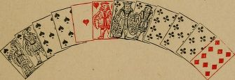

## Preface to the first edition

Since Hoyle's Treatise on Piquet was published in 1744, no original work on Piquet has appeared in the English language (so far as the author has been able to discover), though Hoyle has several times been edited with more or less success.

The issue of an authorized code of Laws*affords a good occasion for the publication of afresh treatise on the game. Although the plan of it is original, the author has made free use of the examples contained in Hoyle's valuable work.The author has also (through the great kindness of Mr. Clay,) been able to avail himself of that accomplished player's judgment and experience. For the assistance rendered to him by Mr. Clay, the author takes this opportunity of expressing his warmest thanks.

Portland Club, May, 1873.

# Description of the game

## Introductory

The Game of Piquet is played by two persons, with a pack of thirty-two cards - the sixes, fives, fours, threes, and twos, being thrown out from a complete pack. It is convenient to have two packs, each being used alternately.

## Dealing

The players cut for deal. The highest has choice. The order of the cards, both in cutting, and in calling and playing, is ace (highest), king,queen, knave, ten, nine, eight, seven (lowest).

The pack is then cut by the non-dealer, or elder hand, to the dealer, or younger hand, who reunites the packets and gives the top two cards to his adversary, the next two to himself, and soon, dealing two cards at a time to each player, until they have twelve cards apiece. Or, the deal may be by three at a time. The dealer places the undealt cards (called the stock), eight in number, face downwards on the table between the players. (See also Laws 1-17)

## Discarding

The players then look at their hands and proceed to discard, i.e., to put out such cards as they deem advisable (but see carte blanche). They then take in an equivalent number of cards from the stock. The elder hand has the privilege of thus exchanging five of his cards. He may take any less number, but he must exchange one. He separates his discard from his hand, places it aside, face downwards on the table, and takes from the top of the stock the number of cards discarded.

If the elder hand takes all his five cards he leaves three for the younger hand. If he discards less than five cards (leaving more than three in the stock) he announces the fact by saying, "I only take four", or three, or less, as the case may be; or, "I leave a card", or two, or more cards, as the case may be.

When the elder hand discards less than five cards he is entitled to look at the cards he leaves. For example: If he discards four cards, he takes the top four cards of the stock, and looks at the fifth, the one left on the top of the stock after he has taken his four. If he discards but three cards, he may similarly look at the two cards left, and so on. He returns the cards thus looked at to the top of the stock without showing them to his adversary.

The younger hand has the privilege of discarding three cards. He is obliged to discard one.

If the elder hand has left any of his cards, the younger hand may take all that remain in the stock, discarding an equal number. Thus, if the elder hand has left one card, the younger may take four, viz., the one left and his own three. He separates his discard from his hand,and lays it aside as explained in respect of the elder hand; and, in a similar way, takes his cards from the stock after the elder hand has taken in.

Whether the elder hand takes all his cards or not, the younger hand must take his cards from the top of the stock, including any card or cards that may have been left by the elder hand. For instance, the elder hand takes four cards; the younger hand only takes two, and leaves two cards. He must take the card left by the elder hand and the top card of the other three, and must leave the bottom two.

If the younger hand leaves any cards, he announces the number left. He has a right to look at cards he leaves, at any time before he plays to the first trick, but not afterwards. He must declare whether he will look at them or notas soon as the elder hand has named the suit he will first lead (which he generally does by leading a card). If the younger hand looks at them, or at any of them, he must also show all that are left to the elder hand, the elder hand first naming the suit he will lead. If the younger hand elects not to look at the cards left, the elder cannot see them.

Cards left untaken, and not looked at, must be kept separate from the hands and discards.

Each player may look at his own discard at any time during the play of the hand; but he must keep his discard separate from his other cards. (See also Laws 21-45)

## Calling and showing

The discarding and taking in being over, the players next announce or _call_ certain combinations of the cards in hand, and, if good, score for them. These combinations are point, sequences, and quatorzes and trios.

The point must be announced first (Law 46). It is scored by the player who calls the suit of greatest number. If each player's best suit contains an equal number of cards, the point is then scored by the one who calls the suit of greatest strength, according to the following way of valuing it: The ace is valued at eleven, each of the court cards at ten apiece, and the other cards at the number of pips on each.

The elder hand calls his point, thus: Suppose his best suit to consist of five cards. He would call, "Five cards." If the younger hand has no suit of equal or greater number, he replies, "Good." The elder hand then names the suit, saying, "In spades" or as the case may be, and counts one for each card, saying, "Five."

If the point called by the elder hand happens to be equal in number to the best suit of his adversary, the younger hand says "Equal". The elder then announces the value of his cards. Thus: the elder's point is ace, king, knave, nine, eight; he would say, "Forty-eight" or, "Making eight". If the younger hand's five cards make less than forty-eight, he replies, "Good", and the elder then names the suit. If the younger hand's point makes exactly forty-eight, he says,"Equal". The elder hand then names the suit in which his equality is, but does not count anything for it.

If the younger hand's five cards make more than forty-eight, he says, "Not good", and the elder hand does not name the suit he called.

If the younger hand has a point consisting of a greater number of cards than the one called by his adversary, he says, "Not good", and the elder does not name the suit he called.

When the younger hand's point is equal, he names the suit after the elder has finished calling his hand and has led a card, but he does not count anything for point. If the younger hand's point is good, he names the suit and reckons one for each card of the point as soon as the elder has led a card.

A player calling a point which is smaller than his best suit, can correct his miscall before the younger hand has answered "Not good" or "Equal."

It is usual, but not compulsory, to call sequences next after point: quatorze or trio maybe called before sequence, without prejudice to a subsequent call of sequence.

The elder hand should first call his best sequence. Any three or more cards of the same suit held in hand in the order given previously constitute a sequence. Sequences, and the amounts reckoned for them when good, are as under:

| A sequence of | eight | cards (named a | huitieme | ) scores | eighteen. |
|               | seven |                | septième |          | seventee. |
|               | six   |                | sixième  |          | sixteen. |
|               | five  |                | cinquième |         | fifteen. |
|               | four  |                | quart    |          | four. |
|               | three |                | tierce   |          | tree. |

It will be observed that tierces and quarts reckon one for each card; and that higher sequences reckon one for each card, with ten added.

Sequences are further defined by name according to the card which heads them. Thus, a sequence of king, queen, knave, is named a tierce to a king; ace, king, queen, is called a tierce major; and so on for other sequences headed by an ace. A sequence of nine, eight, seven, is called a tierce minor; and so on for other sequences of the lowest cards.

Whether or not a sequence is good is determined by (a) the number of cards it contains, and by (b) the highness of the cards. A higher sequence is superior to or good against a lower one containing the same number of cards; but a sequence containing a greater number of cards, even though low ones, is good against a higher sequence containing fewer cards. For example : A tierce major is good against any other tierce; a quart minor is good against a tierce major.

The elder hand, when calling his sequence, names it thus : "A quint minor," "A quart to a queen", or whatever it may be. The younger hand says, "Good", "Equal", or "Not good", as in the case of the point. If good or equal, the elder hand then names the suit in which his sequence is. If not good, the younger calls his sequence, and names the suit in which it is, after the elder has finished calling and has led a card.

When a player has a sequence that is good, he reckons one for each card of it, and an additional ten if it is a sequence of five or more cards. The player whose sequence is allowed to be good, is also entitled to reckon all smaller sequences in his hand, notwithstanding that his adversary holds a sequence of intermediate value. For example: A has a quart to a queen (queen, knave, ten, nine) in one suit and a tierce minor (nine, eight, seven) in another suit; B has a quart to a knave (knave, ten, nine, eight) in a third suit. A calls a quart to a queen, which is good. He scores four for it, and then calls the tierce minor, and scores three for that. B's quart to a ten counts nothing, and does not prevent A from reckoning the tierce minor.

If the two players' sequences are equal, the equality is called by both, and neither scores anything for sequence, even though one player may hold a second sequence of equal value, or an inferior sequence. The equality of the superior sequence nullifies the whole. Thus :  A calls a tierce major; B says, "Equal". A and B are precluded from scoring a second tierce major or any smaller sequence.

If the elder hand inadvertently calls a low sequence, holding a higher one, he may correct his miscall before it has been replied to by the younger hand. After the younger hand has replied, "Good",, or "Equal", the elder must abide by his call, and can only reckon sequences equal to, or lower than, the one he called. Thus : A has a quart minor and a tierce minor. If he first calls a tierce minor, and it is admitted to be good, he can reckon two tierce minors, but he cannot reckon the quart.

There is one exception to this. If the elder hand calls a sequence that is good against the cards (i.e., better than any sequence the younger hand could possibly have in hand and discard taken together), he can reckon any sequence he holds, even though it is better than the one first called. For example: A has a quart to a king, and a tierce to a queen, good against the cards. If he first calls a tierce to a queen, he may afterwards reckon his quart.

Some players show all that they claim as good or equal; this, however, is not compulsory, unless the cards are asked for.

As the law now stands, calling is equivalent to showing. Hence, if A calls, say, "Forty-eight in diamonds," the only diamonds he can hold being ace, knave, ten, nine, eight, B is deemed to know that A holds a quart. A forgets to reckon his quart, and leads a card. B cannot reckon any equal or inferior sequence. If A remembers he has not reckoned the quart, he can rectify the omission before B has played to the first trick.(See Law 56 and Case IV.)

The younger hand is not bound to call his best sequence first. Thus, if the elder has called a tierce major, and the younger has replied, "Not good", the younger is at liberty to show and count a tierce minor first, and then a quart or larger sequence. The reason for the difference between the elder and younger hands in this respect is that the younger is only reckoning (adding up his score); but the elder is ascertaining whether what he calls is good, and, by calling a lower sequence before a higher, he might gain information as to the contents of his opponent's hand to which he is not entitled. The elder hand, however, having called a sequence which is good, may reckon lower sequences in any order for the same reason, viz., that he is then only adding up his score.

After sequence, quatorzes (i.e.,four aces, kings, queens, knaves, or tens), or trios (three of any of these), are called and reckoned as before, except that in this combination there can be no equality. Quatorzes or trios of cards smaller than tens are of no value. A quatorze, if good, reckons fourteen (one for each card with ten added); a trio if good counts three. Any quatorze is good against a trio; thus, four tens are good against three aces. If each player has a quatorze the highest is good; the same if each has a trio; and, as in the case of sequences, anything that is good enables the player to count all smaller combinations of four or three in his hand, and nullifies any that the adversary may hold of intermediate value. For example: A has four tens and three knaves; B, three aces. A. scores fourteen for tens, and three for knaves; and B does not count his aces.

A quatorze or trio is called thus: "Four aces", "Three queens", or as the case may be. The younger hand then says: "Good", or "Not good", as before. The cards of a quatorze or trio are never shown on the table. The adversary, however, has a right to demand their production if he thinks fit.

The reason that quatorzes are not shown is that when aces, kings, queens, knaves, or tens are called, the adversary knows what the cards are. When a player might hold a quatorze, but only calls three of that rank (as, e.g. A calls three kings, when he might have held four), the adversary is entitled to know which card is not reckoned. In the case of the example given, B might say, "Show your kings", by which means he would ascertain the king that is not called. But the usual course is for B to say, "Which king do you not reckon?", and A is bound to reply.

In calling quatorzes or trios the elder hand should call his best first, as, if he calls a lower one, he cannot afterwards reckon a higher one, unless the lower one is good against the cards. If the one first called is good, any lower ones may be reckoned without regard to order, as in the case of sequences.

The younger hand may reckon his quatorzes or trios, if good, in any order. He is not obliged first to call his best, and he may rectify a miscall of any kind until he has played to the first trick,for the reason already given.

After the elder hand has finished calling, and has reckoned all that he has good, he leads a card. Before playing to this card, the younger hand reckons all that he has good, or calls all that he has equal.

A player is not bound to call anything unless he pleases, and he may always call less than he holds, if he does not desire to expose his hand. (See also Laws 46-56)

## Playing

The players having called what they have good or equal, and reckoned what they have good,next proceed to play the hands. The elder hand leads any card he pleases, and his opponent plays to it. The younger hand must follow suit if able, but otherwise he may play any card he thinks fit.

Two cards, one played by each player, constitute a trick. The trick is won by the player who plays to it the higher card of the suit led. A player is not obliged to win the card led unless he chooses, if he can follow suit without. The winner of the trick leads to the next, and soon, until all the twelve cards in each hand a replayed out.

During the play the leader counts one for each card led. He counts one whether he wins the trick or not. If the leader wins the trick, his adversary counts nothing in play; but if the second player wins the trick, he also counts one.The winner of the trick again counts one for the card he next leads, and so on.

The winner of the last trick counts two instead of one.

The tricks are left face upwards on the table in front of the player who wins them. They may be examined by either player at any time.

If each player wins six tricks, the cards are divided, and there is no further score. If one player wins more than six tricks (called winning the cards), he adds ten to his score, beyond what he has counted in hand and play. If one player wins every trick (called winning a capot), he adds forty to his score instead of ten: ten for the cards and thirty for the capot.

All cards scored for as good, or called as equal, must be exhibited to the adversary if demanded during the play of the hand. This, however, does not apply to a call of an equal number of cards for point by the younger hand, when the strength of his point is inferior to that of the elder's. Among players, the cards are not as a rule exhibited; but all necessary questions with regard to them are replied to. Thus: A scores a point of five cards, and plays three of them. Presently, B wants to refresh his memory, so he says, "How many of your point have you ?", or "How many spades?", or as the case may be; and A is bound to reply "Two". Similarly, if A had scored three kings, B is entitled to a reply to the question "What kings have you in hand?", or B might ask, "Have you anything in hand that you have called ?", then A must tell him. (See also Laws 57-60)

## Carte blanche, pique and repique

In the foregoing pages carte blanche, pique and repique have been omitted in order to simplify the description of the game.

If either player has dealt to him a hand which contains neither king, queen, nor knave, he holds carte blanche. This entitles him to score ten. Before he takes in he must show the carte blanche by dealing his cards quickly one on top of the other, face upwards on the table, after which he retakes them into his hand. If either player has carte blanche, he must inform his adversary at once, by saying, "I have a carte blanche", or "Discard for carte blanche." As soon as the adversary has discarded, the carte blanche is shown to him. (See also Laws 18-20)

If the elder hand scores, _in hand and play_,  thirty or more before his adversary counts anything that hand, he wins a _pique_. A _pique_ entitles the player to add thirty to his score; but in all other respects the hand is played as already explained. For example : A has a quint major, which is good for point and sequence, and three aces, which are also good. He counts twenty for the point and quint, and three for the aces, and then leads the quint major and the two aces, or one of the aces and some other card. This makes him thirty; and, as his adversary has not scored anything, it is a _pique_. A, when he leads the card which makes him thirty, instead of counting "Thirty", counts "Sixty". It is not necessary that the card led which makes thirty should win the trick. The elder hand, having reckoned twenty-nine when his adversary has reckoned nothing, and having the lead, wins a _pique_ even if he leads a losing card.

If a player scores, _in hand alone_, thirty points or more by scores that reckon in order before anything that his adversary can count, he wins a _repique_. A _repique_ entitles the player to add sixty to his score. Thus: If a player has point, quint, and quatorze (all good), he _repiques_ his adversary. He counts five for point, fifteen for sequence, making twenty, and fourteen for quatorze, making thirty-four. Instead of counting "Thirty-four," he counts "Ninety-four." In all other ways, the hand is played as already explained.

Equalities do not save a _pique_ or a _repique_. In the case of an equality, the game proceeds as though no such mode of scoring existed. Thus: A has point equal, quint and quatorze, both good, and leads a card. He wins a pique.

## Scoring

During the progress of the hand, each player continues to repeat aloud the amount of his score that hand for the time being. At the end of the hand, the number scored is written on a scoring card, each player recording both his own and his opponent's score, in separate columns.

Although the scores are, for the sake of convenience, recorded only at the end of the hand, they are recordable when they accrue, whether made by the elder or younger hand, in the order given in the following table of precedence:

  1. Carte blanche.
  2. Point.
  3. Sequences.
  4. Quatorzes and trios.
  5. Points made in play.
  6. The cards.

It is important to bear in mind this order of accretion in the case of piques or repiques. Thus, a pique can only be won by the elder hand, as the card he leads counts one in play before the younger hand plays; hence it stops a pique. But the one reckoned by the elder hand, when he leads his first card, does not prevent his being repiqued if he has nothing good, and the younger hand can score thirty or more in hand, because scores in hand reckon before points made in play. So, also, if the elder hand scores thirty or more in hand, he does not necessarily gain a repique. Thus he may have a quint (good), a tierce, and a quatorze(good). But if his point is not good, he does not gain a repique, although he scores thirty-two in hand alone; because the younger hand's point is recordable in order before the sequences and quatorze.

To take another example; A (elder hand) has a huitième (good for twenty-six) and a tierce (good for three more). He then leads a card, and thus reaches thirty. B (younger hand) has three tens which are good. The three tens save a pique, as they reckon in order before the point made in play by A.

Carte blanche, taking precedence of all other scores, saves piques and repiques. Carte blanche counts towards piques and repiques just the same as other scores. Thus: A player showing a carte blanche, and, after discarding, having point and quint (both good), would repique his adversary.

A capot does not count towards a pique, as the forty for the capot is added after the play of the hand is over. For instance: A (elder hand) has ace, king, queen, knave, eight of spades; ace,king, knave, ten, eight, seven of hearts; and ace of diamonds. His point and quart are good.These, with three aces, reckon thirteen. He wins every trick, and his total score is twenty-six. He adds forty for the capot, making him sixty-six. He does not gain a pique, as he only made twenty-six in hand and play.

A player who reckons nothing that deal as a penalty (see Laws 25, 27, 28, 29, 31, 33, 35, 54, and 58) is not piqued or repiqued if he holds any cards which, but for the penalty, would have scored before his adversary reached thirty. His cards though not good to score, are good to bar his adversary.

A partie consists of six deals, each player dealing three times. The partie is won by the player who makes the higher score in six deals. If both players score the same number, each deals once more. If there is a second tie, the partie is drawn.

By agreement the partie may consist of only four deals, the scores in the first and last deals counting double. In case of a tie, each deals once more, the scores in the extra deals counting single.

The winner of a partie deducts the points scored by his opponent from his own, and adds a hundred to the difference. Thus : A scores in the six deals 131; B scores 113. A wins 131 - 13 = 118 points. Should the loser score less than a hundred in the six deals, the winner (whether he has made a hundred or not), adds the points scored by his adversary to his own, instead of deducting them, and also adds a hundred to his score. Thus: A scores 125; B scores 81. A wins 125 + 181= 306. This is called winning a _rubicon_. (See also Laws 61-74)

When, during the last hand of a partie, a player finds (before the play of the hand begins) that he cannot save his rubicon, he is not required to count any points in play. He throws down his hand, and tells his adversary to count every trick (thirteen), and the cards (ten). He may, if he pleases, play to divide the cards; but in that case, he has to add to his score the points he makes in play. Or, his adversary may play for a capot; but that does not affect the case, as, if capoted, the loser has no points in play to score.

Scoring cards and pencils are required. The diagram shows a card ruled for six parties,or for five parties if the totals are recorded on the same card.

The game is played for so much a point, or for so much a hundred, odd money not being reckoned in the final total. Thus : A and B play five parties, at ten shillings a hundred (about equal to half-crown points at whist). A wins 75 points, as shown by the card. Fractions of fifty points are not reckoned ; A wins five shillings. Some players only neglect fractions of twenty-five points; this should be agreed beforehand. Two penny points are reckoned at a pound a hundred, fractions of fifty points not counting in the final total. Three-penny points are not reckoned by the hundred, but by multiples of forty, fractions of forty points not counting; hence 75 points only score as 40. At six penny or shilling points, fractions of a pound are excluded in reckoning the finals; 75 points, therefore, only score as 60.

<table class="calibre8"><tr class="calibre9"><td class="calibre10">
A
</td><td class="calibre10">
B
</td><td class="calibre10">
A
</td><td class="calibre10">
J3
</td><td class="calibre10">
A
</td><td class="calibre10">
J3
</td><td class="calibre10">
A
</td><td class="calibre10">
B
</td><td class="calibre10">
A
</td><td class="calibre10">
B
</td><td class="calibre10">
A
</td><td class="calibre10">
B
</td></tr><tr class="calibre9"><td class="calibre10">
27
</td><td class="calibre10">
13
</td><td class="calibre10">
15
</td><td class="calibre10">
30
</td><td class="calibre10">
20
</td><td class="calibre10">
IS
</td><td class="calibre10">
2S
</td><td class="calibre10">
14
</td><td class="calibre10">
23
</td><td class="calibre10">
12
</td><td class="calibre10">
Tot
</td><td class="calibre10">
als.
</td></tr><tr class="calibre9"><td class="calibre10">
15
</td><td class="calibre10">
31
</td><td class="calibre10">
75
</td><td class="calibre10">
A
</td><td class="calibre10">
4
</td><td class="calibre10">
115
</td><td class="calibre10">
11
</td><td class="calibre10">
36
</td><td class="calibre10">
9
</td><td class="calibre10">
25
</td><td class="calibre10">
150
</td><td class="calibre10">
476
</td></tr><tr class="calibre9"><td class="calibre10">
44
</td><td class="calibre10">
G
</td><td class="calibre10">
45
</td><td class="calibre10">
G
</td><td class="calibre10">
10
</td><td class="calibre10">
42
</td><td class="calibre10">
00
</td><td class="calibre10">
12
</td><td class="calibre10">
40
</td><td class="calibre10">
S
</td><td class="calibre10">
416
</td><td class="calibre10">
141
</td></tr><tr class="calibre9"><td class="calibre10">
IS
</td><td class="calibre10">
20
</td><td class="calibre10">
32
</td><td class="calibre10">
12
</td><td class="calibre10">
33
</td><td class="calibre10">
11
</td><td class="calibre10">
S
</td><td class="calibre10">
41
</td><td class="calibre10">
15
</td><td class="calibre10">
■ 26
</td><td class="calibre10">
126
</td><td class="calibre10">

</td></tr><tr class="calibre9"><td class="calibre10">
35
</td><td class="calibre10">
12
</td><td class="calibre10">
G
</td><td class="calibre10">
38
</td><td class="calibre10">
3
</td><td class="calibre10">
74
</td><td class="calibre10">
10
</td><td class="calibre10">
17
</td><td class="calibre10">
27
</td><td class="calibre10">
13
</td><td class="calibre10">
692
</td><td class="calibre10">
617
</td></tr><tr class="calibre9"><td class="calibre10">
25
</td><td class="calibre10">
23
</td><td class="calibre10">
51
</td><td class="calibre10">
2
</td><td class="calibre10">
5
</td><td class="calibre10">
41
</td><td class="calibre10">
15
</td><td class="calibre10">
24
</td><td class="calibre10">
16
</td><td class="calibre10">
20
</td><td class="calibre10">
617
</td><td class="calibre10">

</td></tr><tr class="calibre9"><td class="calibre10">
1G4
</td><td class="calibre10">
lU
</td><td class="calibre10">
224
</td><td class="calibre10">
02
</td><td class="calibre10">
75
</td><td class="calibre10">
301
</td><td class="calibre10">
103
</td><td class="calibre10">
144
</td><td class="calibre10">
130
</td><td class="calibre10">
104
</td><td class="calibre10">
75
</td><td class="calibre10">

</td></tr><tr class="calibre9"><td class="calibre10">
14
</td><td class="calibre10">

</td><td class="calibre10">
192
</td><td class="calibre10">

</td><td class="calibre10">

</td><td class="calibre10">
175
</td><td class="calibre10">

</td><td class="calibre10">
3
</td><td class="calibre10">
4
</td><td class="calibre10">

</td><td class="calibre10">

</td><td class="calibre10">

</td></tr><tr class="calibre9"><td class="calibre10">
150
</td><td class="calibre10">

</td><td class="calibre10">
41G
</td><td class="calibre10">

</td><td class="calibre10">

</td><td class="calibre10">
47G
</td><td class="calibre10">

</td><td class="calibre10">
141
</td><td class="calibre10">
126
</td><td class="calibre10">

</td><td class="calibre10">

</td><td class="calibre10">

</td></tr></table>

At chouette piquet, the points of each partie are reckoned as multiples of ten, adding one to the tens for units above five, and neglecting units from one to five. Thus, 416 counts 420; 141 counts 140. As the score must always end in a naught, the naughts are omitted when entering the figures. Taking, as an example, the parties on the scoring card, the totals might be entered as under:

<table class="calibre8"><tr class="calibre9"><td class="calibre10">
First Partie.
</td><td class="calibre10">
Second Partie.
</td><td class="calibre10">
Third Partie.
</td><td class="calibre10">
etc.
</td></tr><tr class="calibre9"><td class="calibre10">
A + 30B- 15C - 15
</td><td class="calibre10">
A + 84B -42C -42
</td><td class="calibre10"> A - 96B + 48 C + 48</td></tr></table>

Instead of writing each score at length, as above, and taking out the results at the end, it is found convenient in practice to add and subtract the totals after every partie, and to keep a separate scoring card for that purpose, as shown below:

<table class="calibre8"><tr class="calibre9"><td class="calibre10">
A +
</td><td class="calibre10">
30 +
</td><td class="calibre10">
114
</td><td class="calibre10">
+
</td><td class="calibre10">
18 +
</td><td class="calibre10">
32 +
</td><td class="calibre10">
19
</td></tr><tr class="calibre9"><td class="calibre10">
B -
</td><td class="calibre10">
15 -
</td><td class="calibre10">
57
</td><td class="calibre10">
-
</td><td class="calibre10">
9 -
</td><td class="calibre10">
37 -
</td><td class="calibre10">
50
</td></tr><tr class="calibre9"><td class="calibre10">
C -
</td><td class="calibre10">
15 -
</td><td class="calibre10">
57
</td><td class="calibre10">
-
</td><td class="calibre10">
9 +
</td><td class="calibre10">
5 +
</td><td class="calibre10">
31
</td></tr></table>

A wins 190 ; C, 310 ; B loses 500. At tenshillings a hundred, when fractions of fifty pointsare not reckoned, A wins 150 (or fifteen shillings);C wins 300 (or thirty shillings). B, on the score,actually loses 500 (or fifty shillings); but in con-sequence of fractional parts of fifty points notcounting in the final total of amounts receivable,B gets off with a loss of forty-five.

## EXAMPLE

The following Example will show more distinctly than mere description the mode of playing the game. The reader, if previously unacquainted with Piquet, is advised, after reading the Description of the Game, to play over the Example, and then to re-peruse the description. When playing the Example, it is advisable, in the case of learners, to place the cards face upwards on the table.

A and B are the players.

A (elder hand) has dealt him ace, king, knave of spades; ace, queen, knave, eight of hearts;knave, eight, seven of clubs; and nine, eight of diamonds.

He discards king of spades; eight, seven of clubs; and nine, eight of diamonds.

He takes in nine, eight of spades; king of hearts; nine of clubs; and king of diamonds.

B (younger hand) has ten, seven of spades;ten, nine, seven of hearts; king, queen, ten of clubs; and ace, queen, knave, ten of diamonds.

He discards seven of spades; and nine, seven of hearts.

He takes in queen of spades; ace of clubs;and seven of diamonds.

The game then proceeds thus:-

A (calls his point), "Five cards."

B (says), "What do they make?"

A (replies), "Forty-nine," or "Making nine."

B (replies), "Good."

A (says), " In hearts; and quart major."

B, "Good."

A (counting his point and sequence), " Five and four are nine." " Three knaves ? "

B, "Not good."

A (leads ace of hearts, and says), "Ten."

B (says), " Four tens fourteen, and three queens seventeen." (Plays the ten of hearts, j

A (leads all the hearts, and says), " Eleven,twelve, thirteen, fourteen."

B (plays seven, ten, knave, and queen of diamonds, and, repeating his score, says), "Seventeen."

A now has five tricks, and, in order to win the cards, he should lead anything but a spade; for B,having called queens and tens, must have queen,ten of spades.

A (leads king of diamonds, and says), "Fifteen."

B (wins with ace of diamonds, and says)," Eighteen."

B (leads, ace, king, queen, and ten of clubs,and says), "Nineteen, twenty, twenty-one, twenty-two."

A (plays nine, knave of clubs, and eight, nine, of spades, and, repeating his score, says), "Fifteen."

B (leads queen of spades, and says), "Twenty-three."

PIQUET. 105

A (wins with ace, and says), "Sixteen," (and then leads knave of spades, and says), " Eighteen,"(and then adding the score for the cards, says),"Twenty-eight."

B (repeating his score, says), "Twenty-three."A then writes on his scoring card, 28, 23 ; B writes on his card, 23, 28; the cards are gathered up by B, and the other pack is cut for A's deal.

## Chouette piquet

Sometimes Piquet is played by three persons. The three players (A, B, C,) cut. The one who cuts the highest card (A) has choice of deal and cards, and plays one partie, _a la chouette_, against the other two in consultation. The player who cuts the lowest card (C) sits out, and advises B.

If the single player (A) wins the partie, he continues to play against the other two. C takes B's place, and B advises C ; and so on.

As soon as A loses a partie, the player who advised in that partie (say C) takes A's place. B plays against the other two, and A advises C. If C loses, A takes C's place, and C advises A; if C wins, A takes B's place, and B advises A; and so on.

The single player has choice of deal and cards throughout, and plays double stakes, as at dummy.

When a chouette is played, the totals of each partie are recorded on a separate scoring card.

## Conduct of the game

### Shuffling

The pack should be thoroughly shuffled after every hand. Owing to the nature of the game,cards of the same suit are often played together.Thus : A has a sixième major in spades; B, a sixième minor in hearts. A puts down his sixième, and says, "Play six cards." B has no spade, and plays his sixième minor. A then, seeing he cannot win another trick, lays down the remainder of his sorted hand; on these cards B places the remainder of his sorted hand. Each scores seven in play. If the cards are now taken up together and are not well shuffled, the consequence will be that,when this pack is dealt again, the sixièmes will be pretty equally divided between the players, and the cards in the stock will run in suits; or if the pack is so cut that one of the sixièmes is at or near the bottom, those cards will form the major part of the stock. Even if the cards are moderately shuffled,the cards will have a tendency to keep together in suits, as any one may convince himself by giving an ordinary shuffle to a sorted pack, and then turning it face upwards.

### Dealing

The player who cuts the higher card should elect to deal. There is a slight advantage in having the first deal. The player who deals first is elder hand in the last deal of the partie, and is therefore the attacking hand when he has the best opportunity of discarding, or of playing, to the score.

### Management of the stock

After dealing, count the cards in the stock (and see Laws 10, 11, 12, 39, 40, 41, 42, and 43). Place the stock face downwards on the table, in one packet (Law 9). Some dealers separate the stock into packets of three and five. The elder hand should always object to this, as, if he takes up a card he is not entitled to see (which he might readily do if the packets happen to be separated wrongly), he can reckon nothing that deal.

### Taking up the hand

On taking up your hand, count that it contains the right number of cards; if not, announce the fact (and see Laws 11, 38, 39), While counting and sorting your cards, look for carte blanche.

Your next step is to decide on your discard.(See Discarding)

### Taking in

Having discarded, you proceed to take in.When taking in, always count that you leave the full number of cards for the younger hand, the penalty for mixing one of his cards with your hand being that you can reckon nothing that deal; and this even if there is an erroneous deal,and there are not the right number of cards in the stock. The best method is to draw the stock towards you, at the same time spreading it slightly,when you can easily count the stock before taking up a card.

The younger hand, before taking in, should also count that the proper number of cards are left in the stock; if too many are left, and the younger hand mixes one of his opponent's cards with his hand, he can reckon nothing that deal.

### Calling and showing

Before calling your hand, you should ascertain what remains good against you, or what there is equal. If necessary, examine your discard for this purpose.

When a point or sequence is called, which is good or equal, it is a safe plan, especially for novices, to show it; because a player who voluntarily shows anything, which he claims to be good or equal, is liable to no penalty for miscalling(Law 55).

If you are not in the habit of showing what you call, and have put out a card of your point, which is nevertheless allowed to be good or equal, and the absent card may make a difference to your adversary in playing the cards, you should inform him of the value of the card you do not call. For example: You are younger hand, and have discarded the king of spades. You have taken in spades, and your point, which is good, is ace,knave, ten, eight of spades. When calling the point, you should say, " Thirty-nine in spades, and I do not reckon the king." Your adversary will then know, as he is entitled to know, and as he could know if he asked to see your point, that he need only keep one guard to his queen when playing the cards.

You would be equally entitled not to reckon the king, if you had it in hand, and wished to conceal your strength, in hopes of persuading your opponent to unguard his queen when playing the cards. But as calling without showing draws special attention to the absence of the king, it seems preferable always to show your point, and to say nothing about what you do not reckon. In the case supposed, put ace, knave, ten, eight of spades on the table, and say, "Good for four", and let your adversary think what he pleases about the king.

As a matter of etiquette, if, under such circumstances, you do not show your point, and do not announce that the king is out, your adversary would have just cause of complaint at not being informed. If he is misled by your ignorance of this point of etiquette, the only reparation you can make is to offer to play the cards again.

If you have, or might have, two points of the same counting value, it is also your duty to declare which of them you claim as good or equal 
Thus : You have king, queen, ten, eight of one suit, and might have ace, queen, ten, seven of another. If thirty-eight is good or equal, you should say, "In spades", or "In hearts", or as the case may be, without waiting to be asked in which suit your point is. If younger hand, you need not announce the suit until the elder has led a card.

Similar observations apply to sequences and trios (see Case XIL).

If you call a trio, allowed to be good, when you might hold a quatorze of the same rank, as three kings when you might hold four, you should state which king you do not reckon,e.g. "Three kings, not reckoning the king of diamonds". Many players omit to say which card of a quatorze they do not reckon, and wait to be asked. In that case, you should enquire which card of the quatorze your adversary does not reckon; but you should not put the question until he has played a card (see also, Case IV.).

The question should be in this form, "Which do you not reckon ?". You must not assume that a card is out merely because it is not called;and your adversary is not bound to admit that he has not called a card (whether by inadvertence or design) which he holds in his hand.

If the question is put in another form, e.g. " Which king have you put out ?" and the adversary has not put out a king, but holds four, having called three, he is entitled to reply, "I do not reckon the king of spades", or of the suit in which he deems it best to conceal the king from you. Or, he may simply answer, "King of spades". In giving this answer, he assumes, as he is entitled to do, that you have asked him the regular question. He leaves it doubtful whether he has a king out or not; and all Piquet players understand his reply in that sense (see Case XVI.).

Many players have a habit of referring to the discard while the hand is being called. It is better to avoid this, as, by your consulting the discard, a shrewd adversary may gain a clue to a card you have rejected, or may be reminded of a miscall. Thus, he calls three queens, and you, having no queen in hand, immediately look at your discard. If you find a queen there, your opponent will probably conclude that you were looking for the fourth queen; if you do not find a queen there, and there has been a miscall, your adversary is reminded that he might have four queens, while he is in time to rectify his error.

### Playing the cards

During the play of the cards, the opponent is entitled to be informed as to all the cards you have in hand, which have been reckoned as good or called as equal.

The question is usually put in this way, "How many of your point ?" or, "How many of your quint?" or as the case may be. Sometimes, however, it takes this form, "How many clubs?" or as the case may be.

Suppose you hold three clubs, and have only called two of them. You are entitled to reply, "Two that I have called", or, "Two of my quint", or simply, "Two". This is understood by all Piquet players as leaving it doubtful whether you have a third club, and not necessarily that you have discarded one. The information should be only as to cards called for the purpose of scoring, or of preventing an adverse score. The enquirer is bound in effect to say "How many of so and so have you that you have called ?" (See Cases XV and XVL)

It is disputed whether a player, who has the wrong number of cards in hand, may cover his mistake by intentionally playing too many or too few to his adversary's lead. In strictness, the cards should be played one by one; but, for the sake of convenience the leader frequently puts down a number of winning cards together. If, on doing this, he says " Keep three (or four) cards", or as the case may be, it seems only reasonable that the second to play should be at liberty to do as he is bid, and to keep the number specified. He is not bound to count the cards led by his adversary, with whom the initial irregularity rests. But, if the second to play is told to play so many cards, the case is different, and he ought not knowingly to play any other number. He must then submit to the consequences of his blunder. Some players think that even in the first instance, the wrong number of cards should not be played with intention. This is a question of ethics, which can only be decided by the custom of the card table. No rule has ever been laid down. It is believed, after consultation with several players of repute,that the general custom is as here stated. The leader can always protect himself by counting the cards played.

Another undecided point in playing the cards, which often occurs, is this: At the end of a hand the leader says "All the others are yours". As a matter of fact, they are not yours, you having discarded a winning card. What is your proper course?

In the opinion of players well qualified to judge, you should make no reply to such an observation. If your adversary then proceeds to play his cards, you must play to them in the usual way, and let him win such tricks as he can. If he throws down his hand, and you have discarded a winning card, and therefore cannot win the remaining tricks, you should request him to play the cards one by one. Such a request is, no doubt, equivalent to informing your adversary that you have a winning card out, and the consequence may be somewhat disastrous to you. This is a misfortune which cannot be helped.

### Scoring

During the calling and the play of the hand, always keep in mind your adversary's score as well as your own, as, even among the most honourable players, mistakes sometimes occur. If you observe that your adversary is reckoning too much, correct him at once.

After the play of the cards, call both your own and your adversary's scores aloud as you record them; your adversary should do the same,or should admit your call to be correct.

At the end of the partie, similarly compare the total before entering it on your scoring card (and see Law 74).

## Discarding

### Introductory

On account of the variety and complexity of the considerations involved in discarding at Piquet, the few general rules that can be laid down are liable to frequent modification. Subject to this condition, a statement follows of the more important points to be borne in mind when discarding.

This statement is supplemented by the application of the Doctrine of Probabilities to various cases, and by a series of illustrative Examples.

### General rules

Before deciding on your discard, you should ascertain whether you hold anything which is good against the cards, or is equal, and what there is against you that may be reckoned as good, or called as equal.

For example: You take up A's hand. There are against you, a six card point, a quint major, and four tens. You have nothing good, and may be repiqued. In addition, there are two five card points against you, a quart minor, a tierce major, three kings and three queens. You should make yourself aware of all this before throwing out a card; and so on for other hands. At first, this will be slow work; but, with practice, you will be able to perform the mental operation of finding what there is against you, with but slight effort.

When discarding, elder hand, your main object, with moderately good cards, should be to plan an attack. You should freely unguard kings and queens, and should throw out whole suits, with a view to making a large score if you take into the suits you keep.

On the contrary, your first care, younger hand, should be to protect your weak places. You should keep guards to kings and queens; and you should seldom denude yourself entirely of a suit of which you hold one or two small cards only, as these may guard high cards taken in. The elder hand will probably lead his best suit; and that is not unlikely to be the one in which you were originally weak. For instance: Suppose you, being younger hand, take up the cards already referred to (A's hand), including nine, eight of diamonds. You should not part with both the diamonds, but should discard two small clubs and one diamond.

Keeping the best suit for point is essential inmost cases, and especially younger hand. The point is of much greater consequence than beginners suppose. Gaining the point makes an average difference of more than ten to the score, and, what is more important, it saves piques and repiques. It is, therefore, seldom the game for either player to discard from the suit which he selects for point.

Next in importance to the point are the cards. You should discard in such a way as to give the best chance of dividing or winning the cards. Winning the cards, instead of losing them, makes a difference of about twenty-three or twenty-four points.

In consequence of the previous consideration, it not unfrequently happens, more especially elder hand, that you should not keep the longest suit for point, when that suit is composed of low cards, and keeping them necessitates the discard of high cards from other suits.

Do not break into several suits in discarding if it can be avoided. For if cards are taken in to a broken suit, it remains ragged. When you have made up your mind to discard from a given suit, it is often right to throw the whole of it. If any card of that suit is kept, it would be (a) because it is a winning card ; or, (b) because it is a guarding card, more especially younger hand ; or, (c) because it makes up a quatorze or trio.

Referring to the hand already given (A's hand), you may discard from three suits, for at least of the above reasons, throwing out two small clubs, two diamonds, and king of spades, in order to keep the three knaves. There are four tens against you; and you have a poor chance of the point or of the cards, even if you keep the king of spades. But suppose you had the nine of hearts instead of the knave. You should then throw the clubs and diamonds, and keep two unbroken suits. Going for two suits is often the resource of a player in difficulties.

It is sometimes advisable to throw a whole suit, younger hand, either because it consists of three useless cards, or because keeping it may injure your hand in other respects. In the second case,the rejected suit should be one in which you are not likely to be attacked. Thus : If the suit discarded consists of king, knave, and a small one, the elder hand will probably avoid leading that suit should he happen to hold ace, queen of it. King, queen, and a small card is a suit which may be discarded without much probability of being attacked in it.

It is a common error with beginners at Piquet not to take all their cards, especially if taking the full number involves parting with high cards. The hands where all the cards should not be taken are few. There is not so great an objection, however, to the younger hand's leaving a card as to the elder hand's doing so; for, in the latter case, the card left may be taken by the adversary, but, in the former case, it is merely excluded from the player's hand. The principal situation for leaving a card, elder hand, is where there is a chance of a great score, and no repique against you.

Cards in sequence, or that may form a sequence with those taken in, should be kept in preference to others of equal value. Thus: If you are obliged to discard an ace or a king from an ace, king suit, discard the ace, as you may take in so as to hold a sequence to a king; if you discard the king you cannot hold a major sequence in that suit. But other considerations may cause you to select the king.Looking again at A's hand, p. 103, it will be seen that A throws the king in preference to the ace. His reason is that he has two aces and only one king; he may take in aces to form a trio or quatorze.

Again: Queen, knave, ten is a better suit to keep than king, knave, ten, unless it is deemed advisable to hold a king rather than a queen. It is generally right to retain a virgin tierce to a queen, especially younger hand, unless you see a chance of a great score in other suits.

Trios should be kept if they can be retained without injuring the hand in other respects. Thus: If about to discard a king or a queen of a suit, and you have two other kings, discard the queen; but if you have two other queens,discard the king.

It is seldom advisable to put out a high card for the sake of keeping a low trio, especially when there is a higher one or a quatorze against you. Many a hand is ruined by going for quatorzes of knaves or tens.

The discard is further affected by the state of the score, especially in the last two hands of the partie. If you are a good way ahead, and particularly in the last hand but one, if you have a chance of winning a rubicon, you should make a safe discard, with the view of dividing or winning the cards, in order to keep your adversary back.On the other hand, if the score is much against you, and you are under a rubicon, you are justified in making a bold discard. In the last hand, the discard must frequently be regulated by the state of the score.

### Calculations

The Piquet student should be acquainted with the following odds.

The odds that the elder hand (if he takes all his cards) will take in :

|                                                |            |             |
| ---------------------------------------------- | ---------- | ----------- |
| One named card are                             | 3 to 1     | against him |
| Two named cards are                            | 18 to 1    | "           |
| Three named cards are                          | 113 to 1   | "           |
| Four named cards are                           | 968 to 1   | "           |
| Five named cards are                           | 15503 to 1 | "           |
| One card (at least) of two named cards are     | 5 to 4     | "           |
| One card (at least) of three named cards are   | 3 to 2     | on him      |
| Two cards (at least) of three named cards are  | 6 to 1     | against him |
| One cards (at least) of four named cards are   | 5 to 2     | on him      |
| Two cards (at least) of four named cards are   | 3 to 1     | against him |
| Three cards (at least) of four named cards are | 32 to 1    | "           |

The odds that the younger hand (if he takes all his cards) will take in :

|                                               |           |             |
| --------------------------------------------- | --------- | ----------- |
| One named card are                            | 17 to 3   | against him |
| Two named cards are                           | 62 to 1   | "           |
| Three named cards are                         | 1139 to 1 | "           |
| One card (at least) of two named cards are    | 5 to 2    | "           |
| One card (at least) of three named cards are  | 3 to 2    | "           |
| Two cards (at least) of three named cards are | 21 to 1   | "           |
| One cards (at least) of four named cards are  | 29 to 28  | on him      |

These calculations properly applied will direct the player in discarding.

Thus: It is 3 to 1 that the elder hand does not take in a named card. It is, therefore, more advantageous to carry the best suit for point, and high cards for the chance of the cards, than to throw out any of these in hopes of taking in a card to complete a quatorze of queens, knaves, or tens (see Examples III., IV., and V)

The odds against taking in two or more named cards, or two of three named cards, elder hand, are so considerable, that, except in desperate cases, good cards should not be discarded on such a speculation. But the odds are very slight against taking one at least of two named cards, or two at least of four named cards ; and they are in favour of taking one at least of three or four named cards.

To apply these : If the elder hand has a quart major and two other aces dealt him, the odds that he will take in either the ten to his quart, or the other ace, are only 5 to 4 against him.

Again: If the elder hand carries three aces and three kings, the odds against his taking either the other ace or the other king are only 5 to 4 against him.

If the elder hand has a quatorze dealt him, and there is only one superior quatorze against him, he should, as a rule, keep the quatorze, as the odds that he will take in one card at least of four named cards are 5 to 2 in his favour. But this rule may require reconsideration, with a low quatorze, if, to keep it, cards must be put out that in other ways spoil the hand, as by compelling the player to discard from point or sequence, or to put out high cards that risk the loss of the cards, or of a capot.

With a quart to a king and two other kings, it is 3 to 2 in favour of the elder hand taking in the ace or nine to the quart, or the fourth king, and,therefore, it is very advantageous to keep the quart and the three kings.

If the elder hand has a quart to a king, and a quart major dealt him, and he is considerably behind in the score, and he must discard from one of the quarts, he should keep the quart to the king; for it is 3 to 1 against his taking in the ten to the quart major, but only 5 to 4 against his taking in either the ace or nine to the quart to the king. (For a further illustration of this calculation,see Example XXV.)

The chance of taking a certain number of cards included in a larger number of named cards, must not be confused with the chance of taking a certain number of named cards. For instance, if the elder hand has two kings and two queens dealt him, the odds are 3 to 1 against his taking in two of the other kings and queens. But the odds against his taking two kings or two queens under these circumstances (i.e., two named cards) are 17 to 2 against him.

The odds against the younger hand's taking in even one named card are so considerable (17 to 3 against him) that he ought not to discard on such a chance except in desperate cases (see Example XXX.), especially if by so doing he risks the winning or saving of the cards (see Example XIII.). The same rule applies a fortiori to more than one card.

It is only 5 to 2 against the younger hand's taking in one, at least, of two named cards. Hence, in some cases, he would discard on this chance (see Example XVIII. and Example XXXII.).

Again : It is only 3 to 2 against the younger hand's taking in one, at least, of three named cards. Therefore, if he must take in one of three cards to save a pique or a repique, it would be right for him to discard for this chance, even if, in order to do so, he must put out a valuable card,as a king, or one of his point. (For a further illustration of this calculation, see Example XXXI.)

It is 29 to 28 in favor of the younger hand's taking in one of four named cards. So, having no ace dealt him, he may calculate on taking in at least one; or, with two quarts (except major or minor quarts), he may expect to take a card to make a quint; or, with a quart major against him,he may calculate on drawing, at least, one of the quart major.

If the elder hand has two quatorzes against him(say of aces and kings), it is only 33 to 31 against his drawing both an ace and a king (i.e. Of drawing at least one of four aces, and at least one of four kings). Younger hand, it is 4 to i against taking in one of each quatorze.

The younger hand has two trios, say three knaves and three tens. Either of these, if improved into a quatorze, will save the rubicon.

To keep both the trios, in good play, he must leave a card. Ought he to keep the two trios, and leave a card, or to take three cards and discard from one of the trios?

If he takes all three cards, the probability that he draws the one card to complete the quatorze is 3/20 = 57/380

If he only takes two cards, the probability that he draws one at least of the two cards to complete a quatorze is 74/380

The odds are therefore 74 to 57, or about 4 to 3, in favour of leaving a card.

### Examples

Owing to the impossibility of calculating all the chances in many cases that present themselves in actual play, differences of opinion often arise as to the proper discard. Such differences of opinion may be expressed in respect of some of the following hands. The Author will be content if he has succeeded in avoiding glaring errors, and in exhibiting a series of Examples that serve to guide those who desire to learn the game of Piquet.

The score is assumed to be love all, unless otherwise stated.

Example I.

_Unguarding a kmg, elder hand, to keep the point.
Guarding kings, and protecting a weak suit,
younger hand._

With these cards the elder hand should throwout knave, eight, seven of spades, seven of hearts,and eight of diamonds, keeping the clubs for point,and the three kings. In order to keep the point he must unguard a king; and this, being elder hand, he does not hesitate to do.

The younger hand with these cards should throw eight, seven of spades, and eight of diamonds. He should keep both his kings guarded, and should on no account part with the seven of hearts, which would be of great service should he take in king of hearts, or queen and another.

Example II

_Keeping the point. Unguarding suits elder hand, and keeping guards younger hand._

The elder hand having these cards dealt him,should keep the quart to a king for point, and the four kings, discarding queen, knave of hearts, ace,knave of clubs, and ten of diamonds.

The younger hand should also keep the point and the four kings. In addition to this he should keep all his suits guarded, and should discard knave of hearts, and ace, knave of clubs. He should not part with the ten of diamonds.

Example III.

_Discarding from low trios., to keep the point._

Trios of queens, knaves, or tens, may be freely discarded from, if, in order to keep them, a card of the point has to be put out.

With these cards the elder hand should not keep his three queens, but should throw the clubs and the diamond, and retain the other two suits unbroken.

Example IV.

_Discarding from a trio, in preference to throwing from the point, or to leaving a card._

If the elder hand keeps his knaves he must either throw a card from his point or leave a card. Neither course is advisable. The general rule isn't to break into the point; and it would be dangerous for the elder hand to leave a card with two seven-card points, a quint, three aces, three kings, and three queens against him. He must sacrifice the knaves to keep his point, by which means he will, at all events, divide the cards. His proper discard is the heart and the four diamonds.

Example V.

_Discarding from a trio in order to keep the point. Going for two suits, with a better chance of the cards._

The elder hand has three queens, and there is no great score against him. Notwithstanding this,he should not part with the eight of his point(diamonds) to keep the queens, but should discard the spades and hearts. By sacrificing the queens he gives up a chance of fourteen; but by keeping the eight of diamonds he increases his chance of scoring the point, and he improves his chance of winning tricks in play.

It may be stated generally, that with ace, king, queen, and a small card of a suit, and three queens, or three knaves, or three tens not good against the cards, and such other cards that the player must either discard one of these or the small card of the point, the game is to keep the point.

Example VI.

_Discarding from a point which remains good against the cards._

It is hardly necessary to state that the objection to throwing a card from the point does not apply if, after the discard, the point still remains good against the cards.

The discard, elder hand, is seven of spades, the two hearts, the club, and the diamond, for the reasons already given.

If the club or the diamond were the seven, the discard is less easy; most players would leave a card instead of throwing one of the point.

Example VII.

_Discarding from low trios, to divide or win the cards. Giving up the point, younger hand, in order to keep suits guarded._

It is seldom right to throw out an ace, or a king, in order to carry three queens, knaves, or tens, if by so doing the loss of the cards is risked.

The principal exception is when one named card taken in gives a good chance of a pique or a repique, the cards ought then generally to be risked, subject however to the state of the score, a safe discard being preferable as a rule when ahead.

The elder hand should discard the clubs and diamonds for the reasons already given.

The younger hand's discard is doubtful: on the whole, it seems safest for him to give up the point,and to discard three spades, keeping all his suits guarded, and going for the chance of queens and of dividing the cards.

In the above hand, substitute the ten of spades for the seven. The elder hand should then keep the spades and the queens. The younger hand should throw out the three clubs, unless very backward in the score.

Example VIII.

_Discarding from low quatorzes, to divide or win the cards._

If the loss of the cards is risked by keeping quatorzes of knaves or tens, it is generally the game to sacrifice the quatorze. Younger hand, especially, should not put out a high card, to keep a low quatorze, when there is a superior quatorze against him.

The younger hand should discard knave of hearts,and knave, nine of diamonds. He sacrifices the knaves to keep his point, and a card of entry in every suit. By discarding thus, he must at least divide the cards; the great probability is that he will win them.

Example IX.

_Discarding a quint minor, elder hand, for the chance of the cards. Keeping the quint, younger hand, as a protection against a pique._

With a quart major in one suit, a quint minorin another, and small cards in the third andfourth suits, it would generally be right, elderhand, to put out the quint minor in preferenceto breaking up the quart major. Keeping thequint minor will probably result in loss of thecards, £&lt;?., in a loss of over twenty points for again of fifteen.

But if one of the three outside cards is aknave, and the cards of the fourth suit are suchthat the quint minor is good against the cards, itwould, in most cases, be right to keep the quintand the knaves, as the fourth knave gives a goodchance of a repique.

The younger hand, in the case first stated,should not part with any of his quint. He hasbut little chance of saving the cards, and shouldthrow out his three ragged cards, keeping thequart and the quint in hopes of saving a piqueby his point or sequence.

Example X.A similar case {see Example IX.)

The elder hand here should throw out the five

PIQUET.

small diamonds, as, by keeping them, and throw-ing the high cards from the other suits, he wouldprobably lose the cards, and a number of pointsin play. He would also give up a chance of aquatorze of queens.

It may be objected that, by discarding in theway proposed, the elder hand runs the risk ofbeing repiqued, there being two minor quintsagainst him. It is, however, very improbablethat the younger hand can (or will), carry twominor quints.

The younger hand discard must be conceivedon different principles. He must play on thedefensive, and give up what small chance he hasof the cards in order to make sure of saving arepique. His discard will, therefore, be ace, kingof hearts, and knave of clubs.

Example XI.Discarding for the cards.

In this hand, the cards are of more importancethan the point; the elder hand discard should,therefore, be queen and four small spades, carrying

PIQUET.

135

three kings and three unbroken suits. By dis-carding thus, if he fails to take in the fourthking, he still has a good chance of winning thecards; but if he keeps the six-card suit, and failsto take in the ace of spades, he will have a verypoor chance of the cards, after having thrown outking, queen of hearts, knave of clubs, and king,nine of diamonds.

Example XII.Discarding for the cards.

This is a similar case to the last, but not sopronounced. Most players would discard nineof spades and king, nine, eight, seven of clubs.If the elder hand retains the point in clubs, andthrows out four high cards in other suits, hischance of winning the cards is diminished. Someplayers prefer to discard the hearts and diamonds.

Example XIII.

Discarding for the cards.

If the younger hand has three of each suit dealt'him, and is guarded in each suit, and can calculate

PIQUET.

on dividing the cards, he should not discard morethan one card, when, by so doing, he runs the riskof losing the cards. This rule applies especiallywhen the score renders it advisable to keep theadversary back. It does not apply to cases wherethe younger hand, being very backward in thescore, must go for a great game.

The younger hand should only take one card,discarding the seven of spades, for the reasonalready given.

Example XIV.

Discarding for a capot.

If the elder hand has such cards that he canwin eleven tricks certain, it is often right forhim to discard only one card, the losing card.Then, if he takes in to one of his guarded suits,he has a lay down capot; if not, he will verylikely put his adversary to a card. No exampleof such a combination is necessary, as, oncepointed out, the discard is obvious.

PIQUET.

137

The following case applies to the youngerhand:-

The younger hand should discard queen, ten,eight of diamonds, for the chance of a capot.He is not unlikely to succeed if he happensto strengthen the spade or heart suit when hetakes in.

Example XV.Keeping imbroken suits.

Here the elder hand should throw out the fiveclubs, and keep three unbroken suits. He has abetter chance of scoring points in play than bydiscarding from the other three suits.

13^

PIQUET.

Example XVI.Keeping unbroken suits.

The elder hand discard is tierce minor in clubs,and queen, ten of diamonds, leaving the spadesintact. It would be less advantageous to discardone diamond and one spade, as thus three suitsare broken into.

Example XVII.

Throwing a whole suit, younger hand, to keepthree unbroke?i suits.

In this case, the younger hand should throw thespades, keeping three unbroken suits, with threeaces and three queens.

PIQUET.

139

Example XVIII.

Keeping unbroken suits. Discarding on the chanceof saving a pique.

The younger hand should discard the threesmall clubs, keeping three unbroken suits. Hemight also keep three suits by discarding thehearts; but there is a pique against him, and heought not to part with the hearts, as they givehim a chance of a quart, which saves the pique.

Example XIX.Leaving a card.

Here the elder hand should keep his point andkings, and leave a card.

Similarly, with ace, king, and four small cardsof a suit, and two other kings, the game would be

I40

PIQUET.

to leave a card, if there is no repique against theelder hand.

Example XX.Leaving a card.

Here the elder hand should discard nine ofspades, nine of clubs, and king, queen of dia-monds, leaving a card. His point, sequence, andaces are good against the cards, and he has acertain pique \ but if he discards one of hishearts, he may not get the point, as there arethree six-card suits against him.

The younger hand should also leave a card,throwing the two nines, and keeping his point,three aces, and the guard in diamonds.

Example XXI.

Leaving cards., younger hand.

The main consideration for the younger hand,when in doubt as to taking all his cards, is

PIQUET.

141

whether the card or cards taken will probablybe more valuable than those thrown.

The younger hand discard is nine, eight ofspades, leaving a card. If one of the guards tohearts or diamonds is thrown, a risk is run oftaking in a less valuable card. By discarding onlytwo cards and retaining the guards, the youngerhand has a moral certainty of dividing the cards.

Example XXII.Leaving a card, younger hand.

The younger hand should throw out ten ofspades, and ten of clubs, and leave a card,keeping himself guarded everywhere, and goingfor two unbroken suits of sequence cards.

PIQUET.

Example XXIII.

Leaving a card with a repique against.

This, as a rule, can only be justified by thestate of the score.

It is the last hand of the partie. Score:A (elder hand), 68; B (younger hand), 155.

There is a repique against B.

B discards knave, eight of clubs, and isdoubtful about leaving a card. If he can makecertain of not losing the partie, he should onlydiscard two cards.

A's highest score if he carries all he possiblycan, and B takes in very badly, will be 105,viz., six diamonds (good for twenty-one), aquart in hearts, and four tens (good for four-teen), which, together with sixty for the repique,score 99. He may also make six in play.

In this case B makes nine in play, and thecards, nineteen.

The scores will therefore be. A, 173; B, 174;under the most unfavourable circumstances.

B, having a certainty in hand, should notrisk the partie.

PIQUET. 143

Example XXIV.Discarding for sequence.

With two suits of nearly equal value, the oneshould be selected for point which gives the bestchance of a sequence.

The elder hand should throw out eight ofspades, ten, nine of clubs, and knave, nine ofdiamonds, and keep thirty-nine in hearts forpoint, rather than forty in clubs. The reason is,that one card, viz., the knave of hearts, if takenin, gives a quint, whereas a quint cannot be heldin clubs without drawing two cards; also, bykeeping the hearts, there is a better chance ofwinning the cards.

Similarly, a player holding ace, queen, nine,eight, seven, in one suit, and ace, knave, nine,eight, seven, in another, should keep the latter.The chance of taking king of one or the othersuit is equal, and, consequently, the chance of thecards is equal; but in one case a ten taken ingives a quint, in the other it does not.

If the ten is substituted for the nine in bothsuits, the discard is determined on the sameprinciple.

PIQUET.

Example XXV.Discarding for seque7ice.

The elder hand should discard nine of spades,king, queen, knave of hearts, and nine of clubs.The diamonds are kept for point in preferenceto the hearts, because, in the diamond suit, oneof two named cards taken in gives a quint,whereas, in the heart suit, the quint can onlybe completed by one named card; and, which-ever suit is kept, the chance of making the cardsis not affected.

Example XXVI.Discardi?ig for sequence.

The younger hand must take in a club or aking to save a repique. He should discard queen,

PIQUET. 14.5

ten of spades, and eight of clubs, keeping twounbroken suits, both guarded, and both givinghim a chance of a good sequence if he takes ina chib. He should on no account discard a heartin order to keep his three tens.

Example XXVILDiscarding for a qiiatorze.

The proper discard, elder hand, seems to bequart minor in spades and ace of clubs, for thefollowing reasons :-It is only 5 to 4 against takingqueen or knave of spades. There are also twocombinations in diamonds (viz., ace, ten; or ten,nine), either of which gives the elder hand aquint; and, all these circumstances being con-sidered, there is a probability of a good scoreby discarding as proposed. On the other hand,if the elder hand discards the four spades only,he may leave one of the following cards : king ofclubs, ace of diamonds, or, ace, queen, or knaveof spades; and in any of these cases he would,

L

PIQUET.

probably, lose more points than by parting withthe ace of clubs.

There is another way of discarding the hand,viz., by putting out the spades and one heart. Byso doing, the elder hand runs the risk of puttingout fourteen points on a chance which is but5 to 4 against him, viz., of taking queen or knaveof spades.

Example XXVIII.

Discarding to the score.

The discard here, elder hand, depends greatlyon the state of the score.

At the commencement of a partie the discardis seven of spades, nine of hearts, and nine ofdiamonds, leaving two cards. Although the pointas dealt is good against the cards, and is notnecessarily good after the discard of the sevenof spades, it is better to throw that card thanto leave a third card, as, in order to repique theadversary, it is necessary to break up his septiemein clubs. If the elder hand succeeds in this, his

PIQUET. 147

point and sequence will be good, notwithstandingthe discard of the spade.

If, in the last hand of a partie, the elder hand isonly playing for a pique and the cards, he shoulddiscard one of his aces (not the ace of spades), inaddition to the three cards previously directed tobe thrown. He thus leaves only one card, andincreases his chance of breaking the septieme.The fourth ace is useless at this score, as theelder hand wins the partie without it, if he takesa club.

If the elder hand only wants forty-two to makesure of the partie, his discard should be the twonines, as he can then score forty-two out of hisown hand for certain. This, of course, meansthat forty-two wins the partie, notwithstanding theyounger has a septieme and makes three pointsin play.

If the elder hand's score is such that he mustwin the partie unless there is a septieme againsthim, he should keep the spade suit and throwout the other cards.

Example XXIXDiscarding; to the score.

Before discarding, especially in the fifth andsixth hands, add up the score, and ascertain howmany points each player requires.

L2

PIQUET.

The show of the elder hand is twenty-eightpoints {i.e., it is about an even chance that theelder scores twenty-eight, or more); the show ofthe younger hand is fourteen points {see p. 199).By bearing this in mind, a player can easily tellwhether he has the best of the partie or not.If he has, he should discard for a safe andmoderate game; but, if far behind, he shouldmake a bold discard for a pique or a repique,and should give up all consideration of winningthe cards.

The elder hand, at the beginning of a partie,should discard ten, nine, eight, seven of hearts,and nine of diamonds. But if it is the last handof the partie, and a tepique is necessary to win,the discard is king of spades, tierce major in clubs,and nine of diamonds, keeping the quint and thethi;ee knaves.

Similarly, if the . adversary is well ahead, in thelast hand or last hand but one, a player with aquart to a queen or knave, and three queens,knaves, or tens, should make a push for thepartie, by keeping the quart and the trio.

PIQUET.

149

Example XXX.

Discarding to the score.

The discard of the younger hand, at the com-mencement of a partie, would be the three dia-monds. But if, in the last hand, he were farbehind in the score, he should put out king ofhearts, and queen, nine of diamonds, on thechance of drawing the fourth ten, which wouldgive him a repique. Some players would go forthe repique at the beginning of a partie; but theexpediency of playing so forward a game is doubtful.

Example XXXI.

Discardiiig to the score.

At the beginning of a partie, the younger handshould discard queen, nine, eight of spades ; but

15°

PIQUET.

if, in the last hand of the partie, his score wereeighty-three, he should go for two chances of aquint to save the rubicon, and discard knave ofhearts, king of clubs, and ten of diamonds.

Example XXXII.

Discardhm; to the score.

At love-all, the younger hand would discard ace,nine, eight of clubs. In this hand it is more im-portant to keep the spades guarded and the knavesthan to preserve the four-card point in clubs.

Most i^layers would make the same discard atall scores, it being very unlikely that the elderhand can carry a pique. Some, however, in thelast hand, if only a pique against the hand canwin the partie, would discard the spades, becausethen either nine of diamonds or ten of clubs takenin saves a pique. At this score the sacrifice of theknaves is of little consequence, as they are uselessunless the younger hand pulls a king, in whichevent he is certain to win the partie.

PIQUET.

151

Example XXXIII.A doubtful discard.

This hand (elder) admits of several discards.Some players would sacrifice the knaves, andthrow knave, eight, seven of clubs, and knave,seven of diamonds. Others would throw king,ten, eight of spades, seven of clubs, and seven ofdiamonds; or, king, ten, eight of spades, ace ofhearts, and seven of diamonds; or, ace of hearts,ace, eight, seven of clubs, and seven of diamonds.

The first mode of discarding is preferred bythe Author, unless the game is desperate, whenthe last way of discarding should be resorted to.

&lt;J^^

152 PIQUET.

CALLING.

INTRODUCTORY.

Calling is not such a simple matter as at firstsight appears.

Your object is to reckon all you can (exceptas will be pointed out), and at the same timenot to expose your hand more than necessary,as by informing your adversary of the contentsof your hand, you materially assist him in play-ing the cards.

After taking in, and before calling, lookthrough your hand, and, if your memory is atfault, through your discard also, to ascertainwhat you have good, or equal, or what remainsgood against you.

CALLING THE POINT.

You should not thoughtlessly call your bestsuit for point, when you have two points. Youshould consider which of the two it is to youradvantage to declare.

For example:-You (elder hand) have king,queen, knave, eight of hearts; and ace, queen,ten, eight of clubs. You call four cards, allowedto be good. You propose to attack in hearts;you should therefore declare that suit for point.

PIQUET. 153

To carry the illustration a step further. Yourother cards are ace of spades, and three diamonds.

You have put out knave, nine, eight of spades,and two diamonds.

You know, or ought to know, that thirty-eight,in hearts, is good against the cards. You callfour cards, and are told that four cards areequal. Your point in clubs makes thirty-nine.But having ascertained that thirty-eight is good,you declare the point in hearts. Your adversarymay then suppose that you are out in clubs, andmay therefore play the cards to a disadvantage.

It may be asked, If you know your point isgood, why not declare it at once?

The answer is that, when you may hold thesame number of cards in more than one suit, itis generally advisaj^le to call the number of cardsof your point, even though good against the cards,in hopes of compelling your adversary to discoversome portion of his hand or discard by his reply.Thus:-You have forty-seven in one suit, andmight have had forty-five in another. The bestpoint the younger hand can hold is forty-six. Ifto your call of "Five cards" he repHes, "Equal,"you know five cards in his hand; if he replies,"Good," you know he has discarded from hispoint.

Again: - If any four-card point which theyounger hand can hold must be good, and youhave a point of thirty-one, you should call threecards, though holding four. You may thus induce

154 PIQUET.

the younger hand to beUeve you have three cardsin each suit, and may consequently gain severalpoints in play. (For an example of a thought-less call of four cards, see p. 175.)

REPLYING TO THE CALL OF POINT.

When you are younger hand, and the elder callsa number of cards for point, equal to yours, youshould not declare the equality if his point mustbe good.

Thus:-The elder hand calls, "Five cards." Youhave already noted that the only five-card suit hecan hold is ace, queen, knave, ten, eight of hearts,making forty-nine. Your five-card suit (ace, queen,knave, ten, seven) only makes forty-eight Youshould not reply, " Equal" to the call of five cards,but should at once allow five cards to be good.

When you reply, " Not good" to a point, youshould at the same time observe in which suitthe call is.

For example: - Elder hand calls five cards.You have already seen that the only five-cardpoint he can hold is in hearts. You, therefore,know five cards in his hand ; this knowledge maybe of great use to you in playing the cards.

Or: - Elder hand calls five cards which areequal. He may then decline to say what theymake, if he knows your five cards must be betterthan his. Nevertheless, if he can only hold onefive-card point, you know what the cards are.Or, he may declare that his cards make, say.

PIQUET.

155

forty-four. Forty-four is not good; all the same,you know that his point consists of five cards,without an ace, and ending in a tierce minor.You will thus probably be able to tell five cardsin your opponent's hand.

The following table, if learnt by heart, willfacilitate a knowledge of the cards of a pointwhich is not good :-

A point of 34 must contain35 „„ 36 „

37 ,&gt;„ 38 „

39

40

41

7, 8, 9, and a tenth card.

7, 8, and two tenth cards.

7, 8, 9, and an ace.

7, 9, and two tenth cards.

7, 8, a tenth card, and an ace.

7, and three tenth cards.

8, 9, and two tenth cards.

7, 9, a tenth card, and an ace.

8, and three tenth cards.

8, 9, a tenth card, and an ace.

7, two tenth cards, and an ace.

9, and three tenth cards.

8, two tenth cards, and an ace.four tenth cards.

9, two tenth cards, and an ace.three tenth cards and an ace.

For points from forty-four to fifty-one it is onlynecessary to add a tenth card to these. Forexample:-A point of forty-eight must containeight, and four tenth cards; eight, nine, two tenthcards, and an ace; or seven, three tenth cards,and an ace. Fifty can only be made in oneway, viz., with nine, three tenth cards, and an

156 PIQUET.

ace. Six-card points follow a similar rule; butfor large points, a simpler way of finding thecards that compose them is to see whether youhave in hand, or to remember whether you havein discard, the remaining cards of the suit.

CALLING SEQUENCES.

When, elder hand, you have called a point,which is equal, or not good, and you can con-sequently tell that your sequence in some othersuit is not good, you should not call any se-quence.

For instance:-Your point is forty-one, viz.,ace, king, queen, ten of spades. It is not good.The only better point against you is quart majorand one small diamond. Your best sequence isa quart to a queen in hearts. You should notcall the quart, as it cannot be good or equal,and by calling it you only expose your hand.By not calling it, you leave it doubtful whetheryou have put out any hearts ; and this may beof use to you in playing the cards.

SINKING.

If there is anything good against you, or equal,which is not called, you will jDrobably be, able todiscover some of the cards your adversary has putout This may subsequently assist you in playingthe cards.

But you must not conclude, as a matter ofcourse, that your adversary has discarded what

PIQUET. 157

he does not call. Owing to the advantage inplaying the cards derived from knowing the ad-verse hand, it not unfrequently happens that youradversary will conceal some of his cards, and notcall them, although they may be good. He putsup with the loss of several points in calling hishand, on the chance of afterwards dividing orwinning the cards.

You should be on your guard against thismanoeuvre (called sinking). It is especiallyresorted to when a player has a suit un-guarded, and calling all he holds would exposethe fact.

Your adversary, for instance, is a player whorarely discards from his point. He calls fivecards (good against the cards), and declares fivespades, when he might have six. You shouldimmediately suspect that he may be sinking acard of his point, and should not hesitate toattack him in another suit from which he islikely to have discarded, and in which you havea tenace. The game being for him to keep hisother suits unbroken, you will probably find himunguarded in the suit he has discarded.

Or:-Your adversary may hold a tierce in asuit other than his point. The tierce is good,or equal, and he does not call it. He mayhave put it out; or, he may be unguarded some-where, and calling the tierce would render thisevident; or, he may wish you to attack him inthe suit in which he holds the tierce, and may

PIQUET.

be trying to make you think he has put outthat suit

Again:-He may have a quart to a knave, andmay only call a tierce to a knave, which is good,or equal. Or, he may have a trio which he doesnot call; or, a quatorze, and may only call a trio.

It will be for you to judge of the probabilitiesin these and similar cases, and to act accordingly.You should especially suspect an experiencedplayer of concealing cards which, if called, wouldreveal weakness, affecting the play of the cards,in other places.

It should be added, that it is useless to practisethe stratagem of sinking cards against an indifferentplayer who does not count your hand.

EXAMPLES OF SINKING.

Example I.

The elder hand, having put out three smallhearts and two small clubs, holds the followingcards :-

His point and quart major are admitted to begood. He then proceeds to call a tierce to aking in diamonds (sinking the ten of diamonds-

PIQUET. 159

this must be done without hesitation), in orderto lead his opponent to imagine that the ten ofdiamonds has been discarded, and that the kingof hearts is guarded. He then calls three kings,which are not good. He next leads the spades,and then the king of diamonds, which the ad-versary wins, and leads clubs. To the thirdclub, the elder hand throws (without hesitation)the knave of diamonds, and to the fourth club, thequeen of diamonds. Suppose the younger handnow remains with ace, queen of hearts, and theelder with king of hearts and ten of diamonds.If the younger hand, believing the elder to havetwo hearts (as would seem to him must be thecase, if unacquainted with the ruse), leads hisqueen, in order to win the last trick, the elderhand makes both tricks and wins the cards.

The elder hand's point is equal, the youngerhaving seven hearts. The elder also has fourkings, good against the cards; but, having putout a ten, his three aces and three kings arealso good against the cards.

i6o

PIQUET.

If he calls four kings, he cannot capot hisadversary. He, therefore, calls three aces andthree kings, and declares that he does notreckon the king of hearts. He then leads hisspades, his ace, king of clubs, and ace, king ofdiamonds. His adversary will have to keep onecard, and, as he believes the king of hearts tobe out, he will probably keep either the queenof clubs or of diamonds, and throw away the aceof hearts. If he does so, he is capoted. Theelder hand gives up eleven points by sinking aking, with the moral certainty (except against avery acute or a very stupid player) of gainingthirty-two.

Example III.A (Elder Hand).

B (Younger Hand).

PIQUET. l6l

A has discarded seven of spades; nine, sevenof clubs; and knave, seven of diamonds.

A's point is not good; his tierce is equal. Adoes not call three aces; B reckons point, andthree tens.

A leads the hearts and spades, and remainswith two cards, viz., ace, queen of clubs.

B remains with king, knave of clubs, and aceof diamonds, and has yet to play one card.

If, in consequence of aces not having beencalled, B believes the ace of clubs to be out,he will play knave of clubs, when A will leadace of clubs, and B will be capoted.

A coup such as this will generally succeed inpractice; but it is difficult to see with whatcards A could have gone out to justify the dis-card of the ace of clubs.

B is in a very awkward position. Probablyhis best game is to keep the clubs, as then hesaves the capot, unless A has thrown four clubsand a spade, a most unlikely discard.

When put to a card, the general rule is to countthe cards remaining against {see pp. 170, 171).There is one other consideration, viz., what cardsthe adversary cannot in reason have discarded.Thus:-If a player might have a quart which hedoes not call, and his hand is such that it wouldhave been very bad play to discard from a quart,the presumption is he did not go out with thequart originally, and therefore that he has takenin to that suit {co?iipare Example IV., pp. 162, 163).

M

l62

PIQUET.

Example IV.A (Elder Hand).

B (Younger Hand).

B has discarded nine of clubs; and ten, nineof diamonds.

A calls a point of four cards. He is thereforeout in hearts and diamonds. He has probablygone for clubs and queens. The best four-cardpoint he can hold makes thirty-eight.

B says, " Making? " A replies, " Making eight."B says, " Not good."

The tierce major is equal. B shows ace, knave,ten, eight of spades, for point,. sinking the king,and reckons three aces.

A makes four tricks in clubs. To the fourthclub B plays eight of spades.

PIQUET.

163

A then leads king of diamonds, won by B withthe ace.

B leads tierce major in hearts. To the third heartA, believing king of spades to be out, throws sevenof spades. A wins all the remaining tricks.

A similar feature is to be noticed here as inthe previous example. It is clear that B has aclub and a diamond out. There is no conceiv-able combination of cards with which it wouldbe right for B to discard a club, a diamond, andking of spades. A should see that there is some-thing wrong; and, unless he thinks B has putout the king of spades by mistake, should keephimself doubly guarded in spades.

Example V.A (Elder Hand).

B (Younger Hand).M 2

164 PIQUET.

A has discarded nine, eight, seven of hearts ;and eight, seven of clubs.

He went out with the diamonds and threequeens, and took in king, ten of spades; ace ofhearts; and knave, ten of clubs.

B's discard was knave, ten of hearts; and nineof clubs. He kept a six - card point in spades;ace of clubs; and king, nine of diamonds. Hetook in king of hearts; king of clubs; and sevenof diamonds.

It is the last hand of the partie. A's scoreis seventy - eight; B's score is a hundred andfour.

It is obvious that B must win the partie, evenif he does not reckon his point, All A can score,under the most favourable circumstances, is thirty-three, making him in. B must make six in play;and this, with his three kings, good against thecards, will make him 113.

B should therefore sacrifice his score for point,as, if he can make it appear that he is guarded inhearts, and is therefore not attacked in that suit,he can divide the cards, when A will be rubiconed.A announces five cards. B might ask how manythey make, and score the point, sinking one spade,if A declares hearts. B will immediately be sus-pected, will be attacked in hearts, and A will savethe rubicon, with two tierces, nine in play, and thecards.

B should sink the whole of his point, and allowfive cards to be good. He may still be attacked

PIQUET. 165

in diamonds or in clubs, when he at least dividesthe cards, and A is rubiconed.

It so happens that A's point is in diamonds. Areckons five for point, and two tierces to a queen,in all eleven.

B reckons three kings.

A leads diamonds. B wins the second trickwith the king, and leads ace, queen of spades.A wins the queen, and leads the remaining dia-monds, to which B throws a diamond and twospades. A, supposing B to hold king of heartsguarded, now leads queen of clubs, and B dividesthe cards. If B had called his six-card point, Awould have led ace of hearts, instead of queenof clubs, and would have won the cards.

A scores 98, and is rubiconed.

In the worst possible case that can happen,i.e.^ if A leads ace of hearts instead of queenof clubs, notwithstanding that B is apparentlyguarded in hearts, B, as already pointed out,still wins the partie.

166 PIQUET.

PLAYING THE CARDS.

COUNTING THE HAND.

In playing the cards, you must be guided agood deal by what your adversary has called,and also, to some extent, by what he has notcalled (but see Sinking, pp. 156-165). You willgenerally know several cards in the adverse hand,or will be able to mark some that have beenput out; sometimes you will know all the cards,especially after some of the tricks have beenplayed. For instance : - If the younger handfails to follow suit to your first lead of a suitof which you could only have five cards, it isevident he has put out three of that suit. Youthen know every card in his hand, and shouldregulate your play accordingly.

In default of actual knowledge of the contentsof'your opponent's hand, you should count hiscards so far as he has called them, and shouldconsider what cards he is least likely to havediscarded. You then mentally assign to him thecards he has most probably kept, and so fill uphis number {see Examples I. and II., pp. 175-177).

PIQUET. 167

HABIT OF ADVERSARY.

You should also take into account the personalhabit of your adversary in discarding, calling, andplaying.

For instance:-Some players habitually makebold discards, and throw entire suits. Theseare often found unguarded. Others, on the con-trary, are timid discarders. These are generallyguarded, even elder hand. The timid discarderis apt to leave a card, or to put out one of hispoint, in order to keep himself guarded. In thelatter case he may, if unguarded, have sunk acard; but timid players seldom sink anything,except in very pronounced cases.

The same division of players into bold andtimid applies to their play of the cards. A timidplayer, for example, will never give away a chanceif he can make sure of dividing the cards. Againstsuch an adversary it would be useless to unguarda king in play (as in Examples III. and IV.,pp. 178-180), because, when he finds himself withfive tricks and an ace in hand, he is certain todash out the ace.

Some, again, always throw high cards whenattacked in suits in which they are guarded, inorder to induce the leader to continue the suit.Thus:-With queen, nine, eight, they will throwthe nine to the ace. If a player, who habituallydoes this, plays the eight to the ace, you mayconclude he has not got the nine, and that heis unguarded.

168 PIQUET.

Your safe rule as to playing small cards, isnot to have any rule, and to play them some-times in their natural order, and sometimes not.

PLAYING TO OBTAIN INFORMATION.

This presents itself in various forms. The fol-lowing are two common instances.

You have ace, queen, nine, eight, seven ofhearts. You decide to lead hearts, notwithstand-ing that your adversary has called kings, andmay hold king, knave, ten of hearts.

You lead ace of hearts, to which the ten falls.

You should next lead a small heart, not thequeen. You thus discover w^hether the knave ofhearts is out.

If your adversary has not called kings, and itis possible that he has discarded a king, yoursecond lead should be queen of hearts, as youmay find the knave single against you.

Again:-Several tricks have been played, andyou are in doubt what to lead. You have asuit headed by ace, king. You would generallybe right to lead the ace, in order to see onemore card before determining on your subsequenttactics. This point of play is of more importancethan at first sight appears. It will be incidentallynoticed in the Examples.

Conversely, you should play so as to avoidgiving information. Thus:--When you have thechoice of throwing a card you have called, orone you have not, you should prefer the former.

PIQUET. 169

You have, e.g., king, queen, and a small one ofa suit, and have called kings, but not queens.Ace is led, to which you play the small one.The suit is continued; you should next play theking.

ESTABLISHING A SUIT.

Failing direct indications from the calling, yourfirst lead should be from a suit you are likelyto establish, such as king, queen, knave, and asmall card; ace, queen, knave, and a small card,and so on. It is obvious that, when you againhave the lead, you should generally pursue thesuit of which you have winning cards remaining.

With two suits of equal commanding strength,you should generally begin by leading the oneof which you hold the greater number. (For anexception to this rule, see p. 170.)

PRESERVING GUARDS AND TENACES.

When throwing to the opponent's lead, youshould, of course, keep guards to kings andqueens. Exceptional hands occur in which theseshould be unguarded, owing to the score, or toother circumstances {see Examples III. and IV.,pp. 178-180).

When towards the close of a hand you havea tenace in one suit, and winning cards with alosing card in others, you should lead the winningcards and then the losing card, to oblige youradversary to lead up to the tenace. Of course.

lyo PIQUET.

if you can count that your adversary is unguardedin the tenace suit, the above rule does not apply.

Also, when holding a tenace, it is often advis-able to keep a losing card of another suit of whichthe adversary has the best, in order to give himthe lead at a time when he must lead up to yourtenace.

When you hold two tenace suits of equal com-manding strength, and must find your adversaryunguarded in one of them in order to dividethe cards, you should generally first lead the lessnumerous suit; and, if you must play to dividethe cards (owing to the score), and your adversaryis equally likely to be unguarded in either suit,you should always attack first in the one of whichyou hold the fewer number.

The management and preservation of tenaces isa very important, and often a difficult point, inthe play of the cards. {See Examples V. to X.,pp. 181-189).

PLAYING TO SAVE A CAPOT.

When you are put to a card {i.e., when youradversary has won eleven tricks and you remainwith two cards, and are in doubt which of themto keep), you should keep the card of the suitof which the greater number is against you.

For example:-You remain with ace of spadesand ace of hearts, and have to play one of themto a club or a diamond led. By counting all thecards played, and your discard, you find that there

PIQUET, 171

are three spades wanting, and two diamonds, inrespect of which it is an even chance that anyfour may have been discarded. In that case,you should keep the ace of spades.

In making this calculation, you should includeall the absent cards of each suit, without referenceto the fact that one of them, which might havebeen reckoned in calling, has not been reckoned.For, should your adversary see he can put youto a card, he will certainly sink the combinationwhich, if reckoned, would tell you what his twelfthcard is.

An exception to this is when reckoning thescore, previously assumed to be sunk, would giveyour adversary a pique or a repique. Then itwould not be worth his while to sink a card onthe chance of a capot.

PLAYING TO THE SCORE.

If you have five, or six, tricks and a winningcard and the lead, play the winning card, unlesscertain that your opponent holds that suit, eitherfrom what he has called, or from the cards he hasalready played; for, by playing otherwise, you riskeleven points for the chance of gaining one forthe last card.

If, however, one trick does not make the dif-ference of saving, or winning, the cards, and youremain, at the end of a hand, with a winning cardand a losing card, you should generally lead thelosing card, in order to win the last trick, unless

172 PIQUET.

you can tell that the adversary has none of thesuit to which your winning card belongs. Forinstance:-You remain with ace, queen of a suit,and the lead; and there is nothing in the previouscall or play to show that your adversary does nothold the king guarded. The presumption, then,is that he has the king guarded, and you shouldlead the queen, in hopes of making the last trick.

These rules are liable to modification in conse-quence of the state of the score. For example:-Although the rule is to make sure of the cards,nevertheless, when one point saves the rubicon,or wins or saves the partie, you should risk thecards for the sake of the last trick. Again :-Ifyou are elder hand and have the best of the partie,and can ensure dividing the cards, you shouldnever risk the loss of them; but, if the youngerhand has the best of the partie, it is often to yourinterest, as elder, to risk the loss of the cards,if, by so doing, you obtain a chance of winningthem.

For an instance of playing to divide the cards,see Example XL, p. 189.

It often happens that you have the option, whenplaying the cards, of making a certain number oftricks off the reel, and of letting your opponentscore the remainder, or of changing the lead fromyour hand to his, and vice versa, one or moretimes. In either case, you win the same numberof tricks; but every time you part with the lead

PIQUET. 173

and regain it, each player scores one point in playmore than if the cards had been played withoutchanging the lead. Whether you should maketricks straight ofif, or should play in and out, de-pends on the score.

If you are less than a hundred, and are notwithin your show {see p. 199), you should playin and out. If you are within your show, andyour adversary is not, you should keep him back,by refraining from playing in and out.

If you and your adversary are both over ahundred, it is immaterial whether you play inand out or not. If you play in and out, forevery extra point you score, your adversary doesthe same; so there is then no advantage to eitherside {see Examples XII. to XVL, pp. 190-196).

When you are near a pique, reckon up allthe winning cards you have in hand, to ascertainwhether you can make thirty before you lose thelead. If you can do so, lead your winning cardsone after the other, without considering how manyof the remaining tricks you will lose.

There is one exception to this rule, owing tothe score. Suppose, in the sixth deal, the scoreis such that, if the younger hand wins the cards,he saves the rubicon. In this case, if the elderhand can win the partie without the pique, andcan divide or win the cards by not leading hiswinning cards immediately, but would lose thecards by so doing, he should forego the pique

174 PIQUET.

in order to win a rubicon (see Example XVII.,p. 197).

It may also happen, but seldom, that similartactics should be resorted to in the fifth hand,your adversary being very backward, and youvery forward, in the score.

In the last deal of a partie, if your adversaryhas scored less than a hundred, your object shouldbe to prevent his reaching a hundred, and at thesame time to make him score as many as possible,provided you can stop him short of a hundred.You should endeavour to prevent his declaringequalities; and if you cannot win the cards your-self, you should try to compel him to win them.

If, on the other hand, you see you cannot reacha hundred, your object should be to score as littleas possible, to declare equalities, and to divide thecards. If you see you cannot divide the cards, letyour adversary add thirteen (for the tricks), andten (for the cards), to his score. You thus avoidscoring by in and out play, and score nothing,it being understood that you are not piqued orcapoted in consequence {see p. 100 and Ex-ample XIX., p. 201).

EXAMPLES.

In the following Examples both hands areshown, for the sake of convenience. But onlyone hand is known, viz., the one of which the

PIQUET.

175

discard is stated. All that is known of the ad-verse hand is what is derived from calling, orfrom cards already played, as assumed, for in-stance, in Examples XII., XIII., and XIV.

The score is assumed to be love-all, unlessotherwise stated.

Example I.

Counting the hand fro in the call of point.

A (Elder Hand).

B (Younger Hand).

B has discarded seven of spades; and eight,seven of diamonds.

A calls thirty-four for point, not good. Theonly four-card point, making four, that A canhold is in clubs (^see Table, p. 155).

PIQUET.

A leads the diamonds, to which B follows suit. Athen leads ace, queen of spades; B plays ten, king.

B should now lead ace and another heart, whenhe must at least divide the cards.

If instead of leading the heart he leads the tiercemajor in clubs, he loses the cards.

If B could not count four clubs in A's hand, hewould be right to attack in the tierce major suit.For this reason, and also because if B has a four-card point it will most probably be in clubs, Ashould have called thirty-one for point. In actualpractice, however, a four-card point is frequentlycalled under similar circumstances.

Example II.

Couniing the hand, a trio not having been called.

A (Elder Hand).

B (Younger Hand).

PIQUET. 177

B has discarded eight, seven of spades; andseven of hearts.

A calls a point in hearts, a quint and threeknaves, all good. He leads ace, queen, knaveof spades.

A's score, in hand and play, is now twenty-six.He did not call three queens; and as these wouldhave given him a pique, it may be assumed he hasnot got them.

To the spades, led by A, B therefore throws tenof spades and two clubs.

A then leads a heart. B wins it, and attacksin diamonds. However A plays, B must dividethe cards.

On the other hand, if A had called three queens,B should have thrown the diamonds to the spades,and have attacked in clubs. He assigns the aceof diamonds to A as the card he is most likely tohave kept, in case he went out with, say, a quartin hearts and three knaves. Under these circum-stances it is more than probable that A has at leastone club out, when B, by attacking in clubs, will atleast divide the cards.

Experienced players may perhaps think thatExamples I. and II. are too elementary to beof much use. It is, however, by considerationssimilar to those here given, that even the bestplayers regulate their play in cases of greaterdifficulty. Beginners are recommended to ob-serve carefully the importance of counting thehands {see p. 166).

N

PIQUET,

Example III.

Unguarding a king during the play, in hopes ofdividif^g the cards.

A (Elder Hand).

B (Younger Hand),

B has discarded knave of spades; and eight,seven of hearts.

A reckons five hearts for point, and a quartmajor. He also calls three queens, which arenot good.

A leads the hearts. B plays ten of hearts, nine,eight of spades (unguarding the king), and knave,nine of clubs.

If A, now believing B to hold king, knave ofspades, leads a club or a diamond, and retains

PIQUET.

179

his tenace in spades to be led to, he only dividesthe cards.

For remarks on unguarding, see p. 180.

Example IV.Unguarding a king.

A (Elder Hand).

B (Younger Hand).

A has discarded eight, seven of spades; ten,eight of hearts; and knave of diamonds.

A calls four cards, making forty-one. B re-plies, ** Equal."

B reckons a quart major in spades, three aces,and three knaves.

N 2

l8o PIQUET.

A leads four clubs, to which B plays threeclubs and a small heart.

A then leads king of hearts, won by B withthe ace.

B leads four spades. A plays nine, ten ofspades, and, without hesitation, eight, nine ofdiamonds, unguarding the king.

B then leads a heart. A makes two tricks inhearts, and divides the cards.

If it is B's habit to dash out an ace when hehas five tricks, in order to make certain of dividingthe cards, A's play is difficult.

A has probably asked whether three kings aregood; and, if B is attentive, he will most likelycount queen of hearts, and king, knave of dia-monds in A'S hand, and will therefore lead aheart. But if B is thoughtless, and does nottake the trouble to count the hands, he maylead ace of diamonds in pursuance of his usualtactics. The worse player B is, the less likelyis A's coup to succeed, and A must regulate hisplay accordingly.

Unguarding a king (and sometimes even aqueen) during the play, if done without hesi-tation, will more frequently succeed against ahigh-class player than against an indifferent one.Of course, loss of the cards should not be riskedby unguarding, unless the score renders it im-perative to attempt to win them. Even then,if opposed to a player who keeps the score inview, the coup will hardly ever come off.

i8l

Example V.

Lead of a winning card, to preserve the tenacei?i another suit.

A (Elder Hand).

B (Younger Hand).

B has discarded ten, eight of hearts; and sevenof spades.

A declares a five-card point in spades, and fourqueens.

A leads king of spades; B wins the trick.

B leads ace, king, knave, ten of clubs; A playsseven, queen of clubs, eight of diamonds, andeight of spades.

If A plays queen of diamonds, and retains eightof spades, he is immediately attacked in diamonds,and loses the cards.

B can now read A's hand. It consists of three

PIQUET.

spades, queen and another heart, and ace, queenof diamonds. It is possible that A has put outace of diamonds to keep his four queens, andthat he has three hearts. B need not considerthis point, as then he must win the cards.

B now leads ace of hearts, that the lead maynot be put into his hand again. He next leadsknave of spades, when he must make a trick indiamonds, and win the cards.

If B does not get rid of the ace of hearts, A,after leading the spades, will give B the lead witha heart, and B only divides the cards.

Example A^I.

Leading wtfming ca?'ds, to preserve the tenace

i?i another suit.

A (Elder Hand).

B (Younger Hand).

PIQUET. 183

B has discarded nine, seven of spades; andnine of diamonds.

A calls four cards for point, not good; a quartmajor and a tierce to a knave, good; and threekings, not good .

B reckons five clubs for point; three aces, andthree queens.

A leads a quart major in spades; B plays twospades and two clubs.

A next leads knave of hearts. B wins withqueen, and leads ace, queen of clubs.

A wins the queen of clul;&gt;s, and leads ten ofhearts. B wins the heart, and, whatever he plays,must lose one trick in diamonds. Consequently,the cards are divided.

If B plays properly, he wins the cards. Afterwinning with the queen of hearts, he should leadace, king of hearts. Then, after leading ace, queenof clubs, he must be led up to in diamonds.

Of course, it is possible that A may hold a fourthheart, or a double guard to his king of clubs. Ineither of these cases, B can only divide the cards,however he plays.

The beginner at Piquet should keep theseExamples (V. and VI.) well before him. Gettingrid of winning cards in order to avoid subse-quent leads is frequently overlooked by those notthoroughly versed in the game.

There is also the complementary case of re-serving a losing card with which to place thelead, illustrated by Examples VII. and VIII. ,

PIQUET.

Example VII.

Keeping a losing card to throw the lead, in orderto preserve a tenace.

A (Elder Hand

B (Younger Hand).

A has discarded nine, eight of hearts; andknave, nine, seven of diamonds.

A leads king of spades.

B wins it, and leads the diamonds.

To these, A should throw eight of diamonds,and three small clubs. He should on no accountpart with his ten of hearts.

B now leads king of hearts. A wins it, leadsthe spades, and then the ten of hearts, to getrid of the lead, when he divides the cards.

PIQUET.

185

If A throws ten of hearts to one of the dia-monds, he will remain with three clubs, one ofwhich he must lead. He will then lose the cards.

Example VIII.

Keeping a small card to throw the lead, i7i orderto preserve a tenace.

A (Elder Hand).

B (Younger Hand).

A has discarded knave,

and eight, seven of clubs.

A leads king of hearts.

ten, eight of spades;

B wins it, and leads the clubs.

To the four clubs led by B, A should play two

i86

PIQUET.

clubs, one spade, and knave of diamonds, keep-ing one small spade with which to get rid of thelead.

B next leads king of spades. A wins it, andleads the hearts, and then nine of spades. B mustnow lead a diamond; A makes ace, queen of dia-monds, and divides the cards.

If to the fourth club, A had thrown nine otspades, he would have been obliged to continuewith a diamond, and would have lost the cards.

Example IX.Leadms: the less numerous suit.

B (Younger Hand).

PIQUET. 187

A has discarded nine, eight, seven of spades;and eight, seven of hearts.

B has called three queens.

If B has both queen of hearts and queenof clubs guarded, he must win the cards. Ashould therefore play to find in which suitB is unguarded. If he begins with theclub suit, of which he has five, and finds thequeen guarded, he cannot save the cards. Heshould therefore attack in the three-card suit ofhearts.

If the queen falls to the second trick, he leadsthe knave, and then any card except a club, anddivides the cards. If the queen of hearts doesnot fall to the second trick, he then attacks inclubs.

Similarly, A declares a six-card point, viz., ace,queen, and four small cards. B is guarded inthat suit, and holds ace, queen, ten, and two smallcards of a second suit, and ace, queen, ten onlyof a third. As soon as B obtains the lead, heshould play the ace of the suit of which he holdsonly three. If the adversary is guarded in thatsuit, he is probably unguarded in the other. Ifhe is found guarded, B then attacks in the otherin hopes of winning the cards. Should B beginwith the suit of which he holds five cards, andfind the adversary guarded, he has no chance ofthe cards, but he has a chance by playing asdirected. If A is guarded in both suits B mustlose the cards.

Example X.

Leading the less numerous suit. Playing to the score,

A (Elder Hand).

B (Younger Hand).

B has discarded seven of spades; and eight,seven of diamonds.

A calls a six-card point in clubs, a tierce majorin spades, and four kings. His hand is known,therefore, all but one card, and either the kingof hearts or of diamonds must be unguarded.

A leads tierce major in spades. B plays twospades and eight of hearts. He must not partwith his nine of clubs.

A now leads king of clubs, which B wins.

B should lead the ace of diamonds, becauseit is his less numerous suit. If the king falls,he continues the diamonds, and then leads nineof clubs, and divides the cards.

PIQUET.

189

If the king of diamonds does not fall to theace, B next leads hearts, and divides the cards.

If B leads ace of hearts, before the diamond,and finds the king guarded, he loses the cards;but if he finds the king of hearts unguarded, hewins the cards. B's play may therefore dependon the score. If winning the cards wins thepartie, or saves the rubicon, B should risk theheart; if dividing the cards wins the partie, Bshould lead the diamond. Or, if B is consider-ably behind in the score, and winning the cardsbrings him within his show, he should generallylead the heart {see Example XL).

Example XI.

Making sure of dividing the cards.

A (Elder Hand).

B (Younger Hand).

190 PIQUET.

B has discarded knave, ten of clubs-; and tenof diamonds.

A declares five diamonds, and leads the king.B wins the trick.

The probability is that A has gone for diamondsand queens. It is not at all unlikely that he hasqueen of spades or queen of hearts single.

B therefore leads ace of spades. A plays theeight. B still makes an effort to win the cards,and leads a'ce of hearts, to which A plays the seven.

B is quite in the dark as to the remainingspades and hearts in A's hand. As it happens,if B pursues the attack in hearts, he loses thecards. On the other hand, if A has guards inspades instead of in hearts, and B continues toattack in spades, he also loses the cards.

Under these circumstances, B can make certainof dividing the cards by now leading king of clubs.If the score is such that he must play to win thecards, he has no alternative but to continue hisattack at random in one or other of his ace, kingsuits.

Example XII.In and out play.

The last three cards in the leader's hand areking, queen, ten of a suit, of which he can countthe adversary with ace, knave, and a small one.

The leader makes certain of three points in playby leading the ten. If he leads king or queen,

PIQUET. 191

he only scores two, should his adversary refuseto win the card first led.

In one case, the score in play is A, two; B, three.In the other, it is A, three; B, four.

A's proper lead depends on the score {seepp. 172, 173).

Again:-A has tierce major, and two smallspades; and, king, queen of diamonds.

B has called four knaves and three aces.

A leads four of his spades. If knave of dia-monds remains in B's hand, A makes seven inplay by next leading a diamond. But, if A leadsthe fifth spade, and knave of diamonds is thrownto it, he only scores six in play.

Example XIII.In and out play.

A has, declared in his hand, ace, queen, knaveof spades; and king, ten of hearts.

B holds, ace, queen, knave of hearts; and king,ten of spades.

It is the last hand of the partie. A, who isninety-five, leads the ace of spades, which makeshis total score ninety-six. A has already won threetricks (excluding the ace of spades), and B four.

If B throws the king of spades to the ace, Acan only score to ninety-nine.

If B throws the ten to the ace, each playermakes one more point in play.

The card for B to play to the ace depends onthe score Thus:-If B requires four points to

192 PIQUET.

save the rubicon, he should play the ten tothe ace.

Example XIV.In and out play.

A has, declared in his hand, ace, queen, knaveof spades; ten of hearts; ace, nine of clubs.

B holds, king, ten of spades; knave, nine ofhearts; king, queen of clubs.

A can count B's hand, and knows him to besingly guarded in both spades and clubs.

If A leads ace, queen of spades, he will scorefive in play, and B will score four.

The result will be the same if A leads ace, nineof clubs.

If A leads ten of hearts, he scores six in play,and B five. The number of tricks won by Awill be the same in either case, viz., three.

After what has already been said, it will beclear that A's lead depends on the score.

Say it is the fifth hand of the partie, andthat A is under a rubicon. He should leadthe heart.

Or, to take an extreme case, it is the last hand,and A's score (including what he has alreadymade in the hand) is ninety-four. If he doesnot lead the heart, he is rubiconed.

On the other hand, if A is well ahead, andhis game is to keep B back, he should not leadthe heart.

PIQUET-

193

Example XV.In and out play.

A (Elder Hand).

B (Younger Hand).

B has discarded eight of spades; and eight,seven of diamonds.

A scores seventeen in hand (point in spades,tierces in spades and hearts, three queens, andthree tens).

He must win the cards, and he requires, inaddition, ten in play to get out of the rubicon.

All the cards in his hand, except two, areknown from the call. It is highly improbablethat he has put out both ace and king of dia-monds, especially as he does not reckon the tenof clubs. Therefore, it may be assumed that heo

PIQUET.

has at most two clubs. In that case, he cannotmake more than nine in play, if B plays properly.

A leads the spades. To these, B plays twospades and three diamonds. A then leads threediamonds, and any other card, and only scoresnine in play. B scores five in play.

On the other hand, if B requires six to savehis rubicon, he should keep the diamonds guarded,and should throw to the spades, two spades, aheart, and two clubs. If then he leads a diamondwhen he gets in, he scores one more in play. Ascores two more in play; but B has succeeded insaving the rubicon.

Example XVI.

In and out play.

A (Elder Hand).

B (Younger Hanc).

PIQUET. 195

A has discarded nine, eight of spades; nine,eight of clubs; and ten of diamonds.

It is the sixth hand of the partie. A has onlyfour aces good, which bring his score to seventy-seven. He wins the cards, and has to reckonthirteen in play to save the rubicon.

B's point is in hearts. A can score thirteenby in and out play, unless B has three diamonds,and attacks in that suit. Even if B has threediarnonds, it is unlikely he will lead them untilobliged, as he may find A with ace, queen, tenof the suit.

A leads seven of hearts; B plays the nine.If, instead of the seven, A leads ace, king ofhearts, as he probably would in an ordinaryhand, he cannot reckon thirteen in play.

B leads anything-say, queen of hearts. Awins with the king, and leads ace, eight of hearts.It is compulsory on A to lead eight of heartsafter the ace.

B wins the eight of hearts, and next leads aclub, which A wins.

A's best lead is now seven of spades. B winswith the ten, and continues the club. A winsit, and must return the seven of clubs.

If B now leads a spade, A wins it, returns thespade, and then leads queen of diamonds. Or,if, instead of a spade, B leads a diamond, A winsit, and leads ace, queen of spades, and makes thelast trick with a diamond.

The reason A leads seven of spades, at the

o 2

196 PIQUET.

sixth trick, instead of going on with the clubsuit, IS now apparent. Suppose all the heartsand clubs played, and that A remains with ace,queen, seven of spades, and ace, queen of dia-monds. B has king, knave, ten of spades, andking, knave of diamonds, and it is B's lead. Bleads a diamond, won by A. A leads seven ofspades, won by B, who again leads a diamond,won by A.

Now A remains with ace, queen of spades, andis in a dilemma. He cannot tell whether B hastwo spades left, or a spade and a diamond. Ifthen A leads ace of spades, on the speculationthat B has one spade and one diamond (theprobable case), he fails to score thirteen in play.By leading the seven of spades at an earlier periodof the hand, as directed, A avoids being thus putto a lead.

At some scores, A's play would be very bad.As played, A reckons thirteen and B ten. Byleading three aces and two kings, and any othercard (keeping ace, queen of diamonds), A makesthe same number of tricks, but the scores in playare. A, nine; B, six; a difference of four to eachplayer. Suppose then B were ninety-three aftercounting his hand, and A any higher score, Ashould not play in and out.

Or, suppose it is the fifth hand of the partie,and that A can reach the score of eighty-six,by playing in and out. He should play to getwithin his show {see p. 173).

PIQUET.

197

Example XVII.

Playing to the score, and foregoing a pique,

A (Elder Hand).

B (Younger Hand).

It is the last hand of the partie. A has dis-carded knave, eight, seven of clubs; and ten,eight of diamonds.

A's score is seventy; B's score is eighty-two.

A has a pique, good against the cards, if, afterreckoning his point, quint, and three aces, heleads his aces and kings, and then any othercard.

If A plays in this way, he scores sixty, andhis total score is a hundred and thirty. B scoreseight in play, and ten for the cards, and his total

198 PIQUET.

score is a hundred. B saves the rubicon, andA wins a partie of a hundred and thirty.

But, if A foregoes the pique, and leads aceand another heart, he must divide the cards, what-ever B has discarded. A then wins a rubicon.

Played in this way, with the hands given above,A scores twenty-four in hand, two in play (for ace,queen of hearts), and six for the last five tricks(in all thirty-two), and the cards are divided.

B scores seven in play (this he must reckonin order to divide the cards).

The scores will then be, A, a hundred and two;B, eighty-nine. A wins a rubicon of two hundredand ninety-one.

By foregoing the pique, A gains a hundred andsixty-one points.

In order to avoid complicating the case withother considerations, the question of A's bestplay has hitherto been neglected. It will beseen that A can still make sure of dividing thecards if he leads the ace of spades before at-tacking in hearts. And, he may find B un-guarded in spades. In that event, he wins apique and the cards. If the queen of spadesdoes not fall to the ace, A should then changeto the heart suit, leading ace and queen as aboveadvised. In other words, A should not thought-lessly throw away a chance of a pique, becausehe sees he can certainly win a rubicon by fore-going it.

PIQUET.

199

Example XVIIL

An intricate case of playing to the score (from actual

play), a7id of ivinning a capot by sinking point and

quatoi'ze.

A (Elder Hand).

B (Younger Hand).

It is the sixth hand of the partie. The scoresare, A, forty-three; B, ninety.

A has discarded eight, seven of spades; ten,seven of hearts; and nine of diamonds.

If A's point of thirty-nine in clubs is good, Bmust be out in spades, and A scores a repique.

If B is out in spades, A can equally win arepique by calling a point of thirty-eight in dia-monds. In either case B is rubiconed.

200 PIQUET.

On the other hand, if B has his quart inspades, there is no repique. A's resource, then,is a capot, and this he can win if B is unguardedin clubs.

But A may possibly capot his adversary, evenif guarded in clubs, by inducing him to believethat clubs are out, elder hand. If A calls thirty-nine for point, it is evident that the point is inclubs, and B will keep himself guarded in thatsuit. A's object, therefore, should be to concealthe fact that he holds four clubs, and A shouldcall thirty-eight in diamonds- It has already beenshown that, if B has four spades, this call can onlyinjure A to the extent of four points, a matter notworth considering as against the chance of a capot.

B replies, "Not good." He therefore has aquart in spades.

A, in pursuance of his tactics, calls four kingsand three aces (not reckoning the ace of clubs),

A leads his four diamonds. To three of thediamonds B plays nine of spades, eight of hearts,and seven of clubs. B has now to play one othercard. If he believes the ace of clubs to be out,he will naturally throw the nine of clubs. If hedoes so, he is capoted.

The scores will then be:-A, seventeen in hand,thirteen in play, and forty for the cards and capot;total, seventy. This, added to his former score offorty-three, makes him a hundred and thirteen.B scores eight, making him ninety-eight. A winsa rubicon of three hundred and eleven.

PIQUET.

20I

Example XIX.

Playing to score as lUtle as possible^ and todivide the cards.

A (Elder Hand).

B (Younger Hand).

It is the sixth hand of the partie. A has dis-carded nine, eight of hearts; and queen, nine,eight of clubs.

B's score is fifty.

A's first care should be to see whether B canpossibly make fifty, which saves the rubicon.Whatever he has discarded, he cannot score morethan forty-seven.

If A calls, '"Forty-eight" in diamonds, B willreply, "Equal," and will declare forty-eight inhearts, his object being to declare equalities. A

202 PIQUET.

should call twenty-nine for point, which compelsa score. B should allow this to be good.

A should then call a quart to a knave. Bshould say, "Not good," as, if he admits it,A also reckons a tierce in diamonds.

A then calls three tens, which B, in order toconceal his hand, allows to be good.

A leads ace of clubs, that he may not riskbeing put to a card; and, as he cannot win thecards, should try to lose them. A next leads kingof diamonds.

It is now B's turn. He has discarded sevenof spades; knave of clubs; and nine of diamonds.In order to reckon as little as possible, he onlycalls a quart in hearts.

B wins A's diamond; and, if he plays properly,can divide the cards.

B leads tierce major in spades, four tricks; ace,king of hearts, six tricks. To the hearts A playsking of clubs and ten of diamonds, endeavouringto lose the cards if B holds knave of clubs or nineof diamonds.

B now leads seven of diamonds. A wins it•with the knave; and, as he has only winningcards in his hand, the cards are divided.

If A had continued with a second club afterthe ace, B should have thrown the ten of hearts,as seven of hearts and seven of diamonds, if keptin hand, may enable B, after winning six tricks,to get rid of the lead when A remains with onlywinninLT cards.

PIQUET.

203

ODDS AT PIQUET,

THE SHOW.

The Show, elder hand (when small cards arecounted in play), is twenty-eight; younger hand isfourteen. That is, it is about an even chance theelder hand will score twenty-eight or more, andthat the younger hand will score fourteen or more.

The above results have been obtained empiri-cally thus :-

In 10,000 hands-
<table class="calibre8"><tr class="calibre9"><td class="calibre10">

</td><td class="calibre10">
The Elder Hand scored
</td></tr><tr class="calibre9"><td class="calibre10">

</td><td class="calibre10">
28 or more
</td><td class="calibre10">
27 or less
</td></tr><tr class="calibre9"><td class="calibre10">
Times
</td><td class="calibre10">
5129
</td><td class="calibre10">
4871
</td></tr></table>
It is therefore slightly in favour of a score of atleast twenty-eight, elder hand.In 10,000 hands--■
<table class="calibre8"><tr class="calibre9"><td class="calibre10">

</td><td class="calibre10">
The Younger Hand scored
</td></tr><tr class="calibre9"><td class="calibre10">

</td><td class="calibre10">
14 or more i 13 or less

j 1
</td></tr><tr class="calibre9"><td class="calibre10">
Times
</td><td class="calibre10">
4997 5003
</td></tr></table>
PIQUET.

This gives fourteen as the show, younger hand.

The show, when small cards are not countedin play (as was formerly the case), is twenty-sevenelder hand and thirteen younger hand. It is notknown how this result was arrived at. It is be-lieved that it can only be obtained by the laboriousmethod of keeping statistics of a large number ofhands, as has now been done for the rubicongame, in which small cards are counted in play.

ODDS AT VARIOUS SCORES.

The odds at various scores may be deducedapproximately from the following tables :-

In 10,000 Hands, the Elder Hand scored

Under 10

Between 10 and 20

,, . 20 ,, 30

30 „ 40

40 ,, 50

5j 50 &gt;, 60

60 „ 70

,, 70 ,, 80

,, 80 ,, 90

,, 90 ,, 100

,, 100 ,, no

,, no ,, 120

,, 120 ,, 130

130 ,, 140

,, 140 ,, 150

150 or more

977 times

1743

2867

2105

902

76

166

664

106

20

88

210

40

2

18

16

PIQUET.

205

In 10,000 Hands, the Younger Hand scored
<table class="calibre8"><tr class="calibre9"><td class="calibre10">
Under 10 ..
</td><td class="calibre10">

</td><td class="calibre10">

</td></tr><tr class="calibre9"><td class="calibre10">
Between 10
</td><td class="calibre10">
and
</td><td class="calibre10">
20
</td></tr><tr class="calibre9"><td class="calibre10">
,, 20
</td><td class="calibre10">

</td><td class="calibre10">
30
</td></tr><tr class="calibre9"><td class="calibre10">

</td><td class="calibre10">
30
</td><td class="calibre10">

</td><td class="calibre10">
40
</td></tr><tr class="calibre9"><td class="calibre10">

</td><td class="calibre10">
40
</td><td class="calibre10">

</td><td class="calibre10">
50
</td></tr><tr class="calibre9"><td class="calibre10">

</td><td class="calibre10">
50
</td><td class="calibre10">

</td><td class="calibre10">
60
</td></tr><tr class="calibre9"><td class="calibre10">

</td><td class="calibre10">
60
</td><td class="calibre10">

</td><td class="calibre10">
70
</td></tr><tr class="calibre9"><td class="calibre10">

</td><td class="calibre10">
70
</td><td class="calibre10">

</td><td class="calibre10">
80
</td></tr><tr class="calibre9"><td class="calibre10">

</td><td class="calibre10">
80
</td><td class="calibre10">

</td><td class="calibre10">
90
</td></tr><tr class="calibre9"><td class="calibre10">

</td><td class="calibre10">
90
</td><td class="calibre10">

</td><td class="calibre10">
100
</td></tr><tr class="calibre9"><td class="calibre10">

</td><td class="calibre10">
100
</td><td class="calibre10">

</td><td class="calibre10">
no
</td></tr><tr class="calibre9"><td class="calibre10">

</td><td class="calibre10">
no
</td><td class="calibre10">

</td><td class="calibre10">
120
</td></tr><tr class="calibre9"><td class="calibre10">

</td><td class="calibre10">
120
</td><td class="calibre10">

</td><td class="calibre10">
130
</td></tr><tr class="calibre9"><td class="calibre10">

</td><td class="calibre10">
130
</td><td class="calibre10">

</td><td class="calibre10">
140
</td></tr><tr class="calibre9"><td class="calibre10">

</td><td class="calibre10">
140
</td><td class="calibre10">

</td><td class="calibre10">
150
</td></tr><tr class="calibre9"><td class="calibre10">

</td><td class="calibre10">
150
</td><td class="calibre10">
or more
</td></tr></table>
3556 times'

2560

2317

944

423

35

13

21

528

5238

7

o

o

To Work the Tables.-Add together all thehands which score less than the amount, required;and separately add together all the hands whichscore the number required or more. The sumof the one, as against that of the other, will givethe required odds approximately.

Examples.-(i). It is the last hand of a partie.The elder hand is 90. Required the odds infavour of his saving the rubicon.

The odds are 9023 to 977, or nearly 9^ to ithat he will score 10 or more.

* Of these, 102 times he scored o.

2o6 PIQUET.

(2). Required the odds that the elder hand willscore at least 20.

The odds are 7280 to 2720, or about 8 to 3in his favour.

(3). It is known to be an even chance that theelder hand will score 28 or more. It is thereforeslightly against his scoring at least 30. The tablesgive 5587 to 4413, or about 5 to 4 against.

(4). The odds against the elder hand scoring40 or more are, according to the tables, 7692 to2308, or about 10 to 3.

(5). It is the last hand of the partie. The elderhand is 140 points behind. Required the oddsagainst the elder hand's winning the partie.

The odds given by the table are 9966 to 34,or 293 to I. The elder hand must get a repiqueand capot to win. In a few cases, the youngerhand may score a quatorze, when he may win, not-withstanding the elder hand's repique and capot.Making a full allowance for this contingency, theodds are about 290 to i.

(6). In less desperate cases, the calculation ofthe odds becomes rather more complicated, as theconsideration of the score made by the youngerhand has to be taken into account. Thus :-Itis required to find the odds that the elder handwill score 90 more than the younger.

This cannot be discovered from the tables; butit may be approximated to as follows :-

Including the cases in which the elder scoresbetween 90 and 100, the odds against him are

PIQUET. 207

about 24^ to 1. Excluding these cases, the oddsare about 25 to i. It may be concluded that theodds against the elder hand are nearer to 25 to ithan 24 to I.

As the odds against a rejoique are 27}^ to i,and as an elder hand repique does not necessarilyscore 90 more than the younger, it might be arguedthat the odds should be more than 25 to i. Butmore than 90 may be scored without a repique,as by pique and capot. And, on looking at thetable, it will be seen that the elder hand scoresover 100 more than eighteen times as often as hescores between 90 and 100. Hence it would seemthat the odds of 25 to i are not far from the mark.

(7). Required the odds that the younger handwill save the rubicon, he being 90, last hand ofa partie.

The odds are 6444 to 3556, or 9 to 5 in his favour.

(8). The younger hand wanting 20 to save therubicon, the odds against him are 6116 to 3884,or about 13 to 8.

NEGLECTED VARIATIONS.

The tables necessarily neglect variations which may arise in consequence of discarding and play-ing to the score, the great majority of the recordedhands having been played without reference tothese considerations, and all hands having beenomitted in which a player, finding his game hope-less, has played to divide the cards, or to scoreas little as possible.

2o8 PIQUET.

The odds found by the tables can only be re-garded as approximate odds, and as less than thetrue odds against a player who has to gain a pointfor which he especially strives. For instance:-The elder hand wanting 29 to get out, and seeingit on the cards to make that number, might dis-card, or play the cards, accordingly. On the otherhand, the odds may be more than the true oddsagainst a player v/ho has the partie well in hand,and who is only scheming to keep his adversaryback, as, e.g.^ when the elder hand sacrifices apique in order to win or to divide the cards.

ODDS IRRESPECTIVE OF THE TABLES,.

It is about 5 to 3 on the elder hand for thecards; nearly 3 to i against the younger hand'swinning the cards; and a trifle over 7 to i againstthe cards being divided.

The odds against a rubicon are about 7 to 2.The odds against a named player being rubi-coned are, therefore, 8 to i.

A partie averages two hundred points.

The odds against a repique elder hand arenearly 27}^ to i; against a younger hand re-pique, about 75 to I.

The odds against a pique (which of course in-cludes a repique) are rather more than 7 to i(about 36 to 5).

The odds against a carte blanche in a namedplayer's hand are 1791 to i.

