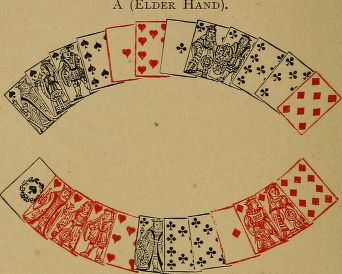
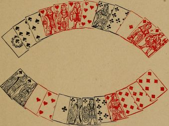
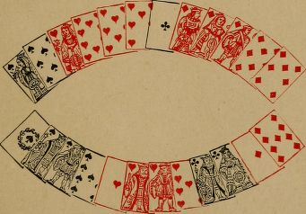

# Playing the cards

## Counting the hand

In playing the cards, you must be guided good deal by what your adversary has called,and also, to some extent, by what he has not called (but see Sinking, pp. 156-165). You will generally know several cards in the adverse hand,or will be able to mark some that have been put out; sometimes you will know all the cards,especially after some of the tricks have been played. For instance : - If the younger hand fails to follow suit to your first lead of a suit of which you could only have five cards, it is evident he has put out three of that suit. You then know every card in his hand, and should regulate your play accordingly.

In default of actual knowledge of the contents of your opponent's hand, you should count his cards so far as he has called them, and should consider what cards he is least likely to have discarded. You then mentally assign to him the cards he has most probably kept, and so fill up his number (see Examples I. and II.).

## Habit of adversary

You should also take into account the personal habit of your adversary in discarding, calling, and playing.

For instance: Some players habitually make bold discards, and throw entire suits. These are often found unguarded. Others, on the contrary, are timid discarders. These are generally guarded, even elder hand. The timid discarder is apt to leave a card, or to put out one of his point, in order to keep himself guarded. In the latter case he may, if unguarded, have sunk a card; but timid players seldom sink anything, except in very pronounced cases.

The same division of players into bold and timid applies to their play of the cards. A timid player, for example, will never give away a chance if he can make sure of dividing the cards. Against such an adversary it would be useless to unguarded king in play (as in Examples III. and IV.), because, when he finds himself with five tricks and an ace in hand, he is certain to dash out the ace.

Some, again, always throw high cards when attacked in suits in which they are guarded, in order to induce the leader to continue the suit.Thus:-With queen, nine, eight, they will throw the nine to the ace. If a player, who habitually does this, plays the eight to the ace, you may conclude he has not got the nine, and that he is unguarded.

Your safe rule as to playing small cards, is not to have any rule, and to play them sometimes in their natural order, and sometimes not.

## Playing to obtain information

This presents itself in various forms. The following are two common instances.

You have ace, queen, nine, eight, seven of hearts. You decide to lead hearts, notwithstanding that your adversary has called kings, and may hold king, knave, ten of hearts.

You lead ace of hearts, to which the ten falls.

You should next lead a small heart, not the queen. You thus discover whether the knave of hearts is out.

If your adversary has not called kings, and it is possible that he has discarded a king, your second lead should be queen of hearts, as you may find the knave single against you.

Again: Several tricks have been played, and you are in doubt what to lead. You have a suit headed by ace, king. You would generally be right to lead the ace, in order to see one more card before determining on your subsequent tactics. This point of play is of more importance than at first sight appears. It will be incidentally noticed in the Examples.

Conversely, you should play so as to avoid giving information. Thus: When you have the choice of throwing a card you have called, or one you have not, you should prefer the former.

You have, e.g., king, queen, and a small one of a suit, and have called kings, but not queens.Ace is led, to which you play the small one.The suit is continued; you should next play the king.

## Establishing a suit

Failing direct indications from the calling, your first lead should be from a suit you are likely to establish, such as king, queen, knave, and a small card; ace, queen, knave, and a small card,and so on. It is obvious that, when you again have the lead, you should generally pursue the suit of which you have winning cards remaining.

With two suits of equal commanding strength, you should generally begin by leading the one of which you hold the greater number. (For an exception to this rule, see below)

## Preserving guards and tenaces

When throwing to the opponent's lead, you should, of course, keep guards to kings and queens. Exceptional hands occur in which these should be unguarded, owing to the score, or to other circumstances (see following Examples III. and IV.).

When towards the close of a hand you have a tenace in one suit, and winning cards with a losing card in others, you should lead the winning cards and then the losing card, to oblige your adversary to lead up to the tenace. Of course, if you can count that your adversary is unguarded in the tenace suit, the above rule does not apply.

Also, when holding a tenace, it is often advisable to keep a losing card of another suit of which the adversary has the best, in order to give him the lead at a time when he must lead up to your tenace.

When you hold two tenace suits of equal commanding strength, and must find your adversary unguarded in one of them in order to divide the cards, you should generally first lead the less numerous suit; and, if you must play to divide the cards (owing to the score), and your adversary is equally likely to be unguarded in either suit,you should always attack first in the one of which you hold the fewer number.

The management and preservation of tenaces is a very important, and often a difficult point, in the play of the cards. (See Examples V. to X).

## Playing to save a capot

When you are put to a card (i.e., when your adversary has won eleven tricks and you remain with two cards, and are in doubt which of them to keep), you should keep the card of the suit of which the greater number is against you.

For example: You remain with ace of spades and ace of hearts, and have to play one of them to a club or a diamond led. By counting all the cards played, and your discard, you find that there are three spades wanting, and two diamonds, in respect of which it is an even chance that any four may have been discarded. In that case,you should keep the ace of spades.

In making this calculation, you should include all the absent cards of each suit, without reference to the fact that one of them, which might have been reckoned in calling, has not been reckoned.For, should your adversary see he can put you to a card, he will certainly sink the combination which, if reckoned, would tell you what his twelfth card is.

An exception to this is when reckoning the score, previously assumed to be sunk, would give your adversary a pique or a repique. Then it would not be worth his while to sink a card on the chance of a capot.

## Playing to the score

If you have five, or six, tricks and a winning card and the lead, play the winning card, unless certain that your opponent holds that suit, either from what he has called, or from the cards he has already played; for, by playing otherwise, you risk eleven points for the chance of gaining one for the last card.

If, however, one trick does not make the difference of saving, or winning, the cards, and you remain, at the end of a hand, with a winning card and a losing card, you should generally lead the losing card, in order to win the last trick, unless you can tell that the adversary has none of the suit to which your winning card belongs. For instance: You remain with ace, queen of a suit,and the lead; and there is nothing in the previous call or play to show that your adversary does not hold the king guarded. The presumption, then,is that he has the king guarded, and you should lead the queen, in hopes of making the last trick.

These rules are liable to modification in consequence of the state of the score. For example:-Although the rule is to make sure of the cards,nevertheless, when one point saves the rubicon,or wins or saves the partie, you should risk the cards for the sake of the last trick. Again : If you are elder hand and have the best of the partie,and can ensure dividing the cards, you should never risk the loss of them; but, if the younger hand has the best of the partie, it is often to your interest, as elder, to risk the loss of the cards,if, by so doing, you obtain a chance of winning them.

For an instance of playing to divide the cards,see Example XL

It often happens that you have the option, when playing the cards, of making a certain number of tricks off the reel, and of letting your opponent score the remainder, or of changing the lead from your hand to his, and vice versa, one or more times. In either case, you win the same number of tricks; but every time you part with the lead and regain it, each player scores one point in play more than if the cards had been played without changing the lead. Whether you should make tricks straight off, or should play in and out, depends on the score.

If you are less than a hundred, and are not within your show {see p. 199), you should play in and out. If you are within your show, and your adversary is not, you should keep him back,by refraining from playing in and out.

If you and your adversary are both over a hundred, it is immaterial whether you play in and out or not. If you play in and out, for every extra point you score, your adversary does the same; so there is then no advantage to either side (see Examples XII. to XVL).

When you are near a pique, reckon up all the winning cards you have in hand, to ascertain whether you can make thirty before you lose the lead. If you can do so, lead your winning cards one after the other, without considering how many of the remaining tricks you will lose.

There is one exception to this rule, owing to the score. Suppose, in the sixth deal, the score is such that, if the younger hand wins the cards,he saves the rubicon. In this case, if the elder hand can win the partie without the pique, and can divide or win the cards by not leading his winning cards immediately, but would lose the cards by so doing, he should forego the pique in order to win a rubicon (see Example XVII.,p. 197).

It may also happen, but seldom, that similar tactics should be resorted to in the fifth hand,your adversary being very backward, and you very forward, in the score.

In the last deal of a partie, if your adversary has scored less than a hundred, your object should be to prevent his reaching a hundred, and at the same time to make him score as many as possible,provided you can stop him short of a hundred.You should endeavor to prevent his declaring equalities; and if you cannot win the cards yourself, you should try to compel him to win them.

If, on the other hand, you see you cannot reach a hundred, your object should be to score as little as possible, to declare equalities, and to divide the cards. If you see you cannot divide the cards, let your adversary add thirteen (for the tricks), and ten (for the cards), to his score. You thus avoid scoring by in and out play, and score nothing,it being understood that you are not piqued or capoted in consequence (see Example XIX.).

## Examples

In the following Examples both hands are shown, for the sake of convenience. But only one hand is known, viz., the one of which the discard is stated. All that is known of the adverse hand is what is derived from calling, or from cards already played, as assumed, for instance, in Examples XII., XIII., and XIV.

The score is assumed to be love-all, unless otherwise stated.

### Example I.

_Counting the hand fro in the call of point._

A (Elder Hand)

B (Younger Hand).

B has discarded seven of spades; and eight,seven of diamonds.

A calls thirty-four for point, not good. The only four-card point, making four, that A can hold is in clubs. 

A leads the diamonds, to which B follows suit. A then leads ace, queen of spades; B plays ten, king.

B should now lead ace and another heart, when he must at least divide the cards.

If instead of leading the heart he leads the tierce major in clubs, he loses the cards.

If B could not count four clubs in A's hand, he would be right to attack in the tierce major suit.For this reason, and also because if B has a four-card point it will most probably be in clubs, A should have called thirty-one for point. In actual practice, however, a four-card point is frequently called under similar circumstances.

### Example II.

_Counting the hand, a trio not having been called._

A (Elder Hand).

B (Younger Hand).

B has discarded eight, seven of spades; and seven of hearts.

A calls a point in hearts, a quint and three knaves, all good. He leads ace, queen, knave of spades.

A's score, in hand and play, is now twenty-six.He did not call three queens; and as these would have given him a pique, it may be assumed he has not got them.

To the spades, led by A, B therefore throws ten of spades and two clubs.

A then leads a heart. B wins it, and attacks in diamonds. However A plays, B must divide the cards.

On the other hand, if A had called three queens,B should have thrown the diamonds to the spades,and have attacked in clubs. He assigns the ace of diamonds to A as the card he is most likely to have kept, in case he went out with, say, a quart in hearts and three knaves. Under these circumstances it is more than probable that A has at least one club out, when B, by attacking in clubs, will at least divide the cards.

Experienced players may perhaps think that Examples I. and II. are too elementary to be of much use. It is, however, by considerations similar to those here given, that even the best players regulate their play in cases of greater difficulty. Beginners are recommended to observe carefully the importance of counting the hands.

### Example III.

_Unguarding a king during the play, in hopes of dividing the cards._

A (Elder Hand).

B (Younger Hand),

B has discarded knave of spades; and eight, seven of hearts.

A reckons five hearts for point, and a quart major. He also calls three queens, which are not good.

A leads the hearts. B plays ten of hearts, nine,eight of spades (unguarding the king), and knave, nine of clubs.

If A, now believing B to hold king, knave of spades, leads a club or a diamond, and retains his tenace in spades to be led to, he only divides the cards.

### Example IV.

_Unguarding a king._

A (Elder Hand).

B (Younger Hand).

A has discarded eight, seven of spades; ten,eight of hearts; and knave of diamonds.

A calls four cards, making forty-one. B replies, "Equal".

B reckons a quart major in spades, three aces,and three knaves.

A leads four clubs, to which B plays three clubs and a small heart.

A then leads king of hearts, won by B with the ace.

B leads four spades. A plays nine, ten of spades, and, without hesitation, eight, nine of diamonds, unguarding the king.

B then leads a heart. A makes two tricks in hearts, and divides the cards.

If it is B's habit to dash out an ace when he has five tricks, in order to make certain of dividing the cards, A's play is difficult.

A has probably asked whether three kings are good; and, if B is attentive, he will most likely count queen of hearts, and king, knave of diamonds in A'S hand, and will therefore lead a heart. But if B is thoughtless, and does not take the trouble to count the hands, he may lead ace of diamonds in pursuance of his usual tactics. The worse player B is, the less likely is A's coup to succeed, and A must regulate his play accordingly.

Unguarding a king (and sometimes even a queen) during the play, if done without hesitation, will more frequently succeed against a high-class player than against an indifferent one. Of course, loss of the cards should not be risked by unguarding, unless the score renders it imperative to attempt to win them. Even then,if opposed to a player who keeps the score in view, the coup will hardly ever come off.

### Example V.

_Lead of a winning card, to preserve the tenace in another suit._

A (Elder Hand).

B (Younger Hand).

B has discarded ten, eight of hearts; and seven of spades.

A declares a five-card point in spades, and four queens.

A leads king of spades; B wins the trick.

B leads ace, king, knave, ten of clubs; A plays seven, queen of clubs, eight of diamonds, and eight of spades.

If A plays queen of diamonds, and retains eight of spades, he is immediately attacked in diamonds,and loses the cards.

B can now read A's hand. It consists of three spades, queen and another heart, and ace, queen of diamonds. It is possible that A has put out ace of diamonds to keep his four queens, and that he has three hearts. B need not consider this point, as then he must win the cards.

B now leads ace of hearts, that the lead may not be put into his hand again. He next leads knave of spades, when he must make a trick in diamonds, and win the cards.

If B does not get rid of the ace of hearts, A,after leading the spades, will give B the lead with a heart, and B only divides the cards.

### Example VI.

_Leading winning cards, to preserve the tenace in another suit._

A (Elder Hand).

B (Younger Hand).

B has discarded nine, seven of spades; andine of diamonds.

A calls four cards for point, not good; a quart major and a tierce to a knave, good; and three kings, not good .

B reckons five clubs for point; three aces, and three queens.

A leads a quart major in spades; B plays two spades and two clubs.

A next leads knave of hearts. B wins with queen, and leads ace, queen of clubs.

A wins the queen of clubs, and leads ten of hearts. B wins the heart, and, whatever he plays,must lose one trick in diamonds. Consequently,the cards are divided.

If B plays properly, he wins the cards. After winning with the queen of hearts, he should lead ace, king of hearts. Then, after leading ace, queen of clubs, he must be led up to in diamonds.

Of course, it is possible that A may hold a fourth heart, or a double guard to his king of clubs. In either of these cases, B can only divide the cards,however he plays.

The beginner at Piquet should keep these Examples (V. and VI.) well before him. Getting rid of winning cards in order to avoid subsequent leads is frequently overlooked by those not thoroughly versed in the game.

There is also the complementary case of reserving a losing card with which to place the lead, illustrated by Examples VII. and VIII. ,

### Example VII.

_Keeping a losing card to throw the lead, in order to preserve a tenace._

A (Elder Hand=

B (Younger Hand).

A has discarded nine, eight of hearts; and knave, nine, seven of diamonds.

A leads king of spades.

B wins it, and leads the diamonds.

To these, A should throw eight of diamonds,and three small clubs. He should on no account part with his ten of hearts.

B now leads king of hearts. A wins it, leads the spades, and then the ten of hearts, to get rid of the lead, when he divides the cards.

If A throws ten of hearts to one of the diamonds, he will remain with three clubs, one of which he must lead. He will then lose the cards.

### Example VIII.

_Keeping a small card to throw the lead, in order to preserve a tenace._

A (Elder Hand).

B (Younger Hand).

A has discarded knave, and eight, seven of clubs.

A leads king of hearts.  ten, eight of spades;

B wins it, and leads the clubs.

To the four clubs led by B, A should play two clubs, one spade, and knave of diamonds, keeping one small spade with which to get rid of the lead.

B next leads king of spades. A wins it, and leads the hearts, and then nine of spades. B must now lead a diamond; A makes ace, queen of diamonds, and divides the cards.

If to the fourth club, A had thrown nine of spades, he would have been obliged to continue with a diamond, and would have lost the cards.

### Example IX.

_Leading the less numerous suit._

B (Younger Hand).

A has discarded nine, eight, seven of spades;and eight, seven of hearts.

B has called three queens.

If B has both queen of hearts and queen of clubs guarded, he must win the cards. A should therefore play to find in which suit B is unguarded. If he begins with the club suit, of which he has five, and finds the queen guarded, he cannot save the cards. He should therefore attack in the three-card suit of hearts.

If the queen falls to the second trick, he leads the knave, and then any card except a club, and divides the cards. If the queen of hearts doesn't fall to the second trick, he then attacks in clubs.

Similarly, A declares a six-card point, viz., ace,queen, and four small cards. B is guarded in that suit, and holds ace, queen, ten, and two small cards of a second suit, and ace, queen, ten only of a third. As soon as B obtains the lead, he should play the ace of the suit of which he holds only three. If the adversary is guarded in that suit, he is probably unguarded in the other. If he is found guarded, B then attacks in the other in hopes of winning the cards. Should B begin with the suit of which he holds five cards, and find the adversary guarded, he has no chance of the cards, but he has a chance by playing as directed. If A is guarded in both suits B must lose the cards.

### Example X.

_Leading the less numerous suit. Playing to the score._

A (Elder Hand).

B (Younger Hand).

B has discarded seven of spades; and eight,seven of diamonds.

A calls a six-card point in clubs, a tierce major in spades, and four kings. His hand is known,therefore, all but one card, and either the king of hearts or of diamonds must be unguarded.

A leads tierce major in spades. B plays two spades and eight of hearts. He must not part with his nine of clubs.

A now leads king of clubs, which B wins.

B should lead the ace of diamonds, because it is his less numerous suit. If the king falls,he continues the diamonds, and then leads nine of clubs, and divides the cards.

If the king of diamonds does not fall to the ace, B next leads hearts, and divides the cards.

If B leads ace of hearts, before the diamond,and finds the king guarded, he loses the cards;but if he finds the king of hearts unguarded, he wins the cards. B's play may therefore depend on the score. If winning the cards wins the partie, or saves the rubicon, B should risk the heart; if dividing the cards wins the partie, B should lead the diamond. Or, if B is considerably behind in the score, and winning the cards brings him within his show, he should generally lead the heart {see Example XL).

### Example XI.

Making sure of dividing the cards.

A (Elder Hand).

B (Younger Hand).

B has discarded knave, ten of clubs-; and ten of diamonds.

A declares five diamonds, and leads the king. B wins the trick.

The probability is that A has gone for diamonds and queens. It is not at all unlikely that he has queen of spades or queen of hearts single.

B therefore leads ace of spades. A plays the eight. B still makes an effort to win the cards,and leads ace of hearts, to which A plays the seven.

B is quite in the dark as to the remaining spades and hearts in A's hand. As it happens,if B pursues the attack in hearts, he loses the cards. On the other hand, if A has guards in spades instead of in hearts, and B continues to attack in spades, he also loses the cards.

Under these circumstances, B can make certain of dividing the cards by now leading king of clubs.If the score is such that he must play to win the cards, he has no alternative but to continue his attack at random in one or other of his ace, king suits.

### Example XII.

_In and out play._

The last three cards in the leader's hand are king, queen, ten of a suit, of which he can count the adversary with ace, knave, and a small one.

The leader makes certain of three points in play by leading the ten. If he leads king or queen, he only scores two, should his adversary refuse to win the card first led.

In one case, the score in play is A, two; B, three.In the other, it is A, three; B, four.

A's proper lead depends on the score.

Again:-A has tierce major, and two small spades; and, king, queen of diamonds.

B has called four knaves and three aces.

A leads four of his spades. If knave of diamonds remains in B's hand, A makes seven in play by next leading a diamond. But, if A leads the fifth spade, and knave of diamonds is thrown to it, he only scores six in play.

### Example XIII.

_In and out play._

A has, declared in his hand, ace, queen, knave of spades; and king, ten of hearts.

B holds, ace, queen, knave of hearts; and king,ten of spades.

It is the last hand of the partie. A, who is ninety-five, leads the ace of spades, which makes his total score ninety-six. A has already won three tricks (excluding the ace of spades), and B four.

If B throws the king of spades to the ace, A can only score to ninety-nine.

If B throws the ten to the ace, each player makes one more point in play.

The card for B to play to the ace depends on the score Thus:-If B requires four points to save the rubicon, he should play the ten to the ace.

### Example XIV.

_In and out play._

A has, declared in his hand, ace, queen, knave of spades; ten of hearts; ace, nine of clubs.

B holds, king, ten of spades; knave, nine of hearts; king, queen of clubs.

A can count B's hand, and knows him to be singly guarded in both spades and clubs.

If A leads ace, queen of spades, he will score five in play, and B will score four.

The result will be the same if A leads ace, nine of clubs.

If A leads ten of hearts, he scores six in play,and B five. The number of tricks won by A will be the same in either case, viz., three.

After what has already been said, it will be clear that A's lead depends on the score.

Say it is the fifth hand of the partie, and that A is under a rubicon. He should lead the heart.

Or, to take an extreme case, it is the last hand,and A's score (including what he has already made in the hand) is ninety-four. If he does not lead the heart, he is rubiconed.

On the other hand, if A is well ahead, and his game is to keep B back, he should not lead the heart.

### Example XV.

_In and out play._

A (Elder Hand).

B (Younger Hand).

B has discarded eight of spades; and eight, seven of diamonds.

A scores seventeen in hand (point in spades,tierces in spades and hearts, three queens, and three tens).

He must win the cards, and he requires, in addition, ten in play to get out of the rubicon.

All the cards in his hand, except two, are known from the call. It is highly improbable that he has put out both ace and king of diamonds, especially as he does not reckon the ten of clubs. Therefore, it may be assumed that he has at most two clubs. In that case, he cannot make more than nine in play, if B plays properly.

A leads the spades. To these, B plays two spades and three diamonds. A then leads three diamonds, and any other card, and only scores nine in play. B scores five in play.

On the other hand, if B requires six to save his rubicon, he should keep the diamonds guarded,and should throw to the spades, two spades, a heart, and two clubs. If then he leads a diamond when he gets in, he scores one more in play. A scores two more in play; but B has succeeded in saving the rubicon.

### Example XVI.

_In and out play._,

A (Elder Hand).

B (Younger Hand)

A has discarded nine, eight of spades; nine,eight of clubs; and ten of diamonds.

It is the sixth hand of the partie. A has only four aces good, which bring his score to seventy-seven. He wins the cards, and has to reckon thirteen in play to save the rubicon.

B's point is in hearts. A can score thirteen by in and out play, unless B has three diamonds,and attacks in that suit. Even if B has three diamonds, it is unlikely he will lead them until obliged, as he may find A with ace, queen, ten of the suit.

A leads seven of hearts; B plays the nine.If, instead of the seven, A leads ace, king of hearts, as he probably would in an ordinary hand, he cannot reckon thirteen in play.

B leads anything - say, queen of hearts. A wins with the king, and leads ace, eight of hearts.It is compulsory on A to lead eight of hearts after the ace.

B wins the eight of hearts, and next leads a club, which A wins.

A's best lead is now seven of spades. B wins with the ten, and continues the club. A wins it, and must return the seven of clubs.

If B now leads a spade, A wins it, returns the spade, and then leads queen of diamonds. Or,if, instead of a spade, B leads a diamond, A wins it, and leads ace, queen of spades, and makes the last trick with a diamond.

The reason A leads seven of spades, at the sixth trick, instead of going on with the club suit, IS now apparent. Suppose all the hearts and clubs played, and that A remains with ace,queen, seven of spades, and ace, queen of diamonds. B has king, knave, ten of spades, and king, knave of diamonds, and it is B's lead. B leads a diamond, won by A. A leads seven of spades, won by B, who again leads a diamond,won by A.

Now A remains with ace, queen of spades, and is in a dilemma. He cannot tell whether B has two spades left, or a spade and a diamond. If then A leads ace of spades, on the speculation that B has one spade and one diamond (the probable case), he fails to score thirteen in play.By leading the seven of spades at an earlier period of the hand, as directed, A avoids being thus put to a lead.

At some scores, A's play would be very bad. As played, A reckons thirteen and B ten. By leading three aces and two kings, and any other card (keeping ace, queen of diamonds), A makes the same number of tricks, but the scores in play are. A, nine; B, six; a difference of four to each player. Suppose then B were ninety-three after counting his hand, and A any higher score, A should not play in and out.

Or, suppose it is the fifth hand of the partie,and that A can reach the score of eighty-six,by playing in and out. He should play to get within his show.

### Example XVII.

Playing to the score, and foregoing a pique,

A (Elder Hand).

B (Younger Hand).

It is the last hand of the partie. A has discarded knave, eight, seven of clubs; and ten, eight of diamonds.

A's score is seventy; B's score is eighty-two.

A has a pique, good against the cards, if, after reckoning his point, quint, and three aces, he leads his aces and kings, and then any other card.

If A plays in this way, he scores sixty, and his total score is a hundred and thirty. B scores eight in play, and ten for the cards, and his total score is a hundred. B saves the rubicon, and A wins a partie of a hundred and thirty.

But, if A foregoes the pique, and leads ace and another heart, he must divide the cards, whatever B has discarded. A then wins a rubicon.

Played in this way, with the hands given above,A scores twenty-four in hand, two in play (for ace,queen of hearts), and six for the last five tricks(in all thirty-two), and the cards are divided.

B scores seven in play (this he must reckon in order to divide the cards).

The scores will then be, A, a hundred and two ; B, eighty-nine. A wins a rubicon of two hundred and ninety-one.

By foregoing the pique, A gains a hundred and sixty-one points.

In order to avoid complicating the case with other considerations, the question of A's best play has hitherto been neglected. It will be seen that A can still make sure of dividing the cards if he leads the ace of spades before attacking in hearts. And, he may find B unguarded in spades. In that event, he wins apique and the cards. If the queen of spades does not fall to the ace, A should then change to the heart suit, leading ace and queen as above advised. In other words, A should not thoughtlessly throw away a chance of a pique, because he sees he can certainly win a rubicon by foregoing it.

### Example XVIII

_An intricate case of playing to the score (from actual play), and of winning a capot by sinking point and quatorze._

A (Elder Hand).

B (Younger Hand).

It is the sixth hand of the partie. The scores are, A, forty-three; B, ninety.

A has discarded eight, seven of spades; ten,seven of hearts; and nine of diamonds.

If A's point of thirty-nine in clubs is good, B must be out in spades, and A scores a repique.

If B is out in spades, A can equally win a repique by calling a point of thirty-eight in diamonds. In either case B is rubiconed.

On the other hand, if B has his quart in spades, there is no repique. A's resource, then,is a capot, and this he can win if B is unguarded in clubs.

But A may possibly capot his adversary, even if guarded in clubs, by inducing him to believe that clubs are out, elder hand. If A calls thirty-nine for point, it is evident that the point is in clubs, and B will keep himself guarded in that suit. A's object, therefore, should be to conceal the fact that he holds four clubs, and A should call thirty-eight in diamonds. It has already been shown that, if B has four spades, this call can only injure A to the extent of four points, a matter not worth considering as against the chance of a capot.

B replies, "Not good". He therefore has a quart in spades.

A, in pursuance of his tactics, calls four kings and three aces (not reckoning the ace of clubs),

A leads his four diamonds. To three of the diamonds B plays nine of spades, eight of hearts,and seven of clubs. B has now to play one other card. If he believes the ace of clubs to be out,he will naturally throw the nine of clubs. If he does so, he is capoted.

The scores will then be: A, seventeen in hand,thirteen in play, and forty for the cards and capot;total, seventy. This, added to his former score of forty-three, makes him a hundred and thirteen.B scores eight, making him ninety-eight. A wins a rubicon of three hundred and eleven.

### Example XIX.

_Playing to score as little as possible and to divide the cards._

A (Elder Hand).

B (Younger Hand).

It is the sixth hand of the partie. A has discarded nine, eight of hearts; and queen, nine,eight of clubs.

B's score is fifty.

A's first care should be to see whether B can possibly make fifty, which saves the rubicon.Whatever he has discarded, he cannot score more than forty-seven.

If A calls, "Forty-eight" in diamonds, B will reply, "Equal", and will declare forty-eight in hearts, his object being to declare equalities. A should call twenty-nine for point, which compels a score. B should allow this to be good.

A should then call a quart to a knave. B should say, "Not good", as, if he admits it,A also reckons a tierce in diamonds.

A then calls three tens, which B, in order to conceal his hand, allows to be good.

A leads ace of clubs, that he may not risk being put to a card; and, as he cannot win the cards, should try to lose them. A next leads king of diamonds.

It is now B's turn. He has discarded seven of spades; knave of clubs; and nine of diamonds.In order to reckon as little as possible, he only calls a quart in hearts.

B wins A's diamond; and, if he plays properly,can divide the cards.

B leads tierce major in spades, four tricks; ace,king of hearts, six tricks. To the hearts A plays king of clubs and ten of diamonds, endeavouring to lose the cards if B holds knave of clubs or nine of diamonds.

B now leads seven of diamonds. A wins it•with the knave; and, as he has only winning cards in his hand, the cards are divided.

If A had continued with a second club after the ace, B should have thrown the ten of hearts,as seven of hearts and seven of diamonds, if kept in hand, may enable B, after winning six tricks,to get rid of the lead when A remains with only winning cards.
