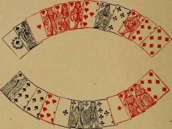
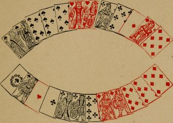
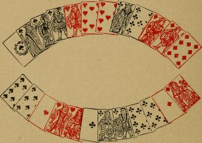
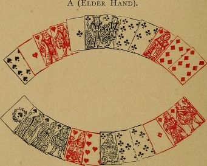
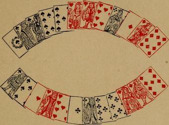

# Playing the cards

## Counting the hand

In playing the cards, you must be guided agood deal by what your adversary has called,and also, to some extent, by what he has notcalled (but see Sinking, pp. 156-165). You willgenerally know several cards in the adverse hand,or will be able to mark some that have beenput out; sometimes you will know all the cards,especially after some of the tricks have beenplayed. For instance : - If the younger handfails to follow suit to your first lead of a suitof which you could only have five cards, it isevident he has put out three of that suit. Youthen know every card in his hand, and shouldregulate your play accordingly.

In default of actual knowledge of the contentsof'your opponent's hand, you should count hiscards so far as he has called them, and shouldconsider what cards he is least likely to havediscarded. You then mentally assign to him thecards he has most probably kept, and so fill uphis number {see Examples I. and II., pp. 175-177).

PIQUET. 167

HABIT OF ADVERSARY.

You should also take into account the personalhabit of your adversary in discarding, calling, andplaying.

For instance:-Some players habitually makebold discards, and throw entire suits. Theseare often found unguarded. Others, on the con-trary, are timid discarders. These are generallyguarded, even elder hand. The timid discarderis apt to leave a card, or to put out one of hispoint, in order to keep himself guarded. In thelatter case he may, if unguarded, have sunk acard; but timid players seldom sink anything,except in very pronounced cases.

The same division of players into bold andtimid applies to their play of the cards. A timidplayer, for example, will never give away a chanceif he can make sure of dividing the cards. Againstsuch an adversary it would be useless to unguarda king in play (as in Examples III. and IV.,pp. 178-180), because, when he finds himself withfive tricks and an ace in hand, he is certain todash out the ace.

Some, again, always throw high cards whenattacked in suits in which they are guarded, inorder to induce the leader to continue the suit.Thus:-With queen, nine, eight, they will throwthe nine to the ace. If a player, who habituallydoes this, plays the eight to the ace, you mayconclude he has not got the nine, and that heis unguarded.

168 PIQUET.

Your safe rule as to playing small cards, isnot to have any rule, and to play them some-times in their natural order, and sometimes not.

PLAYING TO OBTAIN INFORMATION.

This presents itself in various forms. The fol-lowing are two common instances.

You have ace, queen, nine, eight, seven ofhearts. You decide to lead hearts, notwithstand-ing that your adversary has called kings, andmay hold king, knave, ten of hearts.

You lead ace of hearts, to which the ten falls.

You should next lead a small heart, not thequeen. You thus discover w^hether the knave ofhearts is out.

If your adversary has not called kings, and itis possible that he has discarded a king, yoursecond lead should be queen of hearts, as youmay find the knave single against you.

Again:-Several tricks have been played, andyou are in doubt what to lead. You have asuit headed by ace, king. You would generallybe right to lead the ace, in order to see onemore card before determining on your subsequenttactics. This point of play is of more importancethan at first sight appears. It will be incidentallynoticed in the Examples.

Conversely, you should play so as to avoidgiving information. Thus:--When you have thechoice of throwing a card you have called, orone you have not, you should prefer the former.

PIQUET. 169

You have, e.g., king, queen, and a small one ofa suit, and have called kings, but not queens.Ace is led, to which you play the small one.The suit is continued; you should next play theking.

ESTABLISHING A SUIT.

Failing direct indications from the calling, yourfirst lead should be from a suit you are likelyto establish, such as king, queen, knave, and asmall card; ace, queen, knave, and a small card,and so on. It is obvious that, when you againhave the lead, you should generally pursue thesuit of which you have winning cards remaining.

With two suits of equal commanding strength,you should generally begin by leading the oneof which you hold the greater number. (For anexception to this rule, see p. 170.)

PRESERVING GUARDS AND TENACES.

When throwing to the opponent's lead, youshould, of course, keep guards to kings andqueens. Exceptional hands occur in which theseshould be unguarded, owing to the score, or toother circumstances {see Examples III. and IV.,pp. 178-180).

When towards the close of a hand you havea tenace in one suit, and winning cards with alosing card in others, you should lead the winningcards and then the losing card, to oblige youradversary to lead up to the tenace. Of course.

lyo PIQUET.

if you can count that your adversary is unguardedin the tenace suit, the above rule does not apply.

Also, when holding a tenace, it is often advis-able to keep a losing card of another suit of whichthe adversary has the best, in order to give himthe lead at a time when he must lead up to yourtenace.

When you hold two tenace suits of equal com-manding strength, and must find your adversaryunguarded in one of them in order to dividethe cards, you should generally first lead the lessnumerous suit; and, if you must play to dividethe cards (owing to the score), and your adversaryis equally likely to be unguarded in either suit,you should always attack first in the one of whichyou hold the fewer number.

The management and preservation of tenaces isa very important, and often a difficult point, inthe play of the cards. {See Examples V. to X.,pp. 181-189).

PLAYING TO SAVE A CAPOT.

When you are put to a card {i.e., when youradversary has won eleven tricks and you remainwith two cards, and are in doubt which of themto keep), you should keep the card of the suitof which the greater number is against you.

For example:-You remain with ace of spadesand ace of hearts, and have to play one of themto a club or a diamond led. By counting all thecards played, and your discard, you find that there

PIQUET, 171

are three spades wanting, and two diamonds, inrespect of which it is an even chance that anyfour may have been discarded. In that case,you should keep the ace of spades.

In making this calculation, you should includeall the absent cards of each suit, without referenceto the fact that one of them, which might havebeen reckoned in calling, has not been reckoned.For, should your adversary see he can put youto a card, he will certainly sink the combinationwhich, if reckoned, would tell you what his twelfthcard is.

An exception to this is when reckoning thescore, previously assumed to be sunk, would giveyour adversary a pique or a repique. Then itwould not be worth his while to sink a card onthe chance of a capot.

PLAYING TO THE SCORE.

If you have five, or six, tricks and a winningcard and the lead, play the winning card, unlesscertain that your opponent holds that suit, eitherfrom what he has called, or from the cards he hasalready played; for, by playing otherwise, you riskeleven points for the chance of gaining one forthe last card.

If, however, one trick does not make the dif-ference of saving, or winning, the cards, and youremain, at the end of a hand, with a winning cardand a losing card, you should generally lead thelosing card, in order to win the last trick, unless

172 PIQUET.

you can tell that the adversary has none of thesuit to which your winning card belongs. Forinstance:-You remain with ace, queen of a suit,and the lead; and there is nothing in the previouscall or play to show that your adversary does nothold the king guarded. The presumption, then,is that he has the king guarded, and you shouldlead the queen, in hopes of making the last trick.

These rules are liable to modification in conse-quence of the state of the score. For example:-Although the rule is to make sure of the cards,nevertheless, when one point saves the rubicon,or wins or saves the partie, you should risk thecards for the sake of the last trick. Again :-Ifyou are elder hand and have the best of the partie,and can ensure dividing the cards, you shouldnever risk the loss of them; but, if the youngerhand has the best of the partie, it is often to yourinterest, as elder, to risk the loss of the cards,if, by so doing, you obtain a chance of winningthem.

For an instance of playing to divide the cards,see Example XL, p. 189.

It often happens that you have the option, whenplaying the cards, of making a certain number oftricks off the reel, and of letting your opponentscore the remainder, or of changing the lead fromyour hand to his, and vice versa, one or moretimes. In either case, you win the same numberof tricks; but every time you part with the lead

PIQUET. 173

and regain it, each player scores one point in playmore than if the cards had been played withoutchanging the lead. Whether you should maketricks straight ofif, or should play in and out, de-pends on the score.

If you are less than a hundred, and are notwithin your show {see p. 199), you should playin and out. If you are within your show, andyour adversary is not, you should keep him back,by refraining from playing in and out.

If you and your adversary are both over ahundred, it is immaterial whether you play inand out or not. If you play in and out, forevery extra point you score, your adversary doesthe same; so there is then no advantage to eitherside {see Examples XII. to XVL, pp. 190-196).

When you are near a pique, reckon up allthe winning cards you have in hand, to ascertainwhether you can make thirty before you lose thelead. If you can do so, lead your winning cardsone after the other, without considering how manyof the remaining tricks you will lose.

There is one exception to this rule, owing tothe score. Suppose, in the sixth deal, the scoreis such that, if the younger hand wins the cards,he saves the rubicon. In this case, if the elderhand can win the partie without the pique, andcan divide or win the cards by not leading hiswinning cards immediately, but would lose thecards by so doing, he should forego the pique

174 PIQUET.

in order to win a rubicon (see Example XVII.,p. 197).

It may also happen, but seldom, that similartactics should be resorted to in the fifth hand,your adversary being very backward, and youvery forward, in the score.

In the last deal of a partie, if your adversaryhas scored less than a hundred, your object shouldbe to prevent his reaching a hundred, and at thesame time to make him score as many as possible,provided you can stop him short of a hundred.You should endeavour to prevent his declaringequalities; and if you cannot win the cards your-self, you should try to compel him to win them.

If, on the other hand, you see you cannot reacha hundred, your object should be to score as littleas possible, to declare equalities, and to divide thecards. If you see you cannot divide the cards, letyour adversary add thirteen (for the tricks), andten (for the cards), to his score. You thus avoidscoring by in and out play, and score nothing,it being understood that you are not piqued orcapoted in consequence {see p. 100 and Ex-ample XIX., p. 201).

EXAMPLES.

In the following Examples both hands areshown, for the sake of convenience. But onlyone hand is known, viz., the one of which the

PIQUET.

175

discard is stated. All that is known of the ad-verse hand is what is derived from calling, orfrom cards already played, as assumed, for in-stance, in Examples XII., XIII., and XIV.

The score is assumed to be love-all, unlessotherwise stated.

Example I.

Counting the hand fro in the call of point.

A (Elder Hand).

B (Younger Hand).

B has discarded seven of spades; and eight,seven of diamonds.

A calls thirty-four for point, not good. Theonly four-card point, making four, that A canhold is in clubs (^see Table, p. 155).

PIQUET.

A leads the diamonds, to which B follows suit. Athen leads ace, queen of spades; B plays ten, king.

B should now lead ace and another heart, whenhe must at least divide the cards.

If instead of leading the heart he leads the tiercemajor in clubs, he loses the cards.

If B could not count four clubs in A's hand, hewould be right to attack in the tierce major suit.For this reason, and also because if B has a four-card point it will most probably be in clubs, Ashould have called thirty-one for point. In actualpractice, however, a four-card point is frequentlycalled under similar circumstances.

Example II.

Couniing the hand, a trio not having been called.

A (Elder Hand).

B (Younger Hand).

PIQUET. 177

B has discarded eight, seven of spades; andseven of hearts.

A calls a point in hearts, a quint and threeknaves, all good. He leads ace, queen, knaveof spades.

A's score, in hand and play, is now twenty-six.He did not call three queens; and as these wouldhave given him a pique, it may be assumed he hasnot got them.

To the spades, led by A, B therefore throws tenof spades and two clubs.

A then leads a heart. B wins it, and attacksin diamonds. However A plays, B must dividethe cards.

On the other hand, if A had called three queens,B should have thrown the diamonds to the spades,and have attacked in clubs. He assigns the aceof diamonds to A as the card he is most likely tohave kept, in case he went out with, say, a quartin hearts and three knaves. Under these circum-stances it is more than probable that A has at leastone club out, when B, by attacking in clubs, will atleast divide the cards.

Experienced players may perhaps think thatExamples I. and II. are too elementary to beof much use. It is, however, by considerationssimilar to those here given, that even the bestplayers regulate their play in cases of greaterdifficulty. Beginners are recommended to ob-serve carefully the importance of counting thehands {see p. 166).

N

PIQUET,

Example III.

Unguarding a king during the play, in hopes ofdividif^g the cards.

A (Elder Hand).

B (Younger Hand),

B has discarded knave of spades; and eight,seven of hearts.

A reckons five hearts for point, and a quartmajor. He also calls three queens, which arenot good.

A leads the hearts. B plays ten of hearts, nine,eight of spades (unguarding the king), and knave,nine of clubs.

If A, now believing B to hold king, knave ofspades, leads a club or a diamond, and retains

PIQUET.

179

his tenace in spades to be led to, he only dividesthe cards.

For remarks on unguarding, see p. 180.

Example IV.Unguarding a king.

A (Elder Hand).

B (Younger Hand).

A has discarded eight, seven of spades; ten,eight of hearts; and knave of diamonds.

A calls four cards, making forty-one. B re-plies, ** Equal."

B reckons a quart major in spades, three aces,and three knaves.

N 2

l8o PIQUET.

A leads four clubs, to which B plays threeclubs and a small heart.

A then leads king of hearts, won by B withthe ace.

B leads four spades. A plays nine, ten ofspades, and, without hesitation, eight, nine ofdiamonds, unguarding the king.

B then leads a heart. A makes two tricks inhearts, and divides the cards.

If it is B's habit to dash out an ace when hehas five tricks, in order to make certain of dividingthe cards, A's play is difficult.

A has probably asked whether three kings aregood; and, if B is attentive, he will most likelycount queen of hearts, and king, knave of dia-monds in A'S hand, and will therefore lead aheart. But if B is thoughtless, and does nottake the trouble to count the hands, he maylead ace of diamonds in pursuance of his usualtactics. The worse player B is, the less likelyis A's coup to succeed, and A must regulate hisplay accordingly.

Unguarding a king (and sometimes even aqueen) during the play, if done without hesi-tation, will more frequently succeed against ahigh-class player than against an indifferent one.Of course, loss of the cards should not be riskedby unguarding, unless the score renders it im-perative to attempt to win them. Even then,if opposed to a player who keeps the score inview, the coup will hardly ever come off.

i8l

Example V.

Lead of a winning card, to preserve the tenacei?i another suit.

A (Elder Hand).

B (Younger Hand).

B has discarded ten, eight of hearts; and sevenof spades.

A declares a five-card point in spades, and fourqueens.

A leads king of spades; B wins the trick.

B leads ace, king, knave, ten of clubs; A playsseven, queen of clubs, eight of diamonds, andeight of spades.

If A plays queen of diamonds, and retains eightof spades, he is immediately attacked in diamonds,and loses the cards.

B can now read A's hand. It consists of three

PIQUET.

spades, queen and another heart, and ace, queenof diamonds. It is possible that A has put outace of diamonds to keep his four queens, andthat he has three hearts. B need not considerthis point, as then he must win the cards.

B now leads ace of hearts, that the lead maynot be put into his hand again. He next leadsknave of spades, when he must make a trick indiamonds, and win the cards.

If B does not get rid of the ace of hearts, A,after leading the spades, will give B the lead witha heart, and B only divides the cards.

Example A^I.

Leading wtfming ca?'ds, to preserve the tenace

i?i another suit.

A (Elder Hand).

B (Younger Hand).

PIQUET. 183

B has discarded nine, seven of spades; andnine of diamonds.

A calls four cards for point, not good; a quartmajor and a tierce to a knave, good; and threekings, not good .

B reckons five clubs for point; three aces, andthree queens.

A leads a quart major in spades; B plays twospades and two clubs.

A next leads knave of hearts. B wins withqueen, and leads ace, queen of clubs.

A wins the queen of clul;&gt;s, and leads ten ofhearts. B wins the heart, and, whatever he plays,must lose one trick in diamonds. Consequently,the cards are divided.

If B plays properly, he wins the cards. Afterwinning with the queen of hearts, he should leadace, king of hearts. Then, after leading ace, queenof clubs, he must be led up to in diamonds.

Of course, it is possible that A may hold a fourthheart, or a double guard to his king of clubs. Ineither of these cases, B can only divide the cards,however he plays.

The beginner at Piquet should keep theseExamples (V. and VI.) well before him. Gettingrid of winning cards in order to avoid subse-quent leads is frequently overlooked by those notthoroughly versed in the game.

There is also the complementary case of re-serving a losing card with which to place thelead, illustrated by Examples VII. and VIII. ,

PIQUET.

Example VII.

Keeping a losing card to throw the lead, in orderto preserve a tenace.

A (Elder Hand

B (Younger Hand).

A has discarded nine, eight of hearts; andknave, nine, seven of diamonds.

A leads king of spades.

B wins it, and leads the diamonds.

To these, A should throw eight of diamonds,and three small clubs. He should on no accountpart with his ten of hearts.

B now leads king of hearts. A wins it, leadsthe spades, and then the ten of hearts, to getrid of the lead, when he divides the cards.

PIQUET.

185

If A throws ten of hearts to one of the dia-monds, he will remain with three clubs, one ofwhich he must lead. He will then lose the cards.

Example VIII.

Keeping a small card to throw the lead, i7i orderto preserve a tenace.

A (Elder Hand).

B (Younger Hand).

A has discarded knave,

and eight, seven of clubs.

A leads king of hearts.

ten, eight of spades;

B wins it, and leads the clubs.

To the four clubs led by B, A should play two

i86

PIQUET.

clubs, one spade, and knave of diamonds, keep-ing one small spade with which to get rid of thelead.

B next leads king of spades. A wins it, andleads the hearts, and then nine of spades. B mustnow lead a diamond; A makes ace, queen of dia-monds, and divides the cards.

If to the fourth club, A had thrown nine otspades, he would have been obliged to continuewith a diamond, and would have lost the cards.

Example IX.Leadms: the less numerous suit.

B (Younger Hand).

PIQUET. 187

A has discarded nine, eight, seven of spades;and eight, seven of hearts.

B has called three queens.

If B has both queen of hearts and queenof clubs guarded, he must win the cards. Ashould therefore play to find in which suitB is unguarded. If he begins with theclub suit, of which he has five, and finds thequeen guarded, he cannot save the cards. Heshould therefore attack in the three-card suit ofhearts.

If the queen falls to the second trick, he leadsthe knave, and then any card except a club, anddivides the cards. If the queen of hearts doesnot fall to the second trick, he then attacks inclubs.

Similarly, A declares a six-card point, viz., ace,queen, and four small cards. B is guarded inthat suit, and holds ace, queen, ten, and two smallcards of a second suit, and ace, queen, ten onlyof a third. As soon as B obtains the lead, heshould play the ace of the suit of which he holdsonly three. If the adversary is guarded in thatsuit, he is probably unguarded in the other. Ifhe is found guarded, B then attacks in the otherin hopes of winning the cards. Should B beginwith the suit of which he holds five cards, andfind the adversary guarded, he has no chance ofthe cards, but he has a chance by playing asdirected. If A is guarded in both suits B mustlose the cards.

Example X.

Leading the less numerous suit. Playing to the score,

A (Elder Hand).

B (Younger Hand).

B has discarded seven of spades; and eight,seven of diamonds.

A calls a six-card point in clubs, a tierce majorin spades, and four kings. His hand is known,therefore, all but one card, and either the kingof hearts or of diamonds must be unguarded.

A leads tierce major in spades. B plays twospades and eight of hearts. He must not partwith his nine of clubs.

A now leads king of clubs, which B wins.

B should lead the ace of diamonds, becauseit is his less numerous suit. If the king falls,he continues the diamonds, and then leads nineof clubs, and divides the cards.

PIQUET.

189

If the king of diamonds does not fall to theace, B next leads hearts, and divides the cards.

If B leads ace of hearts, before the diamond,and finds the king guarded, he loses the cards;but if he finds the king of hearts unguarded, hewins the cards. B's play may therefore dependon the score. If winning the cards wins thepartie, or saves the rubicon, B should risk theheart; if dividing the cards wins the partie, Bshould lead the diamond. Or, if B is consider-ably behind in the score, and winning the cardsbrings him within his show, he should generallylead the heart {see Example XL).

Example XI.

Making sure of dividing the cards.

A (Elder Hand).

B (Younger Hand).

190 PIQUET.

B has discarded knave, ten of clubs-; and tenof diamonds.

A declares five diamonds, and leads the king.B wins the trick.

The probability is that A has gone for diamondsand queens. It is not at all unlikely that he hasqueen of spades or queen of hearts single.

B therefore leads ace of spades. A plays theeight. B still makes an effort to win the cards,and leads a'ce of hearts, to which A plays the seven.

B is quite in the dark as to the remainingspades and hearts in A's hand. As it happens,if B pursues the attack in hearts, he loses thecards. On the other hand, if A has guards inspades instead of in hearts, and B continues toattack in spades, he also loses the cards.

Under these circumstances, B can make certainof dividing the cards by now leading king of clubs.If the score is such that he must play to win thecards, he has no alternative but to continue hisattack at random in one or other of his ace, kingsuits.

Example XII.In and out play.

The last three cards in the leader's hand areking, queen, ten of a suit, of which he can countthe adversary with ace, knave, and a small one.

The leader makes certain of three points in playby leading the ten. If he leads king or queen,

PIQUET. 191

he only scores two, should his adversary refuseto win the card first led.

In one case, the score in play is A, two; B, three.In the other, it is A, three; B, four.

A's proper lead depends on the score {seepp. 172, 173).

Again:-A has tierce major, and two smallspades; and, king, queen of diamonds.

B has called four knaves and three aces.

A leads four of his spades. If knave of dia-monds remains in B's hand, A makes seven inplay by next leading a diamond. But, if A leadsthe fifth spade, and knave of diamonds is thrownto it, he only scores six in play.

Example XIII.In and out play.

A has, declared in his hand, ace, queen, knaveof spades; and king, ten of hearts.

B holds, ace, queen, knave of hearts; and king,ten of spades.

It is the last hand of the partie. A, who isninety-five, leads the ace of spades, which makeshis total score ninety-six. A has already won threetricks (excluding the ace of spades), and B four.

If B throws the king of spades to the ace, Acan only score to ninety-nine.

If B throws the ten to the ace, each playermakes one more point in play.

The card for B to play to the ace depends onthe score Thus:-If B requires four points to

192 PIQUET.

save the rubicon, he should play the ten tothe ace.

Example XIV.In and out play.

A has, declared in his hand, ace, queen, knaveof spades; ten of hearts; ace, nine of clubs.

B holds, king, ten of spades; knave, nine ofhearts; king, queen of clubs.

A can count B's hand, and knows him to besingly guarded in both spades and clubs.

If A leads ace, queen of spades, he will scorefive in play, and B will score four.

The result will be the same if A leads ace, nineof clubs.

If A leads ten of hearts, he scores six in play,and B five. The number of tricks won by Awill be the same in either case, viz., three.

After what has already been said, it will beclear that A's lead depends on the score.

Say it is the fifth hand of the partie, andthat A is under a rubicon. He should leadthe heart.

Or, to take an extreme case, it is the last hand,and A's score (including what he has alreadymade in the hand) is ninety-four. If he doesnot lead the heart, he is rubiconed.

On the other hand, if A is well ahead, andhis game is to keep B back, he should not leadthe heart.

PIQUET-

193

Example XV.In and out play.

A (Elder Hand).

B (Younger Hand).

B has discarded eight of spades; and eight,seven of diamonds.

A scores seventeen in hand (point in spades,tierces in spades and hearts, three queens, andthree tens).

He must win the cards, and he requires, inaddition, ten in play to get out of the rubicon.

All the cards in his hand, except two, areknown from the call. It is highly improbablethat he has put out both ace and king of dia-monds, especially as he does not reckon the tenof clubs. Therefore, it may be assumed that heo

PIQUET.

has at most two clubs. In that case, he cannotmake more than nine in play, if B plays properly.

A leads the spades. To these, B plays twospades and three diamonds. A then leads threediamonds, and any other card, and only scoresnine in play. B scores five in play.

On the other hand, if B requires six to savehis rubicon, he should keep the diamonds guarded,and should throw to the spades, two spades, aheart, and two clubs. If then he leads a diamondwhen he gets in, he scores one more in play. Ascores two more in play; but B has succeeded insaving the rubicon.

Example XVI.

In and out play.

A (Elder Hand).

B (Younger Hanc).

PIQUET. 195

A has discarded nine, eight of spades; nine,eight of clubs; and ten of diamonds.

It is the sixth hand of the partie. A has onlyfour aces good, which bring his score to seventy-seven. He wins the cards, and has to reckonthirteen in play to save the rubicon.

B's point is in hearts. A can score thirteenby in and out play, unless B has three diamonds,and attacks in that suit. Even if B has threediarnonds, it is unlikely he will lead them untilobliged, as he may find A with ace, queen, tenof the suit.

A leads seven of hearts; B plays the nine.If, instead of the seven, A leads ace, king ofhearts, as he probably would in an ordinaryhand, he cannot reckon thirteen in play.

B leads anything-say, queen of hearts. Awins with the king, and leads ace, eight of hearts.It is compulsory on A to lead eight of heartsafter the ace.

B wins the eight of hearts, and next leads aclub, which A wins.

A's best lead is now seven of spades. B winswith the ten, and continues the club. A winsit, and must return the seven of clubs.

If B now leads a spade, A wins it, returns thespade, and then leads queen of diamonds. Or,if, instead of a spade, B leads a diamond, A winsit, and leads ace, queen of spades, and makes thelast trick with a diamond.

The reason A leads seven of spades, at the

o 2

196 PIQUET.

sixth trick, instead of going on with the clubsuit, IS now apparent. Suppose all the heartsand clubs played, and that A remains with ace,queen, seven of spades, and ace, queen of dia-monds. B has king, knave, ten of spades, andking, knave of diamonds, and it is B's lead. Bleads a diamond, won by A. A leads seven ofspades, won by B, who again leads a diamond,won by A.

Now A remains with ace, queen of spades, andis in a dilemma. He cannot tell whether B hastwo spades left, or a spade and a diamond. Ifthen A leads ace of spades, on the speculationthat B has one spade and one diamond (theprobable case), he fails to score thirteen in play.By leading the seven of spades at an earlier periodof the hand, as directed, A avoids being thus putto a lead.

At some scores, A's play would be very bad.As played, A reckons thirteen and B ten. Byleading three aces and two kings, and any othercard (keeping ace, queen of diamonds), A makesthe same number of tricks, but the scores in playare. A, nine; B, six; a difference of four to eachplayer. Suppose then B were ninety-three aftercounting his hand, and A any higher score, Ashould not play in and out.

Or, suppose it is the fifth hand of the partie,and that A can reach the score of eighty-six,by playing in and out. He should play to getwithin his show {see p. 173).

PIQUET.

197

Example XVII.

Playing to the score, and foregoing a pique,

A (Elder Hand).

B (Younger Hand).

It is the last hand of the partie. A has dis-carded knave, eight, seven of clubs; and ten,eight of diamonds.

A's score is seventy; B's score is eighty-two.

A has a pique, good against the cards, if, afterreckoning his point, quint, and three aces, heleads his aces and kings, and then any othercard.

If A plays in this way, he scores sixty, andhis total score is a hundred and thirty. B scoreseight in play, and ten for the cards, and his total

198 PIQUET.

score is a hundred. B saves the rubicon, andA wins a partie of a hundred and thirty.

But, if A foregoes the pique, and leads aceand another heart, he must divide the cards, what-ever B has discarded. A then wins a rubicon.

Played in this way, with the hands given above,A scores twenty-four in hand, two in play (for ace,queen of hearts), and six for the last five tricks(in all thirty-two), and the cards are divided.

B scores seven in play (this he must reckonin order to divide the cards).

The scores will then be, A, a hundred and two;B, eighty-nine. A wins a rubicon of two hundredand ninety-one.

By foregoing the pique, A gains a hundred andsixty-one points.

In order to avoid complicating the case withother considerations, the question of A's bestplay has hitherto been neglected. It will beseen that A can still make sure of dividing thecards if he leads the ace of spades before at-tacking in hearts. And, he may find B un-guarded in spades. In that event, he wins apique and the cards. If the queen of spadesdoes not fall to the ace, A should then changeto the heart suit, leading ace and queen as aboveadvised. In other words, A should not thought-lessly throw away a chance of a pique, becausehe sees he can certainly win a rubicon by fore-going it.

PIQUET.

199

Example XVIIL

An intricate case of playing to the score (from actual

play), a7id of ivinning a capot by sinking point and

quatoi'ze.

A (Elder Hand).

B (Younger Hand).

It is the sixth hand of the partie. The scoresare, A, forty-three; B, ninety.

A has discarded eight, seven of spades; ten,seven of hearts; and nine of diamonds.

If A's point of thirty-nine in clubs is good, Bmust be out in spades, and A scores a repique.

If B is out in spades, A can equally win arepique by calling a point of thirty-eight in dia-monds. In either case B is rubiconed.

200 PIQUET.

On the other hand, if B has his quart inspades, there is no repique. A's resource, then,is a capot, and this he can win if B is unguardedin clubs.

But A may possibly capot his adversary, evenif guarded in clubs, by inducing him to believethat clubs are out, elder hand. If A calls thirty-nine for point, it is evident that the point is inclubs, and B will keep himself guarded in thatsuit. A's object, therefore, should be to concealthe fact that he holds four clubs, and A shouldcall thirty-eight in diamonds- It has already beenshown that, if B has four spades, this call can onlyinjure A to the extent of four points, a matter notworth considering as against the chance of a capot.

B replies, "Not good." He therefore has aquart in spades.

A, in pursuance of his tactics, calls four kingsand three aces (not reckoning the ace of clubs),

A leads his four diamonds. To three of thediamonds B plays nine of spades, eight of hearts,and seven of clubs. B has now to play one othercard. If he believes the ace of clubs to be out,he will naturally throw the nine of clubs. If hedoes so, he is capoted.

The scores will then be:-A, seventeen in hand,thirteen in play, and forty for the cards and capot;total, seventy. This, added to his former score offorty-three, makes him a hundred and thirteen.B scores eight, making him ninety-eight. A winsa rubicon of three hundred and eleven.

PIQUET.

20I

Example XIX.

Playing to score as lUtle as possible^ and todivide the cards.

A (Elder Hand).

B (Younger Hand).

It is the sixth hand of the partie. A has dis-carded nine, eight of hearts; and queen, nine,eight of clubs.

B's score is fifty.

A's first care should be to see whether B canpossibly make fifty, which saves the rubicon.Whatever he has discarded, he cannot score morethan forty-seven.

If A calls, '"Forty-eight" in diamonds, B willreply, "Equal," and will declare forty-eight inhearts, his object being to declare equalities. A

202 PIQUET.

should call twenty-nine for point, which compelsa score. B should allow this to be good.

A should then call a quart to a knave. Bshould say, "Not good," as, if he admits it,A also reckons a tierce in diamonds.

A then calls three tens, which B, in order toconceal his hand, allows to be good.

A leads ace of clubs, that he may not riskbeing put to a card; and, as he cannot win thecards, should try to lose them. A next leads kingof diamonds.

It is now B's turn. He has discarded sevenof spades; knave of clubs; and nine of diamonds.In order to reckon as little as possible, he onlycalls a quart in hearts.

B wins A's diamond; and, if he plays properly,can divide the cards.

B leads tierce major in spades, four tricks; ace,king of hearts, six tricks. To the hearts A playsking of clubs and ten of diamonds, endeavouringto lose the cards if B holds knave of clubs or nineof diamonds.

B now leads seven of diamonds. A wins it•with the knave; and, as he has only winningcards in his hand, the cards are divided.

If A had continued with a second club afterthe ace, B should have thrown the ten of hearts,as seven of hearts and seven of diamonds, if keptin hand, may enable B, after winning six tricks,to get rid of the lead when A remains with onlywinninLT cards.
